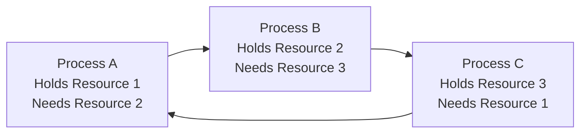
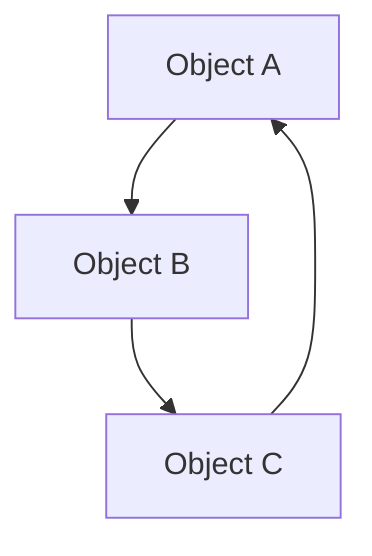
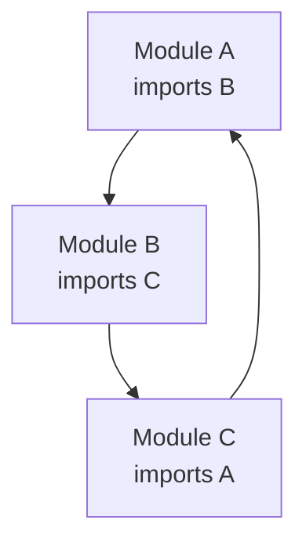
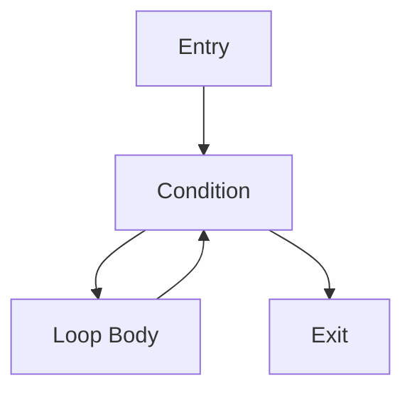

# Cycle Detection in the Real World: Applications and Implementation Tips 🌐

> [!NOTE]
> In this lesson, we'll explore practical applications of cycle detection algorithms and provide tips for implementing them in real-world scenarios.

## Real-World Applications 🌍

Cycle detection algorithms are not just theoretical concepts—they have numerous practical applications in software development and beyond:

### 1. Operating Systems: Deadlock Detection 💻

One of the most important applications is detecting deadlocks in operating systems:



Operating systems use cycle detection to identify circular wait conditions where:
- Process A is waiting for a resource held by Process B
- Process B is waiting for a resource held by Process C
- Process C is waiting for a resource held by Process A

### 2. Memory Management: Garbage Collection 🗑️

Modern garbage collectors use cycle detection to identify and clean up memory leaks caused by circular references:



Even when these objects are no longer reachable from the program's roots, they reference each other, preventing automatic cleanup. Cycle detection helps identify and collect these cycles.

### 3. Dependency Management: Circular Dependencies 📦

Build systems and package managers use cycle detection to identify circular dependencies between modules:



Circular dependencies can cause maintenance nightmares, initialization issues, and tight coupling. Detecting them early helps maintain a healthy codebase.

### 4. Network Topology: Routing Loops 🌐

Network routing protocols use cycle detection to prevent packets from infinitely circulating in the network:


Routing loops can cause network congestion and packet loss. Protocols like Spanning Tree Protocol (STP) ensure loop-free network topologies.

### 5. Compiler Analysis: Control Flow Graphs 🔄

Compilers use cycle detection on control flow graphs to identify loops for optimization:



Identifying loops helps with code optimization techniques like loop unrolling, invariant code motion, and parallelization.

## Implementation Tips and Best Practices 🛠️

When implementing cycle detection in real-world applications, keep these tips in mind:

### 1. Choose the Right Algorithm for Your Use Case

| Algorithm | Best For | Space Complexity | Time Complexity |
|-----------|----------|------------------|-----------------|
| **Set-Based** | Small data structures, clarity of code | O(n) | O(n) |
| **Floyd's Tortoise & Hare** | Linked structures, limited memory | O(1) | O(n) |
| **Brent's Algorithm** | Performance-critical applications | O(1) | O(n) with fewer comparisons |
| **DFS with Colors** | Graph structures | O(V) | O(V+E) |

### 2. Handle Edge Cases Properly ⚠️

Always consider these edge cases in your implementation:

- Empty structures (null/empty graphs)
- Single-element structures
- Self-loops (nodes pointing to themselves)
- Disconnected components in graphs

> [!WARNING]
> Forgetting to handle edge cases is one of the most common sources of bugs in cycle detection implementations!

### 3. Optimize for Your Specific Domain 🚀

- **Memory-constrained environments**: Use Floyd's or Brent's algorithms
- **Large graphs**: Consider using bit vectors instead of boolean arrays for visited nodes
- **Distributed systems**: Use specialized distributed cycle detection algorithms

### 4. Testing Your Implementation 🧪

Create comprehensive test cases covering:

- Structures with no cycles
- Structures with cycles of different lengths
- Cycles at different positions (beginning, middle, end)
- Edge cases (empty, single element, etc.)

```javascript
// Example test cases for a linked list cycle detector
test('Empty list', () => {
  expect(hasCycle(null)).toBe(false);
});

test('Single-node list without cycle', () => {
  const node = new ListNode(1);
  expect(hasCycle(node)).toBe(false);
});

test('Single-node list with self-loop', () => {
  const node = new ListNode(1);
  node.next = node;
  expect(hasCycle(node)).toBe(true);
});

// More tests for different cycle positions and lengths...
```

## Common Pitfalls and How to Avoid Them 🕳️

### 1. Infinite Loops in Your Cycle Detection Code

> [!TIP]
> Always ensure your algorithm has a proper termination condition!

### 2. Confusing Back Edges in Undirected Graphs

In undirected graphs, an edge to a parent node is not a back edge (doesn't indicate a cycle). Always track parent nodes to avoid false positives.

### 3. Stack Overflow in Recursive Implementations

For large graphs, recursive DFS implementations might exceed stack limits. Consider using an iterative approach with an explicit stack.

### 4. Performance Bottlenecks

- Use appropriate data structures (e.g., adjacency lists for sparse graphs)
- Consider early termination once a cycle is found
- For repeated checks, cache results when possible

## Performance Considerations 📊

When working with large data structures:

- **Time complexity** matters: All the algorithms we've discussed are O(n) or O(V+E), but constants matter in practice!
- **Memory usage** can be critical: Floyd's or Brent's algorithms shine when memory is constrained
- **Cache efficiency** affects real-world performance: Algorithms that access memory sequentially (like Floyd's) can be faster due to cache locality

<details>
<summary>Advanced: Custom Data Structures</summary>

For specialized applications, you might need to adapt cycle detection algorithms to custom data structures. When doing so:

1. Define what constitutes a "next node" in your structure
2. Ensure your comparison mechanism correctly identifies the same node
3. Handle any domain-specific edge cases

For example, in a file system dependency checker, you might represent files as nodes and imports as edges, then use graph cycle detection to find circular dependencies.
</details>

In the next and final lesson, we'll summarize what we've learned and explore further resources to deepen your understanding of cycle detection algorithms. 