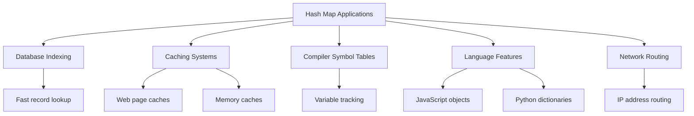

# 🎓 Conclusion: The Path to Hash Map Mastery

> [!NOTE]
> Congratulations on completing our in-depth exploration of hash maps! Let's summarize what we've learned and discuss where to go from here.

## Our Journey Through Hash Maps 🗺️

We've covered a comprehensive exploration of hash maps, from the fundamental concepts to advanced implementations and applications:

1. **Understanding the Problem** - We started by understanding why we need hash maps and the key-value storage problem
2. **Hash Functions** - We learned how hash functions convert keys into array indices
3. **Collision Handling** - We explored separate chaining and open addressing techniques
4. **Basic Operations** - We implemented the core put, get, and remove operations
5. **Complete Implementation** - We built full hash map implementations using different approaches
6. **Advanced Concepts** - We explored specialized hash map variants and optimization techniques

## Key Takeaways 💡

Here are the most important lessons about hash maps:

### Conceptual Understanding

- Hash maps provide **near-constant time** access, insertion, and deletion operations
- They achieve this through a clever combination of **array indexing** and **hash functions**
- The tradeoff is typically **space for time** - hash maps use more memory but offer faster operations

### Technical Mastery

- A good **hash function** should distribute keys uniformly and be quick to compute
- **Collision resolution** strategies are essential for handling when different keys hash to the same index
- The **load factor** (entries/capacity) affects performance and should be kept below a threshold
- **Resizing** (rehashing) is necessary as the map grows to maintain performance

### Practical Applications

- Hash maps are incredibly versatile data structures used in countless real-world applications
- They're fundamental building blocks for **caching**, **databases**, **language features**, and more
- Many common programming problems can be solved efficiently using hash maps

## Common Pitfalls to Avoid ⚠️

As you use hash maps in your own projects, be mindful of these common issues:

1. **Poor hash functions** that create many collisions
2. **Using mutable objects as keys** without care
3. **Not accounting for hash collisions** in performance calculations
4. **Ignoring the load factor** and not resizing when needed
5. **Overusing hash maps** when simpler structures would suffice

> [!WARNING]
> Remember that while hash maps offer O(1) average time complexity, they can degrade to O(n) in worst-case scenarios with many collisions!

## Hash Map Implementations in Popular Languages 🌐

Almost every major programming language includes a built-in hash map implementation:

| Language | Implementation | Notable Features |
|----------|----------------|-----------------|
| JavaScript | `Map`, `Object` | Map preserves insertion order, allows any key type |
| Python | `dict` | Highly optimized, core language feature |
| Java | `HashMap`, `LinkedHashMap` | LinkedHashMap maintains insertion order |
| C++ | `std::unordered_map` | Part of the Standard Template Library |
| Go | `map` | Built-in language feature |
| Ruby | `Hash` | Maintains insertion order since Ruby 1.9 |

## Practical Skills You've Gained 🛠️

By completing this series, you've developed several valuable skills:

1. **Ability to implement** a hash map from scratch
2. **Understanding of tradeoffs** between different collision resolution strategies
3. **Knowledge of when and how** to use hash maps to solve problems
4. **Insight into data structure design** and optimization

## Real-world Applications and Examples 🏙️

Let's recap some of the powerful ways hash maps are used in real-world software:

## Testing Your Understanding 📝

Here's a quick quiz to test your understanding:

1. What is the primary advantage of using a hash map over an array?

Hash maps provide O(1) average-case time complexity for lookups, insertions, and deletions regardless of size, while arrays require O(n) time for searching unless indexed directly.

2. What happens if two different keys produce the same hash value?

This is called a collision. It can be handled using separate chaining (storing multiple values at the same index, typically in a linked list) or open addressing (finding another open slot in the array).

3. Why is the load factor important in hash maps?

The load factor (number of entries / capacity) determines how full the hash map is. As it increases, collisions become more likely, degrading performance. Most implementations resize when the load factor exceeds a threshold (typically 0.75).

4. What makes a good hash function?

A good hash function:
- Distributes values uniformly across the array
- Is deterministic (same input always produces same output)
- Is efficient to compute
- Minimizes collisions

## Further Learning Resources 📚

If you want to continue your hash map journey, here are some excellent resources:

### Books
- "Introduction to Algorithms" by Cormen, Leiserson, Rivest, and Stein
- "Data Structures and Algorithm Analysis" by Mark Allen Weiss
- "Algorithms" by Robert Sedgewick and Kevin Wayne

### Online Courses
- MIT OpenCourseWare: "Introduction to Algorithms"
- Coursera: "Algorithms Specialization" by Stanford
- Udacity: "Data Structures and Algorithms Nanodegree"

### Interactive Learning
- VisuAlgo: [Hash Table visualization](https://visualgo.net/en/hashtable)
- LeetCode: Practice problems using hash maps
- HackerRank: Data Structures challenges

### Advanced Topics
- Consistent Hashing
- Perfect Hashing
- Bloom Filters
- Cuckoo Hashing
- Distributed Hash Tables

## Final Challenge 🏆

As a final exercise, try tackling this challenge:

Implement a simple LRU (Least Recently Used) cache with a fixed capacity using a hash map and a doubly linked list. The cache should support:

1. `get(key)` - Get the value of the key if it exists in the cache
2. `put(key, value)` - Set or insert the value if the key is not already present
3. When the cache reaches capacity, remove the least recently used key before inserting a new one

This challenge combines your understanding of hash maps with another important data structure (doubly linked lists) to create a useful tool for real-world applications.

## Congratulations! 🎉

You now have a deep understanding of one of the most important data structures in computer science. Hash maps are powerful tools that will serve you well throughout your programming career. Whether you're building a database, a web application, or solving algorithmic challenges, your knowledge of hash maps will help you create efficient and elegant solutions.

Remember that mastery comes with practice. Try implementing your own hash map variations, use them to solve problems, and continue exploring the rich world of data structures and algorithms!

**Happy coding!** 💻 