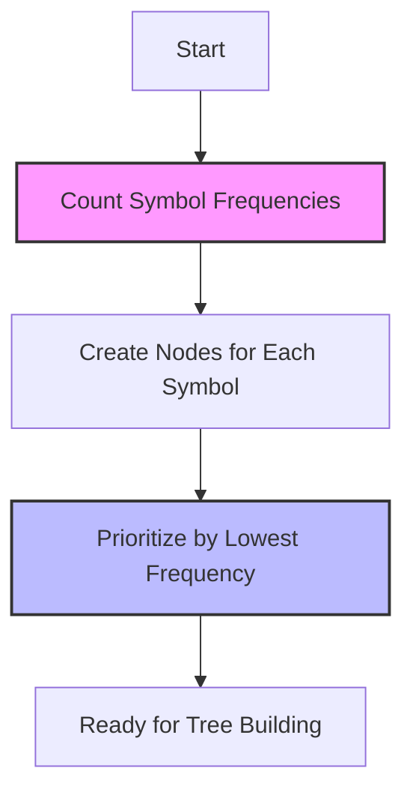

# 📊 Calculating and Prioritizing Frequencies 📊

In this step, we'll learn how to prepare our data for the Huffman encoding algorithm by calculating symbol frequencies and setting up a priority structure.

## Counting Symbol Frequencies

Before we can compress data, we need to understand its patterns. The first step in Huffman encoding is to **count how frequently each symbol appears** in our data.

> [!NOTE]
> In most implementations, we'll be given this frequency information directly. But in real-world applications, you'd need to scan through your data once to count occurrences.

### Example:

Let's say we want to encode the string: "abracadabra"

First, we count the frequency of each character:
- 'a': appears 5 times
- 'b': appears 2 times
- 'r': appears 2 times
- 'c': appears 1 time
- 'd': appears 1 time

## Why Frequencies Matter

The entire Huffman encoding algorithm is built around the concept that **not all symbols are created equal**. Some appear much more frequently than others, and we can take advantage of this uneven distribution.

Think of it like this: if you're designing a keyboard, you'd put the most commonly used keys in the most accessible positions! 🎹

## Prioritizing Symbols by Frequency

Once we have our frequencies, we need to **organize our symbols in a way that prioritizes those with lower frequencies**. This might seem counterintuitive at first, but it's because we'll be building our encoding tree from the bottom up, starting with the least frequent symbols.

In our implementation, we'll use a priority queue (min-heap) or a sorted list for this purpose.



## Creating Nodes for Our Tree

Each symbol and its frequency will be wrapped in a **node structure** that will eventually become part of our Huffman tree.

In pseudocode, our node might look like this:

```
class HuffmanNode:
    character    // The symbol (might be null for internal nodes)
    frequency    // How often this symbol appears
    leftChild    // Reference to left child (initially null)
    rightChild   // Reference to right child (initially null)
```

> [!TIP]
> Visualize each symbol as a leaf waiting to be connected to form a tree. The frequency will determine which leaves get connected first!

## Handling Edge Cases

What happens if we have only one unique symbol? Or no symbols at all? It's important to handle these edge cases gracefully:

<details>
<summary>Single Symbol Case</summary>

If there's only one unique symbol, we can't build a proper binary tree. In this case, we typically assign it a code of "0".

Example: If our input is just "aaaaa", we'd encode 'a' as "0", resulting in "00000".
</details>

<details>
<summary>Empty Input Case</summary>

If there are no symbols at all, we simply return an empty encoding map.
</details>

## Let's Practice!

Given the frequencies from our "abracadabra" example, try arranging the characters in order of increasing frequency:

<details>
<summary>See the answer</summary>

Arranging by increasing frequency:
1. 'c' (1 time)
2. 'd' (1 time)
3. 'b' (2 times)
4. 'r' (2 times)
5. 'a' (5 times)

These will be the initial nodes in our priority queue.
</details>

In the next lesson, we'll take these prioritized nodes and start building our Huffman tree! 🌳

> [!WARNING]
> The accuracy of your frequency calculation directly impacts the efficiency of your compression. Make sure you've counted correctly before proceeding to the next step! 