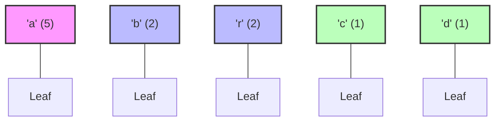
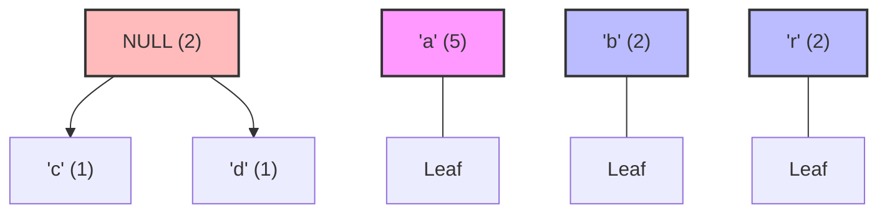
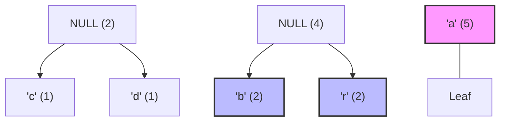
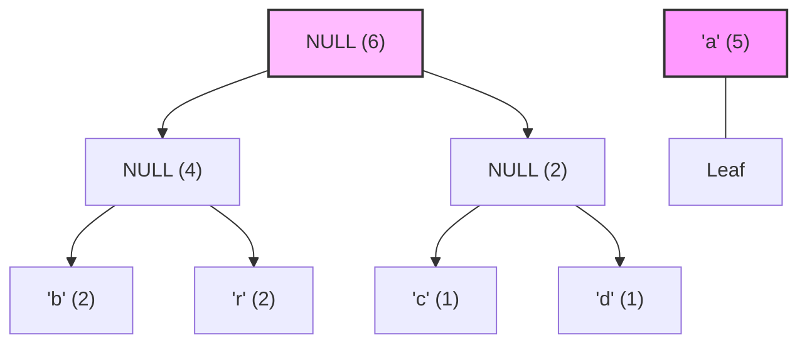
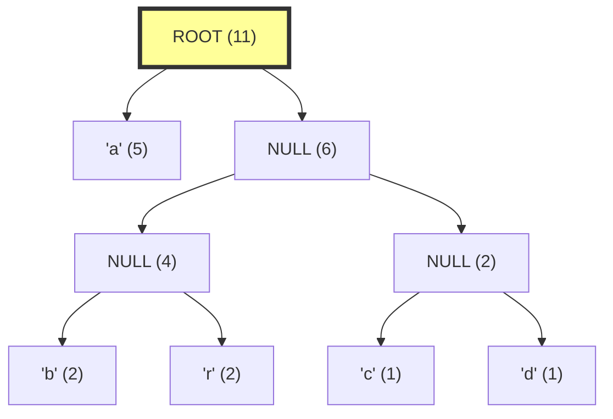

# 🌳 Building the Huffman Tree 🌳

In this step, we'll transform our symbols and frequencies into a special binary tree called a Huffman tree. This tree will be the key to generating our optimal codes!

## The Huffman Tree Concept

A Huffman tree is a **full binary tree** where:
- Each **leaf node** represents a symbol from our input
- Each **internal node** represents a combination of its children
- The **path from root to leaf** defines the binary code for each symbol

## Building the Tree Step by Step

The process of building a Huffman tree follows these steps:

1. Start with a collection of nodes, each containing a symbol and its frequency
2. **Repeatedly** take the two nodes with the lowest frequencies
3. Combine them into a new internal node with frequency = sum of the two nodes
4. Add the new node back to the collection
5. Continue until only one node remains (the root of our tree)

Let's visualize this with our "abracadabra" example:

> [!NOTE]
> We have these symbols and frequencies:
> - 'a': 5 times
> - 'b': 2 times 
> - 'r': 2 times
> - 'c': 1 time
> - 'd': 1 time

### Step 1: Initial Nodes



### Step 2: First Combination

We combine the two nodes with the lowest frequencies: 'c' (1) and 'd' (1)



### Step 3: Second Combination

Now we have 4 nodes: 'a' (5), 'b' (2), 'r' (2), and our new node (2)
We combine the two with lowest frequencies: let's say 'b' (2) and 'r' (2)



### Step 4: Third Combination

Now we combine our CD node (2) with the next lowest frequency node, which is our BR node (4)



### Step 5: Final Combination

Finally, we combine the remaining nodes: 'a' (5) and our BRCD node (6)



And there we have it - our complete Huffman tree! 🎉

## Why This Works

The magic of this approach is that:

1. **Symbols with lower frequencies** end up deeper in the tree (longer codes)
2. **Symbols with higher frequencies** end up closer to the root (shorter codes)
3. The tree is constructed in a way that **satisfies the prefix property** (no code is a prefix of another)

> [!TIP]
> Remember that the frequencies at internal nodes are just the sum of their children's frequencies. They help us prioritize during construction but don't affect the final codes.

## Implementing the Tree Building Process

In code, we typically use a priority queue (min-heap) to efficiently find the two nodes with lowest frequencies at each step:

<details>
<summary>Pseudocode for Building the Huffman Tree</summary>

```
function buildHuffmanTree(symbols, frequencies):
    // Create a leaf node for each symbol
    nodes = createNodes(symbols, frequencies)
    
    // Create a min-heap priority queue
    priorityQueue = MinHeap(nodes)
    
    // While there's more than one node in the queue
    while priorityQueue.size() > 1:
        // Extract the two nodes with lowest frequencies
        left = priorityQueue.extractMin()
        right = priorityQueue.extractMin()
        
        // Create a new internal node with these two nodes as children
        internalNode = new Node(NULL, left.frequency + right.frequency)
        internalNode.left = left
        internalNode.right = right
        
        // Add the new node back to the queue
        priorityQueue.add(internalNode)
    
    // Return the root of the Huffman tree
    return priorityQueue.extractMin()
```
</details>

## Let's Practice!

Try tracing through the tree-building process for these symbols and frequencies:
- 'x': 4
- 'y': 2
- 'z': 1

<details>
<summary>See the solution</summary>

1. Initial nodes: 'x' (4), 'y' (2), 'z' (1)
2. Combine the two lowest: 'y' (2) and 'z' (1) → New node YZ (3)
3. Remaining nodes: 'x' (4) and YZ (3)
4. Combine these two: 'x' (4) and YZ (3) → Root node (7)

The final tree would look like:
```
     (7)
    /   \
 'x'(4)  (3)
        /   \
     'y'(2) 'z'(1)
```
</details>

In the next lesson, we'll learn how to traverse this tree to generate our optimal Huffman codes! 🚀

> [!WARNING]
> When implementing this algorithm, be careful with the priority queue operations. If two nodes have the same frequency, the order in which you process them can affect the shape of the tree (though not the overall efficiency of the encoding). 