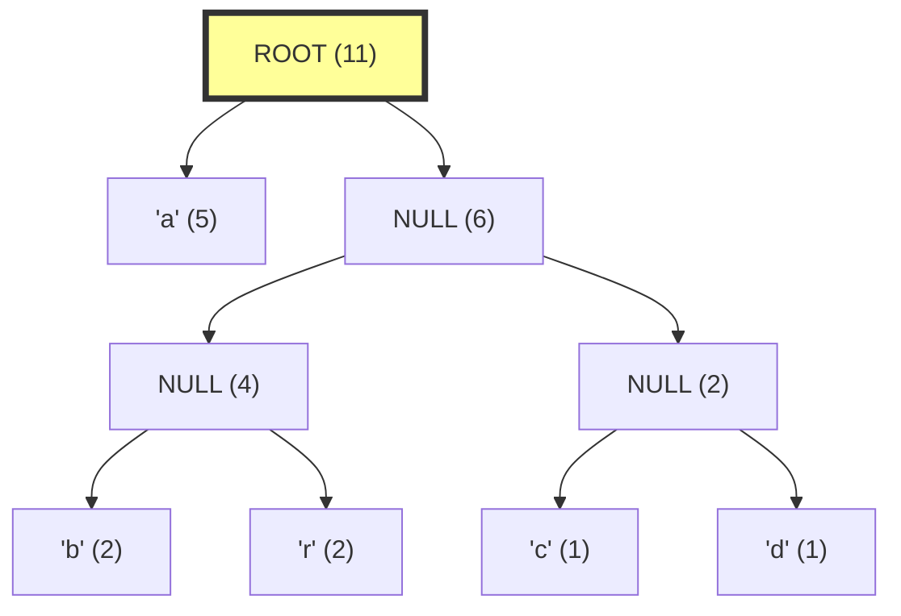

# 🔢 Generating Huffman Codes 🔢

Now that we've built our Huffman tree, we need to extract the codes for each symbol. This is the exciting part where we see the fruits of our labor!

## How Huffman Codes Are Determined

In a Huffman tree, **the path from the root to a leaf node defines the code** for the symbol at that leaf:
- Going **left** adds a **0** to the code
- Going **right** adds a **1** to the code

This elegantly ensures that no code is a prefix of another code, because each symbol is at a leaf node.

## Walking the Tree for Codes

Let's see how we can generate the codes from our example Huffman tree for "abracadabra":



### Tracing the Paths

Starting from the ROOT, let's trace the path to each symbol:

- **'a'**: Go left from ROOT → Code: **0**

- **'b'**: Go right from ROOT, then left from BRCD, then left from BR → Code: **100**

- **'r'**: Go right from ROOT, then left from BRCD, then right from BR → Code: **101**

- **'c'**: Go right from ROOT, then right from BRCD, then left from CD → Code: **110**

- **'d'**: Go right from ROOT, then right from BRCD, then right from CD → Code: **111**

So our final codes are:
- 'a': **0**
- 'b': **100**
- 'r': **101**
- 'c': **110**
- 'd': **111**

> [!TIP]
> Notice how 'a', which has the highest frequency (5), got the shortest code (just a single bit)!

## Implementing the Code Generation

We can implement this process using a recursive algorithm that traverses the tree and builds up the codes:

<details>
<summary>Pseudocode for Generating Huffman Codes</summary>

```
function generateCodes(node, currentCode, huffmanCodes):
    // Base case: leaf node (has a symbol)
    if node.symbol is not NULL:
        huffmanCodes[node.symbol] = currentCode
        return
    
    // Recursive case: internal node
    // Traverse left with '0' appended to code
    if node.left is not NULL:
        generateCodes(node.left, currentCode + "0", huffmanCodes)
    
    // Traverse right with '1' appended to code
    if node.right is not NULL:
        generateCodes(node.right, currentCode + "1", huffmanCodes)
```
</details>

## Let's Check Our Efficiency

Remember our example with "abracadabra"? Let's see how efficient our encoding is:

Original: "abracadabra" (11 characters × 8 bits/char = 88 bits)

Huffman encoded:
- 'a' (5 occurrences): 0 × 5 = 5 bits
- 'b' (2 occurrences): 100 × 2 = 6 bits
- 'r' (2 occurrences): 101 × 2 = 6 bits
- 'c' (1 occurrence): 110 × 1 = 3 bits
- 'd' (1 occurrence): 111 × 1 = 3 bits

Total: 5 + 6 + 6 + 3 + 3 = **23 bits**

That's a compression ratio of 88:23, or about **74% space savings**! 📉

> [!NOTE]
> In practice, we'd also need to store the Huffman tree or the code table to allow decoding, which would reduce the net compression ratio somewhat.

## Handling Special Cases

<details>
<summary>Empty Tree</summary>

If the tree is empty, we return an empty map of codes.
</details>

<details>
<summary>Single Node Tree</summary>

If there's only one node (one unique symbol), we typically assign it a code of "0".
</details>

## Let's Practice!

Using the Huffman tree we built in the previous exercise:

```
     (7)
    /   \
 'x'(4)  (3)
        /   \
     'y'(2) 'z'(1)
```

Try to determine the codes for 'x', 'y', and 'z':

<details>
<summary>See the answer</summary>

Tracing the paths from the root:
- **'x'**: Go left → Code: **0**
- **'y'**: Go right, then left → Code: **10**
- **'z'**: Go right, then right → Code: **11**

Now try encoding "xyz": 0 + 10 + 11 = **011**
</details>

## Visualizing the Final Encoding

Let's visualize our encoding for "abracadabra":

```
a    b     r     a    c     a    d     a    b     r     a
↓    ↓     ↓     ↓    ↓     ↓    ↓     ↓    ↓     ↓     ↓
0    100   101   0    110   0    111   0    100   101   0
```

Concatenated: **0 100 101 0 110 0 111 0 100 101 0** = **01001010110011101001010**

That's our compressed data! 🎯

In the next lesson, we'll learn how to decode these Huffman codes back into the original symbols. 🔄

> [!WARNING]
> When implementing, be careful not to lose track of the current path during recursion. Each recursive call should have its own copy of the current code. 