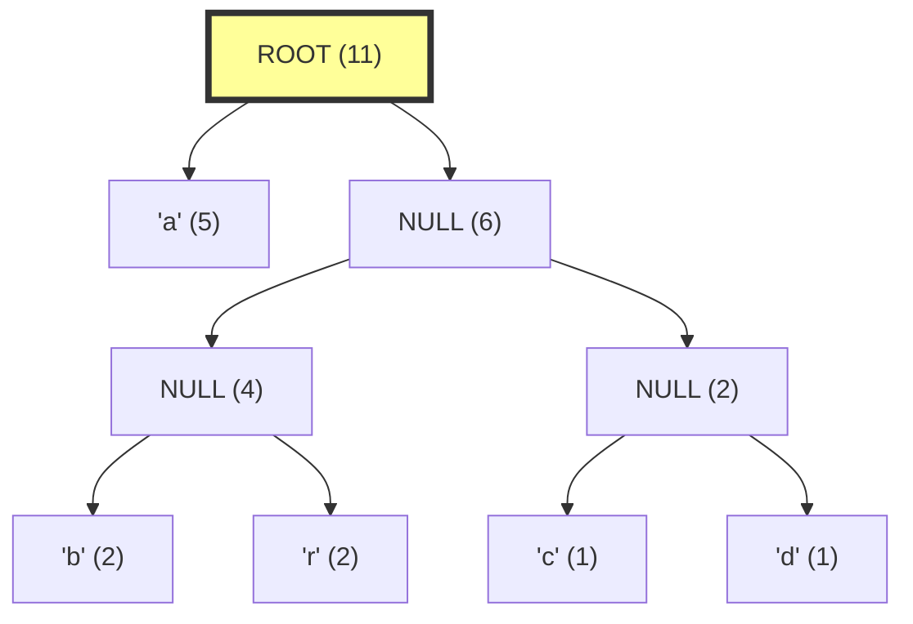

# 🔍 Decoding Huffman Codes 🔍

Now that we know how to build a Huffman tree and generate codes, let's learn how to decode an encoded message back to its original form. Decoding is an essential part of any compression algorithm, as it allows us to recover the original data!

## The Decoding Process

Decoding a Huffman-encoded message involves:
1. **Starting at the root** of the Huffman tree
2. **Reading encoded bits** one by one
3. **Moving down the tree**: left for '0', right for '1'
4. When a **leaf node** is reached, output its symbol and return to the root
5. **Repeat** until all bits are decoded

The process is like following a treasure map where each bit tells you which direction to go! 🗺️

## Visual Example

Let's decode our example message "01001010110011101001010" using our Huffman tree:



Let's step through bit by bit:

1. Read **0**: Go left from ROOT → Reached 'a' (leaf node) → Output: **a**, return to ROOT
2. Read **1**: Go right from ROOT → At BRCD (internal node)
3. Read **0**: Go left from BRCD → At BR (internal node)
4. Read **0**: Go left from BR → Reached 'b' (leaf node) → Output: **b**, return to ROOT
5. Read **1**: Go right from ROOT → At BRCD (internal node)
6. Read **0**: Go left from BRCD → At BR (internal node)
7. Read **1**: Go right from BR → Reached 'r' (leaf node) → Output: **r**, return to ROOT

And so on...

Continuing the entire process, we get: **abracadabra** 🎉

## How It Works in Code

Here's how we might implement the decoding process:

<details>
<summary>Pseudocode for Huffman Decoding</summary>

```
function decodeHuffman(encodedBits, huffmanTree):
    result = []
    currentNode = huffmanTree  // Start at the root
    
    for bit in encodedBits:
        // Move left or right based on the bit
        if bit == '0':
            currentNode = currentNode.left
        else:  // bit == '1'
            currentNode = currentNode.right
        
        // Check if we've reached a leaf node
        if currentNode.isLeaf():
            // Add the symbol to our result
            result.append(currentNode.symbol)
            
            // Go back to the root for the next symbol
            currentNode = huffmanTree
    
    return join(result)  // Combine the symbols into a string
```
</details>

## Alternative Approach: Using a Lookup Table

Instead of traversing the tree for each bit, we can also decode by accumulating bits until we find a matching code in our code table:

<details>
<summary>Pseudocode for Decoding with a Lookup Table</summary>

```
function decodeWithTable(encodedBits, huffmanCodes):
    // Invert the codes map for lookup: code -> symbol
    lookupTable = invertMap(huffmanCodes)
    
    result = []
    currentCode = ""
    
    for bit in encodedBits:
        // Add the bit to our current code
        currentCode += bit
        
        // Check if the current code matches a symbol
        if currentCode in lookupTable:
            // Add the matched symbol to our result
            result.append(lookupTable[currentCode])
            
            // Reset the current code for the next symbol
            currentCode = ""
    
    // If we have leftover bits that don't match any code, there's an error
    if currentCode != "":
        throw Error("Invalid encoded sequence")
    
    return join(result)  // Combine the symbols into a string
```
</details>

## Why This Works

The decoding process works because:

1. **Unique Decodability**: No code is a prefix of another code (the prefix property), so there's never any ambiguity about where one code ends and another begins.

2. **Tree Structure**: The tree is constructed such that each leaf node corresponds to exactly one symbol, and each unique path from root to leaf corresponds to one code.

3. **Bit Directionality**: The consistent use of '0' for left and '1' for right (or vice versa, as long as it's consistent) ensures we follow the same paths during decoding as we traced during encoding.

## Handling Edge Cases

<details>
<summary>Empty Input</summary>

If the encoded bit sequence is empty, we return an empty string.
</details>

<details>
<summary>Invalid Input</summary>

If the encoded bits don't form valid codes (e.g., if the sequence ends in the middle of a code), we should handle this error. This shouldn't happen with properly encoded data.
</details>

## Let's Practice!

Using our Huffman codes from the previous lesson:
- 'x': **0** 
- 'y': **10**
- 'z': **11**

Try to decode this bit sequence: **011010**

<details>
<summary>See the answer</summary>

Let's decode bit by bit:
1. Read **0**: Matched 'x', output: **x**
2. Read **1**: No match yet, continue
3. Read **1**: Matched '11' = 'z', output: **z**
4. Read **0**: Matched '0' = 'x', output: **x**
5. Read **1**: No match yet, continue
6. Read **0**: Matched '10' = 'y', output: **y**

So the decoded message is: **xzxy**
</details>

## When to Use Tree vs. Lookup Table

- **Tree Traversal**: More intuitive, directly follows the algorithm's design, and doesn't require preprocessing the codes.
  
- **Lookup Table**: Can be faster for decoding, especially for large messages, as it avoids traversing the tree repeatedly.

> [!TIP]
> In practice, **the lookup table approach is often preferred for performance** when decoding large messages, as it trades memory for speed.

## Wrapping Up

Congratulations! You now understand both the encoding and decoding processes of Huffman coding. This two-way process allows us to compress data and then recover it perfectly—the essence of lossless compression. 🏆

In the next lesson, we'll explore the complete algorithm implementation and analyze its performance in more detail. 📊

> [!WARNING]
> When implementing the decoding logic, always make sure your tree or lookup table is correctly constructed. A small error can lead to completely incorrect decoding! 