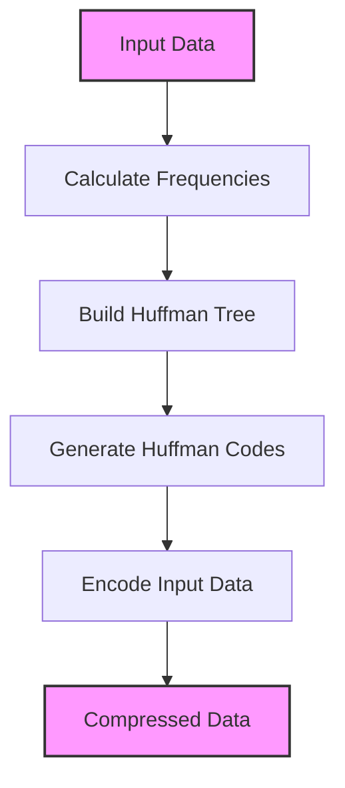

# 💻 Full Implementation and Algorithm Analysis 💻

Now that we understand the conceptual parts of Huffman encoding, let's put it all together and analyze the complete algorithm. We'll also look at its complexity and performance characteristics.

## Complete Huffman Encoding Algorithm

The complete Huffman encoding process involves these main steps:

1. **Calculate frequencies** of each symbol in the input
2. **Build a Huffman tree** using a priority queue
3. **Generate Huffman codes** by traversing the tree
4. **Encode the input** using the generated codes



## Complete Implementation

Here's a complete implementation of the Huffman encoding algorithm in Python:

<details>
<summary>Complete Python Implementation</summary>

```python
import heapq
from collections import Counter

class HuffmanNode:
    def __init__(self, char, frequency):
        self.char = char
        self.frequency = frequency
        self.left = None
        self.right = None
    
    # Define comparison for the priority queue
    def __lt__(self, other):
        return self.frequency < other.frequency

def huffman_encoding(data):
    if not data:
        return "", {}
    
    # Calculate frequencies
    frequencies = Counter(data)
    
    # Handle single character edge case
    if len(frequencies) == 1:
        char = list(frequencies.keys())[0]
        return "0" * len(data), {char: "0"}
    
    # Create nodes for each character
    nodes = [HuffmanNode(char, freq) for char, freq in frequencies.items()]
    heapq.heapify(nodes)
    
    # Build Huffman tree
    while len(nodes) > 1:
        left = heapq.heappop(nodes)
        right = heapq.heappop(nodes)
        
        merged_node = HuffmanNode(None, left.frequency + right.frequency)
        merged_node.left = left
        merged_node.right = right
        
        heapq.heappush(nodes, merged_node)
    
    # Generate codes by traversing the tree
    huffman_codes = {}
    generate_codes(nodes[0], "", huffman_codes)
    
    # Encode the input data
    encoded_data = "".join(huffman_codes[char] for char in data)
    
    return encoded_data, huffman_codes

def generate_codes(node, current_code, huffman_codes):
    if node.char is not None:
        huffman_codes[node.char] = current_code or "0"
        return
    
    generate_codes(node.left, current_code + "0", huffman_codes)
    generate_codes(node.right, current_code + "1", huffman_codes)

def huffman_decoding(encoded_data, huffman_tree):
    if not encoded_data:
        return ""
    
    # Handle single character edge case
    if huffman_tree.left is None and huffman_tree.right is None:
        return huffman_tree.char * len(encoded_data)
    
    current_node = huffman_tree
    decoded_data = []
    
    for bit in encoded_data:
        if bit == "0":
            current_node = current_node.left
        else:  # bit == "1"
            current_node = current_node.right
        
        if current_node.char is not None:
            decoded_data.append(current_node.char)
            current_node = huffman_tree
    
    return "".join(decoded_data)
```
</details>

## Algorithm Complexity Analysis

Let's analyze the time and space complexity of the Huffman encoding algorithm:

### Time Complexity

#### Building the Huffman Tree

- Calculating frequencies takes **O(n)** time, where n is the length of the input.
- Building the priority queue takes **O(k)** time, where k is the number of unique symbols.
- Extracting and inserting nodes in the priority queue takes **O(log k)** per operation.
- We perform k-1 merges, each taking **O(log k)** time.

Therefore, **building the tree has a time complexity of O(n + k log k)**.

#### Generating Codes

- Traversing the tree to generate codes takes **O(k)** time.

#### Encoding the Input

- Encoding the input using the generated codes takes **O(n)** time.

#### Overall

The overall time complexity is **O(n + k log k)**, which is dominated by the tree-building step for large inputs with relatively few unique symbols.

### Space Complexity

- The Huffman tree has **2k-1** nodes (k leaf nodes and k-1 internal nodes).
- The code map takes **O(k)** space.
- The priority queue takes **O(k)** space.

Therefore, the overall space complexity is **O(k)**.

## Compression Efficiency

The efficiency of Huffman encoding depends on the frequency distribution of symbols in the input:

- **Skewed distributions** (some symbols much more frequent than others) yield better compression.
- **Uniform distributions** yield minimal compression.

> [!NOTE]
> Theoretical optimal compression for a symbol with probability p is -log₂(p) bits. Huffman coding comes very close to this theoretical optimum!

## Practical Considerations

When implementing Huffman encoding in practice, consider:

### 1. Storing the Tree/Codes

To decompress the data, you need the Huffman tree or codes. Options include:

- **Canonical Huffman Coding**: A standardized way to represent Huffman codes that can be reconstructed with minimal information.
- **Storing the Tree Structure**: Can be done efficiently with a pre-order traversal.
- **Including Frequency Information**: Allow the decoder to rebuild the same tree.

### 2. Handling Fractional Bits

Since we're encoding with variable-length bit sequences, the final encoded data might not align with byte boundaries. Solutions include:

- **Padding**: Add extra bits to the end to make the total a multiple of 8 (for byte alignment).
- **Bit Packing**: Use bit manipulation to efficiently pack bits into bytes.

### 3. Stream Processing

For large inputs that can't fit in memory:

- Process the input in chunks to calculate frequencies.
- Build the tree and generate codes based on sampled data.
- Use adaptive Huffman coding for one-pass compression.

## Let's Compare Compression Ratios

Using our example from before:

Original "abracadabra": 11 characters × 8 bits = 88 bits

Huffman encoded: 23 bits

**Compression ratio**: 88/23 ≈ 3.83 (74% reduction)

Now let's try a different example with a more uniform distribution:

Text: "xyz xyz xyz" (9 characters)
Frequencies: x:3, y:3, z:3

With equal probabilities, each symbol gets a 2-bit code:
- x: 00
- y: 01
- z: 10

Encoded: 18 bits (compared to 72 bits original)
**Compression ratio**: 72/18 = 4 (75% reduction)

> [!TIP]
> The more redundant or predictable your data, the better compression Huffman encoding will achieve!

## Advanced Variations of Huffman Coding

### Adaptive Huffman Coding

Updates the Huffman tree dynamically as data is processed, eliminating the need for a two-pass algorithm.

### Canonical Huffman Coding

Generates Huffman codes in a specific order, making it easier to represent and decode the codebook.

### Huffman Coding with Unequal Letter Costs

A variation where different bits have different costs, useful in certain communication channels.

## Let's Practice!

Try to trace through the complete algorithm for this input:
"hello"

<details>
<summary>Solution</summary>

1. **Frequencies**: h:1, e:1, l:2, o:1
2. **Initial nodes**: h(1), e(1), l(2), o(1)
3. **First merge**: h(1) + e(1) = HE(2)
4. **Second merge**: HE(2) + o(1) = HEO(3)
5. **Final merge**: HEO(3) + l(2) = ROOT(5)

Tree structure:
```
     (5)
    /   \
  (3)    l(2)
 /   \
HE(2)  o(1)
/   \
h(1) e(1)
```

Codes:
- h: 000
- e: 001
- l: 1
- o: 01

Encoded "hello": 000 + 001 + 1 + 1 + 01 = 00000111 01
</details>

In the next lesson, we'll look at real-world applications and extensions of Huffman encoding. 🌍

> [!WARNING]
> When implementing Huffman encoding, be careful with the bit manipulation operations. Off-by-one errors in bit operations can lead to incorrect encoding or decoding! 