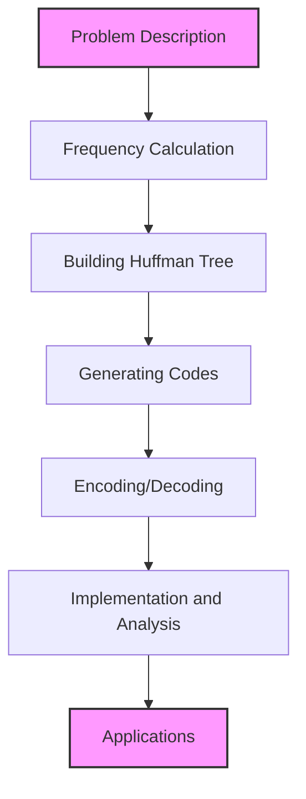

# 🌍 Real-World Applications and Conclusion 🌍

Congratulations on making it to the final lesson! Now that you understand how Huffman encoding works, let's explore its practical applications in the real world and wrap up what we've learned.

## Real-World Applications of Huffman Encoding

Huffman encoding isn't just a theoretical concept—it's used in numerous real-world applications:

### 1. File Compression

Huffman coding is a fundamental component in many file compression algorithms and formats:

- **DEFLATE**: The algorithm used in ZIP files combines Huffman coding with LZ77 compression
- **GZIP**: Uses Huffman coding as part of its compression pipeline
- **PKZIP**: Incorporates Huffman coding for efficient compression

> [!NOTE]
> While modern compression algorithms like LZMA and Brotli have surpassed Huffman coding in efficiency, they still use Huffman coding as one of their components!

### 2. Image and Multimedia Compression

Huffman coding is used extensively in multimedia compression:

- **JPEG**: Uses Huffman coding to compress the quantized DCT coefficients
- **MP3**: Employs Huffman coding for part of its audio compression process
- **PNG**: Uses Huffman coding to compress filtered prediction errors

How JPEG Uses Huffman Coding

In JPEG compression:
1. The image is divided into 8×8 blocks
2. Each block undergoes Discrete Cosine Transform (DCT)
3. The DCT coefficients are quantized
4. **Huffman coding** is then used to compress these quantized values

This is why editing and resaving a JPEG image multiple times degrades quality—each save involves quantization and Huffman coding!

### 3. Data Transmission

Huffman coding optimizes data transmission in bandwidth-constrained environments:

- **Telecommunications**: Reduces bandwidth requirements for data transmission
- **Satellite Communications**: Minimizes the amount of data sent over expensive satellite links
- **Networking Protocols**: Used in some protocols to compress headers and payloads

### 4. Character Encoding

The principles of Huffman coding have influenced character encoding schemes:

- **Morse Code**: Though developed before Huffman, follows a similar principle with shorter codes for common letters
- **Unicode Compression**: Some Unicode compression methods use Huffman-like variable-length encoding

## Huffman Coding in Modern Computing

While Huffman coding itself is over 70 years old, its principles continue to influence modern computing:

### 1. Modern Compression Algorithms

Advanced algorithms build upon and extend Huffman coding:

- **Arithmetic Coding**: Achieves better compression by encoding entire sequences as a single number
- **Range Encoding**: A more efficient implementation of arithmetic coding
- **Context-Based Compression**: Adjusts probabilities based on context to improve compression

### 2. Machine Learning Applications

Huffman's principles have connections to machine learning:

- **Decision Trees**: Share structural similarities with Huffman trees
- **Information Gain**: Both use concepts from information theory
- **Neural Network Compression**: Some techniques use Huffman-like coding to compress network weights

### 3. Quantum Computing

Even in cutting-edge fields, Huffman's principles appear:

- **Quantum Algorithms**: Some quantum communication protocols use ideas similar to Huffman coding to optimize quantum bit usage

## Why Huffman Coding Matters Today

Despite being a relatively simple algorithm, Huffman coding remains relevant because:

1. **It's optimal** for symbol-by-symbol encoding (no variable-length code can do better)
2. **It's efficient** in terms of time and space complexity
3. **It's easy to implement** compared to more complex compression methods
4. **It's a building block** for more sophisticated compression techniques

> [!TIP]
> Understanding Huffman coding provides a solid foundation for exploring more advanced data compression techniques!

## What We've Learned

Throughout these lessons, we've covered:

1. **The data compression challenge** and why variable-length coding is effective
2. **How to calculate and prioritize frequencies** to prepare for tree building
3. **The process of building a Huffman tree** by repeatedly combining the least frequent nodes
4. **Generating optimal Huffman codes** by traversing paths from root to leaf
5. **Decoding Huffman-encoded data** using either tree traversal or lookup tables
6. **Complete implementation and complexity analysis** of the algorithm
7. **Real-world applications** where Huffman coding makes a difference

## Challenging Yourself Further

Now that you understand Huffman coding, here are some ways to deepen your knowledge:

### 1. Implementation Challenges

- Implement a complete file compression utility using Huffman coding
- Create a visualization tool for Huffman trees and encoding process
- Build an adaptive Huffman coding implementation that updates the tree as it processes data

### 2. Theoretical Extensions

- Compare Huffman coding with other compression algorithms like LZ77, LZW, and arithmetic coding
- Explore how Huffman coding relates to information theory concepts like entropy
- Investigate the mathematical proofs behind Huffman's optimality

### 3. Practical Applications

- Analyze how different types of files (text, images, executables) respond to Huffman compression
- Experiment with pre-processing techniques that can improve Huffman coding efficiency
- Combine Huffman coding with other algorithms to create a hybrid compression method

## Reflections and Key Takeaways

As we conclude our exploration of Huffman encoding, remember these key insights:

🔑 **Frequency matters** - The distribution of symbols in your data determines compression efficiency

🔑 **Greedy algorithms can be optimal** - Huffman's local choices lead to a globally optimal solution

🔑 **Trees are powerful data structures** - The tree structure elegantly solves the prefix code problem

🔑 **Compression involves tradeoffs** - Between time, space, and compression ratio

🔑 **Theoretical foundations have practical impact** - Information theory concepts drive real-world applications

## Final Thoughts

Huffman encoding demonstrates how elegant algorithmic thinking can solve practical problems. By understanding this algorithm, you've gained insights into data compression, information theory, greedy algorithms, and tree-based data structures.

These concepts extend far beyond just Huffman coding—they're fundamental principles in computer science that will serve you well in many contexts.

> [!NOTE]
> Remember that Huffman coding is just one tool in the data compression toolbox. Different scenarios call for different algorithms, and understanding when to use Huffman coding (and when not to) is as important as knowing how it works.

Thank you for journeying through this exploration of Huffman encoding! May your data always be efficiently compressed and your algorithms optimally designed. 🎉

> [!TIP]
> The best way to solidify your understanding is to implement the algorithm yourself. Try coding it in your favorite programming language and experiment with different inputs to see how it performs! 