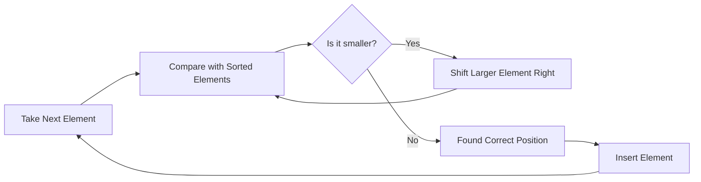

# 🧠 The Intuition Behind Insertion Sort

## 🔍 Understanding the Core Idea

Insertion Sort builds the final sorted array **one item at a time**. It's similar to how you might sort a hand of playing cards:

1. We start with the first element, which by itself is already "sorted"
2. We take the next element and place it in its correct position relative to the sorted portion
3. We repeat this process, growing the sorted portion one element at a time

> [!NOTE]
> The key insight: We maintain a sorted subarray and insert each new element into its correct position within that subarray.

## 🚶‍♂️ The Mental Model: Two Regions

When implementing Insertion Sort, it helps to visualize the array as divided into two regions:

```
[ Sorted Region | Unsorted Region ]
```

With each step, we:
1. Take the first element from the unsorted region
2. Find its correct position in the sorted region
3. Insert it there, shifting other elements as needed

## 🎬 Let's See It in Action

Imagine we have the array: `[29, 10, 14, 37, 14]`

**Initial state:**
```
[ | 29, 10, 14, 37, 14 ]  (Empty sorted region, all elements are unsorted)
```

**Step 1:** We consider the first element as sorted.
```
[ 29 | 10, 14, 37, 14 ]  (Sorted region has one element)
```

**Step 2:** Take 10 from the unsorted region and insert it into its correct position in the sorted region.
```
[ 10, 29 | 14, 37, 14 ]  (Sorted region has two elements)
```

**Step 3:** Take 14 and insert it into its correct position.
```
[ 10, 14, 29 | 37, 14 ]  (Sorted region has three elements)
```

**Step 4:** Take 37 and insert it into its correct position.
```
[ 10, 14, 29, 37 | 14 ]  (Sorted region has four elements)
```

**Step 5:** Take the last 14 and insert it into its correct position.
```
[ 10, 14, 14, 29, 37 | ]  (All elements are now sorted)
```

## 🔄 The Key Operation: Shifting

When inserting an element into the sorted region, we need to:
1. Compare it with elements in the sorted region from right to left
2. Shift elements greater than our current element one position to the right
3. Place our current element in the resulting gap

This shifting operation is what gives Insertion Sort its name!



> [!TIP]
> Think of insertion sort as creating space for the new element by shifting larger elements out of the way.

## 🤔 Think About It

<details>
<summary>How might the performance of Insertion Sort be affected if the input array is already sorted?</summary>

If the array is already sorted, Insertion Sort performs at its best with O(n) time complexity! This is because each new element is already in the correct position, so no shifting is needed. This makes Insertion Sort an excellent choice for nearly sorted data.
</details>

In the next lesson, we'll walk through a detailed, step-by-step example to solidify our understanding! 