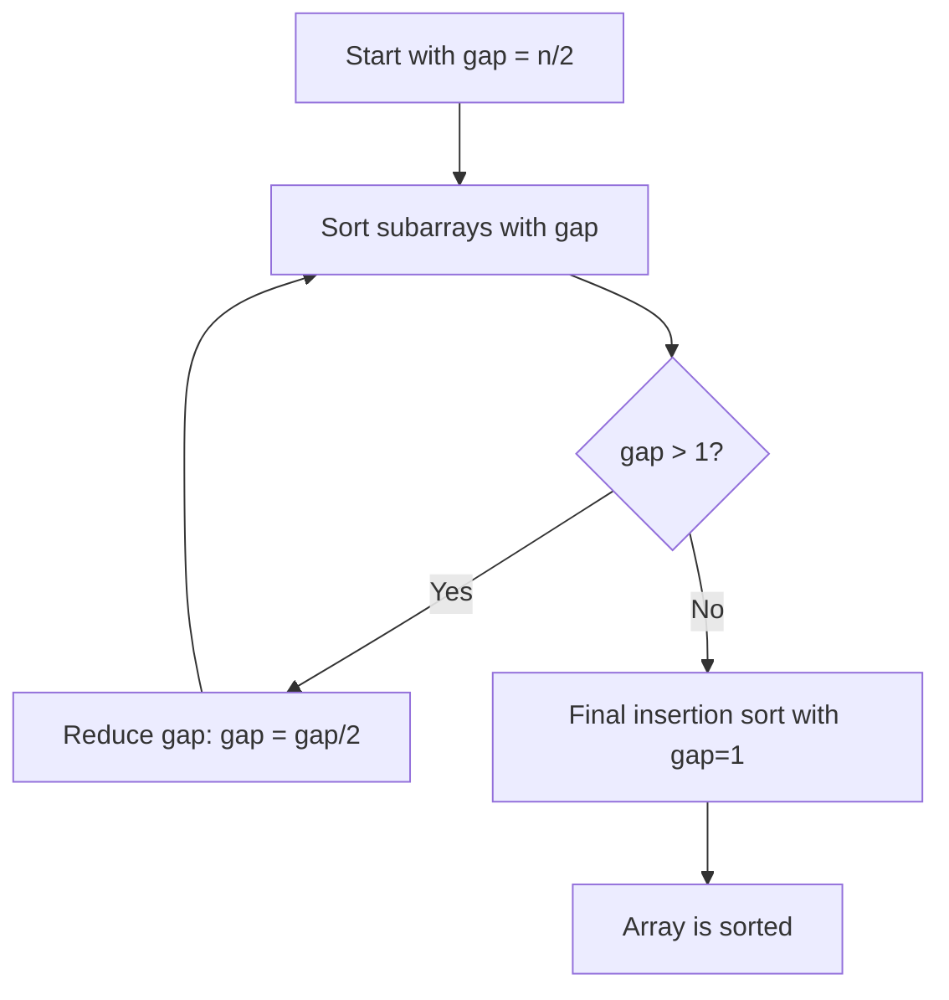

# 🔧 Variations and Optimizations of Insertion Sort

While the standard Insertion Sort is elegant in its simplicity, there are several variations and optimizations that can improve its performance in specific scenarios. Let's explore some of these alternatives!

## 🔍 Binary Insertion Sort

One way to optimize Insertion Sort is to use binary search to find the insertion position, reducing the number of comparisons.

### How It Works

1. Instead of sequentially comparing the current element with the sorted portion, use binary search to find the insertion point
2. Once the insertion point is found, shift elements as usual
3. Insert the current element at the correct position

### Implementation

```javascript
function binaryInsertionSort(nums) {
  for (let i = 1; i < nums.length; i++) {
    const key = nums[i];
    // Find location to insert using binary search
    let left = 0;
    let right = i - 1;
    
    while (left <= right) {
      const mid = Math.floor((left + right) / 2);
      if (nums[mid] > key) {
        right = mid - 1;
      } else {
        left = mid + 1;
      }
    }
    
    // Shift elements to make room for the key
    for (let j = i - 1; j >= left; j--) {
      nums[j + 1] = nums[j];
    }
    
    // Insert the key at the correct position
    nums[left] = key;
  }
  
  return nums;
}
```

### Complexity Analysis

- **Time Complexity**: Still O(n²) in the worst case, but with fewer comparisons (O(n log n) comparisons but O(n²) shifts)
- **When to Use**: When comparisons are expensive but shifts are cheap

## 🚀 Shell Sort

Shell Sort is a generalization of Insertion Sort that allows for the exchange of distant elements, making it much more efficient.

### How It Works

1. Sort elements that are a certain gap distance apart using Insertion Sort
2. Reduce the gap and repeat until the gap is 1 (which is just a regular Insertion Sort)
3. The early passes with larger gaps help move elements closer to their final positions quickly



### Implementation

```javascript
function shellSort(nums) {
  const n = nums.length;
  
  // Start with a large gap and reduce it
  for (let gap = Math.floor(n / 2); gap > 0; gap = Math.floor(gap / 2)) {
    // Perform insertion sort for elements at each gap
    for (let i = gap; i < n; i++) {
      const temp = nums[i];
      let j;
      
      // Shift elements that are gap positions apart
      for (j = i; j >= gap && nums[j - gap] > temp; j -= gap) {
        nums[j] = nums[j - gap];
      }
      
      // Place temp in its correct position
      nums[j] = temp;
    }
  }
  
  return nums;
}
```

### Complexity Analysis

- **Time Complexity**: Between O(n log² n) and O(n²), depending on the gap sequence
- **Space Complexity**: O(1)
- **When to Use**: When you need better performance than basic Insertion Sort but still want a simple algorithm

## 🧩 Insertion Sort with Early Termination

If we're sure the array contains distinct elements, we can add an early termination check:

```javascript
function optimizedInsertionSort(nums) {
  for (let i = 1; i < nums.length; i++) {
    // If the element is already in the right place, skip it
    if (nums[i] >= nums[i - 1]) continue;
    
    const key = nums[i];
    let j = i - 1;
    
    while (j >= 0 && nums[j] > key) {
      nums[j + 1] = nums[j];
      j--;
    }
    
    nums[j + 1] = key;
  }
  
  return nums;
}
```

This optimization is particularly effective for partially sorted arrays.

## 🌐 Two-Way Insertion Sort

Two-Way Insertion Sort maintains a sorted array that can grow in both directions, reducing the number of shifts needed.

### How It Works

1. Start with the first element in the middle of a new array
2. For each new element, compare it with the current endpoints
3. Insert at the appropriate end, requiring fewer shifts on average

```javascript
function twoWayInsertionSort(nums) {
  const n = nums.length;
  if (n <= 1) return nums;
  
  // Create a new array to hold sorted elements
  const sorted = new Array(n);
  sorted[0] = nums[0];
  let left = 0, right = 0; // Current bounds of sorted portion
  
  for (let i = 1; i < n; i++) {
    if (nums[i] < sorted[left]) {
      // Insert at the left
      left--;
      sorted[left] = nums[i];
    } else if (nums[i] > sorted[right]) {
      // Insert at the right
      right++;
      sorted[right] = nums[i];
    } else {
      // Insert within the sorted portion
      right++;
      // Shift elements to make room
      for (let j = right; j > left + 1; j--) {
        sorted[j] = sorted[j - 1];
      }
      sorted[left + 1] = nums[i];
    }
  }
  
  // Copy back to original array
  let k = 0;
  for (let i = left; i <= right; i++) {
    nums[k++] = sorted[i];
  }
  
  return nums;
}
```

> [!NOTE]
> This variation requires additional space, so it trades space for potential time savings.

## 🧮 Insertion Sort for Linked Lists

Insertion Sort is particularly well-suited for linked lists because inserting an element doesn't require shifting; we can simply adjust the pointers.

```javascript
class Node {
  constructor(val) {
    this.val = val;
    this.next = null;
  }
}

function insertionSortLinkedList(head) {
  if (!head || !head.next) return head;
  
  let sorted = null; // Initialize sorted list
  let current = head;
  
  // Traverse the original list
  while (current) {
    // Store next for next iteration
    let next = current.next;
    
    // Insert current into sorted list
    if (!sorted || sorted.val >= current.val) {
      // Insert at the beginning
      current.next = sorted;
      sorted = current;
    } else {
      // Find the appropriate position
      let search = sorted;
      while (search.next && search.next.val < current.val) {
        search = search.next;
      }
      // Insert after search
      current.next = search.next;
      search.next = current;
    }
    
    // Move to next element in original list
    current = next;
  }
  
  return sorted;
}
```

## 🤔 Think About It

<details>
<summary>Which variation of Insertion Sort would be most appropriate for sorting a nearly sorted array?</summary>

For a nearly sorted array, the basic Insertion Sort with early termination would be most appropriate. Since most elements are already close to their final positions, the early termination check (`if (nums[i] >= nums[i - 1]) continue;`) would skip many unnecessary operations, allowing the algorithm to approach O(n) time complexity.
</details>

<details>
<summary>When might you choose Shell Sort over the standard Insertion Sort?</summary>

Shell Sort would be preferable when:
- Dealing with medium to large datasets where Insertion Sort would be too slow
- You want better performance without the implementation complexity of algorithms like Quick Sort
- Memory usage needs to be minimal (O(1) space complexity)
- The data has some patterns that Shell Sort's gap sequence can exploit
</details>

In the next lesson, we'll look at some real-world applications of Insertion Sort and its variations! 