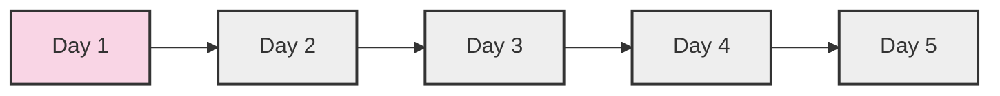
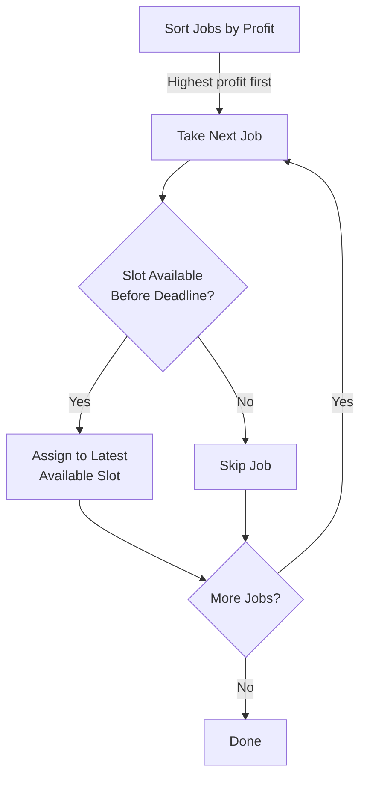

# 🧩 Understanding Job Scheduling Concepts

Before diving into the algorithm, let's understand some fundamental concepts related to job scheduling that will help us build intuition about this problem.

## Key Concepts in Job Scheduling ⚙️

### 1. Job Characteristics 📊

In our problem:
- Each job has a **profit** (the value we gain by completing it)
- Each job has a **deadline** (the last day by which it must be completed)
- Each job takes **exactly one unit of time** to complete

> [!NOTE]
> Understanding these characteristics is crucial because they define the constraints of our problem.

### 2. Time Slots ⏰

- We can think of our schedule as a series of discrete time slots
- Each slot can accommodate exactly one job
- A job with deadline `d` can be scheduled in any time slot from 1 to `d`

### 3. Scheduling Priorities 🎯

In job scheduling, we often have to consider various strategies:

- **Deadline-First**: Prioritize jobs with earlier deadlines
- **Profit-First**: Prioritize jobs with higher profits
- **Hybrid Approaches**: Consider both profit and deadline

For the Job Sequencing with Deadlines problem, we'll focus on a **profit-first approach** because our goal is to maximize total profit.

## Greedy vs. Non-Greedy Approaches 🔄

### Greedy Approach

A greedy algorithm makes the **locally optimal choice** at each step, hoping to find the global optimum.

> [!TIP]
> In our context, the "greedy" choice is to always select the job with the highest profit first, then find a suitable time slot for it.

### Why Greedy Works for Job Sequencing

For this specific problem, a greedy approach works because:

1. Selecting high-profit jobs first maximizes our potential earnings
2. By placing each job in the latest possible time slot (just before its deadline), we keep earlier slots available for other high-profit jobs

Example to illustrate why this works

Consider these jobs:
- Job A: Profit = $100, Deadline = Day 2
- Job B: Profit = $50, Deadline = Day 1
- Job C: Profit = $20, Deadline = Day 2

If we greedily select Job A first and place it on Day 2, then Job B on Day 1, we make $150.

If we had placed Job A on Day 1, we could only add Job C on Day 2, making $120.

## The Slot Assignment Problem 🧮

Once we decide which jobs to prioritize, we need to determine:

1. Which jobs make it into our final schedule
2. When each selected job should be executed

This is where the concept of **slot assignment** comes in:

- We need to assign each job to a specific time slot before its deadline
- If multiple slots are available, we should choose the **latest possible slot**
- If no slot is available before the deadline, we skip the job

## Impact of Deadline Distribution 📈

The distribution of deadlines across jobs can significantly impact our scheduling strategy:

- When many high-profit jobs have **similar deadlines**, we face tough choices
- When deadlines are **well-spread**, we might be able to include more jobs
- The **maximum deadline** determines how many jobs we can potentially include in our schedule

> [!WARNING]
> A common mistake is focusing only on profits without considering how deadline constraints affect your scheduling options.

## Reflection Questions ✨

Before moving on, think about these questions:

1. Why do you think we might want to assign a job to the latest possible slot before its deadline rather than the earliest?

2. Could there be scenarios where a greedy approach would not work for job scheduling problems? What might those look like?

In the next lesson, we'll explore the greedy approach in more detail and set up the foundation for our algorithm. 