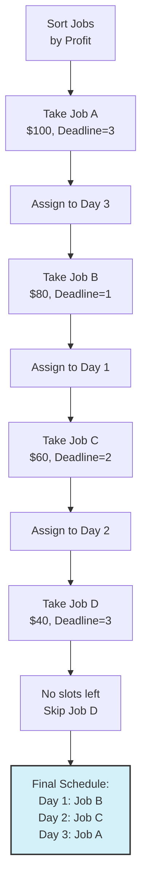

# 🧠 The Greedy Approach to Job Sequencing

In this lesson, we'll explore how to apply a greedy approach to solve the Job Sequencing with Deadlines problem.

## Why Greedy? 🎯

> [!NOTE]
> A greedy algorithm builds a solution piece by piece, always choosing the next piece that offers the most immediate benefit.

For Job Sequencing, our goal is to maximize profit. Since each job takes the same amount of time (one unit), a natural greedy approach is to:

1. Start with the most profitable job
2. Then choose the next most profitable job
3. And so on...

But we need to respect deadlines. This creates our greedy strategy.

## Our Greedy Strategy 📝

Our approach will be:

1. **Sort all jobs in decreasing order of profit**
2. **For each job (from highest to lowest profit):**
   - Find a time slot as close as possible to the deadline (but not after it)
   - If found, assign the job to that slot
   - If no slot is available, skip the job

## Illustrating the Greedy Approach 🖼️

Let's consider a concrete example:

```
Jobs:
- Job A: Profit = $100, Deadline = Day 3
- Job B: Profit = $80, Deadline = Day 1
- Job C: Profit = $60, Deadline = Day 2
- Job D: Profit = $40, Deadline = Day 3
```

Let's trace through our greedy approach:

### Step 1: Sort jobs by profit (highest to lowest)
```
1. Job A: $100, Deadline = Day 3
2. Job B: $80, Deadline = Day 1  
3. Job C: $60, Deadline = Day 2
4. Job D: $40, Deadline = Day 3
```

### Step 2: Process each job in order

> [!TIP]
> For each job, we try to assign it to the latest available time slot before or at its deadline.

<details open>
<summary>Let's walk through this step by step</summary>

#### Processing Job A ($100, Deadline = Day 3)
- Available slots: Days 1, 2, 3
- We choose Day 3 (the latest possible slot)
- Schedule now: [__, __, A]

#### Processing Job B ($80, Deadline = Day 1)
- Available slots: Days 1, 2
- We choose Day 1 (the only slot before its deadline)
- Schedule now: [B, __, A]

#### Processing Job C ($60, Deadline = Day 2)
- Available slots: Day 2
- We choose Day 2 (the only remaining slot before its deadline)
- Schedule now: [B, C, A]

#### Processing Job D ($40, Deadline = Day 3)
- No available slots before its deadline
- We skip this job
- Final schedule: [B, C, A]

Our total profit is $100 + $80 + $60 = $240.
</details>

## Visualizing the Process 📊

Here's how our scheduling process might look visually:



## Why This Works: The Late Assignment Rule 🕒

You might wonder: **Why do we assign jobs to the latest possible time slot?**

This is a critical insight:

> [!TIP]
> By assigning jobs to the latest possible time slot before their deadline, we keep earlier slots available for other high-profit jobs that might have tighter deadlines.

Think of it as **maximizing your options**:
- Placing a job with a flexible deadline (later deadline) in its latest possible slot 
- Preserves earlier slots for jobs with tighter deadlines
- This increases our chances of accommodating more high-profit jobs

## Edge Cases to Consider 🔍

When designing our algorithm, we need to consider several special situations:

### 1. Multiple Jobs with Same Deadline

When multiple jobs have the same deadline, our sorting by profit ensures we consider the higher-profit job first, giving it priority for available slots.

### 2. No Available Slots

If there are no available slots for a job before its deadline, we skip it entirely. This happens when all slots up to the deadline are filled with higher-profit jobs.

### 3. Empty Job List

If there are no jobs to schedule, our result should be an empty schedule.

## Reflection Questions ✨

Before moving on:

1. Can you think of a scenario where scheduling a job at its earliest possible slot (rather than latest) would lead to a suboptimal solution?

2. What would happen if we sorted jobs by deadline instead of profit? Would the algorithm still work? Why or why not?

3. How would the algorithm change if jobs had different durations (not just one unit of time)?

In the next lesson, we'll formalize these ideas into a step-by-step algorithm and prepare for implementation. 