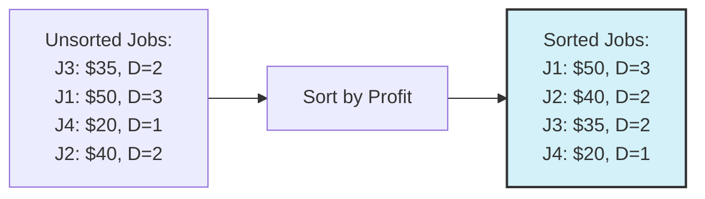

# 🧮 Algorithm Steps for Job Sequencing

Now that we understand the greedy approach, let's formalize the Job Sequencing algorithm into clear, well-defined steps.

## The Algorithm Overview 🔍

The Job Sequencing with Deadlines algorithm can be broken down into these major steps:

1. **Sort jobs** by profit in non-increasing order (highest profit first)
2. **Find the maximum deadline** among all jobs
3. **Initialize** a result array and slot availability tracker
4. **Process jobs** one by one in the sorted order
5. **Find available slots** for each job and assign if possible
6. **Return** the final job sequence

Let's dive into each step in detail.

## Detailed Algorithm Steps 📋

### Step 1: Sort Jobs by Profit 📊

We start by sorting all jobs in descending order of profit:



> [!NOTE]
> Sorting ensures we consider the most profitable jobs first, giving them priority in our schedule.

### Step 2: Find Maximum Deadline ⏰

Next, we find the maximum deadline among all jobs. This tells us how many time slots we need to consider.

```javascript
let maxDeadline = 0;
for (const job of jobs) {
  maxDeadline = Math.max(maxDeadline, job.deadline);
}
```

If the maximum deadline is `d`, then we have time slots numbered from `0` to `d-1` (or `1` to `d` if using 1-indexing).

### Step 3: Initialize Data Structures 🏗️

We need two main data structures:

1. **Time slots array**: To track which slots are filled
2. **Result array**: To store our selected jobs in sequence

```javascript
// Initialize time slots (null means available)
const timeSlots = new Array(maxDeadline).fill(null);

// Array to store the sequence of selected job IDs
const result = [];
```

> [!TIP]
> Using `null` for empty slots makes it easy to check if a slot is available.

### Step 4: Process Jobs in Order 🔄

Now, we iterate through each job in our sorted list (highest profit first):

```javascript
for (const job of sortedJobs) {
  // Find a suitable slot for this job
  // (implementation in next step)
}
```

### Step 5: Find and Assign Slots ✅

For each job, we need to find an available time slot. The key insight:

> [!WARNING]
> Always try to assign a job to the latest possible slot before its deadline.

Here's how we implement this:

```javascript
// For each job (in descending order of profit)
for (const job of sortedJobs) {
  // Start from the last slot before deadline and move backward
  for (let i = job.deadline - 1; i >= 0; i--) {
    if (timeSlots[i] === null) {
      // Found an empty slot, assign the job
      timeSlots[i] = job.id;
      result.push(job.id);
      break;  // Move to next job
    }
  }
}
```

<details>
<summary>Why do we search backward from the deadline?</summary>

By assigning jobs to the latest possible slot, we leave earlier slots open for other jobs that might have earlier deadlines. This maximizes our chances of fitting in more jobs.

Consider:
- Job A: Profit $50, Deadline = Day 3
- Job B: Profit $40, Deadline = Day 1

If we place Job A in Day 1, we can't schedule Job B at all. But if we place Job A in Day 3, we can schedule both jobs.
</details>

### Step 6: Return the Final Sequence 🏁

Finally, we return the sequence of job IDs we've selected:

```javascript
return result;
```

The returned array contains the IDs of jobs in our optimal schedule, not necessarily in the order they'll be executed.

## Complete Algorithm Pseudocode 📝

Let's put it all together:

```
function jobSequencing(jobs):
  // Sort jobs by profit in descending order
  sort jobs by profit in decreasing order
  
  // Find the maximum deadline
  maxDeadline = maximum deadline among all jobs
  
  // Initialize data structures
  timeSlots = array of size maxDeadline filled with null
  result = empty array
  
  // Process each job in order of decreasing profit
  for each job in sorted jobs:
    // Find the latest available slot before deadline
    for slot = job.deadline - 1 down to 0:
      if timeSlots[slot] is null:
        timeSlots[slot] = job.id
        append job.id to result
        break  // Move to next job
  
  // Return the final job sequence
  return result
```

## Visualizing the Algorithm in Action 🎬

Let's see how the algorithm works with a complete example:

```
Jobs:
J1: Profit $20, Deadline = Day 1
J2: Profit $15, Deadline = Day 2  
J3: Profit $10, Deadline = Day 2
J4: Profit $5, Deadline = Day 1
```

<details open>
<summary>Tracing through the algorithm step by step</summary>

1. **Sort jobs by profit**: [J1, J2, J3, J4]
2. **Maximum deadline**: 2 (time slots are indexed 0 and 1)
3. **Initialize time slots**: [null, null]
4. **Process jobs**:
   
   **Job J1 ($20, Deadline=1):**
   - Check slot 0: Available
   - Assign J1 to slot 0
   - Time slots: [J1, null]
   - Result: [J1]
   
   **Job J2 ($15, Deadline=2):**
   - Check slot 1: Available
   - Assign J2 to slot 1
   - Time slots: [J1, J2]
   - Result: [J1, J2]
   
   **Job J3 ($10, Deadline=2):**
   - Check slot 1: Not available
   - Check slot 0: Not available
   - No slot found, skip J3
   - Time slots: [J1, J2]
   - Result: [J1, J2]
   
   **Job J4 ($5, Deadline=1):**
   - Check slot 0: Not available
   - No slot found, skip J4
   - Time slots: [J1, J2]
   - Result: [J1, J2]

5. **Final result**: [J1, J2] with a total profit of $35
</details>

## Reflection Questions ✨

Before moving on, think about these questions:

1. What would be the result if two jobs had the same profit but different deadlines? How does the algorithm handle this?

2. Is it possible to have a scenario where a job with lower profit gets selected while a higher profit job is rejected? If so, under what conditions?

3. How would you modify the algorithm if jobs had priorities in addition to profits?

In the next lesson, we'll translate this algorithm into actual code and walk through an implementation. 