# ⏱️ Time and Space Complexity Analysis

Understanding the efficiency of an algorithm is crucial for evaluating its performance in different scenarios. In this lesson, we'll analyze the time and space complexity of the Job Sequencing algorithm.

## Time Complexity 🕒

The time complexity of our implementation can be broken down into several components:

### 1. Sorting Jobs 📊

```javascript
jobs.sort((a, b) => b.profit - a.profit);
```

- Sorting has a time complexity of **O(n log n)**, where n is the number of jobs.
- Most modern JavaScript engines use a variation of quicksort or timsort, which both have an average time complexity of O(n log n).

### 2. Finding Maximum Deadline ⏰

```javascript
let maxDeadline = 0;
for (const job of jobs) {
  maxDeadline = Math.max(maxDeadline, job.deadline);
}
```

- This requires a single pass through all jobs: **O(n)** time.

### 3. Initializing Data Structures 🏗️

```javascript
const timeSlots = new Array(maxDeadline).fill(null);
const result = [];
```

- Creating and initializing the `timeSlots` array takes **O(d)** time, where d is the maximum deadline.
- In the worst case, d could be n (if each job has a unique deadline).

### 4. Assigning Jobs to Slots 🔄

```javascript
for (const job of jobs) {
  for (let i = job.deadline - 1; i >= 0; i--) {
    if (timeSlots[i] === null) {
      timeSlots[i] = job.id;
      result.push(job.id);
      break;
    }
  }
}
```

This involves:
- An outer loop that iterates through all n jobs: **O(n)**
- An inner loop that, in the worst case, checks all slots from 1 to the job's deadline
- In the worst case, we might need to check all d slots for each job

The worst-case time complexity of this section is **O(n × d)**.

### Overall Time Complexity

Combining all components:
- Sorting: O(n log n)
- Finding maximum deadline: O(n)
- Initializing data structures: O(d)
- Assigning jobs: O(n × d)

Since d can be at most n (when each job has a unique deadline), the worst-case time complexity is:
- **O(n log n + n + n + n²) = O(n²)**

The time complexity is dominated by the nested loops in the job assignment phase.

> [!NOTE]
> If most jobs have small deadlines (d << n), the algorithm will perform better in practice than the worst-case analysis suggests.

## Space Complexity 🧮

Let's analyze the space requirements of our algorithm:

### 1. Input Storage

- We're assuming the input list of jobs requires **O(n)** space.
- Note that the sorting operation in JavaScript typically sorts the array in place, so it doesn't require additional space for a new sorted array.

### 2. Time Slots Array

```javascript
const timeSlots = new Array(maxDeadline).fill(null);
```

- This requires **O(d)** space, where d is the maximum deadline.
- In the worst case, d could be n, so this would be **O(n)** space.

### 3. Result Array

```javascript
const result = [];
```

- In the worst case, we might include all n jobs in our result, requiring **O(n)** space.

### Overall Space Complexity

Combining all space requirements:
- Input storage: O(n)
- Time slots array: O(d) ≤ O(n)
- Result array: O(n)

The overall space complexity is **O(n)**.

## Comparing with Other Approaches 🔍

### Brute Force Approach

A brute force approach would try all possible combinations of jobs and select the one with the highest profit. This would have a time complexity of O(2ⁿ), which is significantly worse than our O(n²) solution.

### Optimized Implementation with Disjoint Set

An optimized implementation using a disjoint set (union-find) data structure can reduce the time complexity to **O(n log n)**:

1. Sort jobs by profit (highest first): O(n log n)
2. For each job, find the latest available slot using a disjoint set operation: O(log n) per operation
3. Total time: O(n log n) + O(n × log n) = O(n log n)

```mermaid
graph TD
    A["Standard Implementation<br>O(n²)"] --> B["Optimized Implementation<br>O(n log n)"]
    
    C["Lower Complexity"] --> D["Faster Runtime"]
    B --> D
    
    style D fill:#d4f1f9,stroke:#333,stroke-width:2px
```



## Practical Considerations ⚖️

When choosing an algorithm implementation, consider these factors:

### 1. Input Size

- For small input sizes (few jobs), the simpler O(n²) implementation may be faster due to lower constant factors.
- For larger inputs, the optimized O(n log n) approach becomes more valuable.

### 2. Deadline Distribution

- If most deadlines are small (much less than n), the inner loop in our algorithm will be more efficient than the worst case suggests.
- The gap between theoretical worst-case performance and actual performance can be significant.

### 3. Implementation Complexity

- The standard implementation is simpler and easier to understand.
- The disjoint set approach requires more complex data structures and operations.

> [!TIP]
> Always profile your algorithm with realistic data before deciding on optimizations. Premature optimization can lead to more complex code without significant performance benefits.

## Visualization of Complexity 📈

Here's a visual representation of how the time complexity grows with the number of jobs:

```mermaid
graph LR
    A["10 Jobs"] --> B["100 Operations (O(n²))"]
    C["100 Jobs"] --> D["10,000 Operations (O(n²))"]
    E["1000 Jobs"] --> F["1,000,000 Operations (O(n²))"]
    
    G["10 Jobs"] --> H["100 Operations (O(n log n))"]
    I["100 Jobs"] --> J["700 Operations (O(n log n))"]
    K["1000 Jobs"] --> L["10,000 Operations (O(n log n))"]
    
    style F fill:#f9d5e5,stroke:#333,stroke-width:2px
    style L fill:#d4f1f9,stroke:#333,stroke-width:2px
```



The graph shows how O(n²) grows much faster than O(n log n) as the input size increases.

## Reflection Questions ✨

1. How would the time complexity change if we sorted jobs by deadline instead of profit? Would this affect the correctness of the algorithm?

2. In what scenarios might the simple O(n²) implementation be preferred over the optimized O(n log n) approach?

3. How would the complexity analysis change if jobs had variable durations (not just one unit of time)?

In the next lesson, we'll explore how to visualize the Job Sequencing algorithm to gain a better intuitive understanding of how it works. 