# 🎨 Visualizing the Job Sequencing Algorithm

Visualizing algorithms can significantly enhance our understanding of how they work. In this lesson, we'll use various visual representations to illustrate the Job Sequencing algorithm in action.

## The Problem Visualization 🖼️

Let's start with a visual representation of a job sequencing problem:


Our task is to assign jobs to days to maximize total profit while respecting each job's deadline.

## Step-by-Step Visualization 🔄

Let's visualize how the algorithm processes this example step by step.

### Step 1: Sort Jobs by Profit (Highest to Lowest)


### Step 2: Initialize Time Slots

We create an array to track which day each job is assigned to:


### Step 3: Process Each Job in Order

#### Processing Job 1 ($70, Deadline 3)

We try to assign Job 1 to the latest available slot before its deadline (Day 3):


#### Processing Job 3 ($60, Deadline 2)

Next, we try to assign Job 3 to the latest available slot before its deadline (Day 2):


#### Processing Job 4 ($40, Deadline 1)

Now, we try to assign Job 4 to the latest available slot before its deadline (Day 1):


#### Processing Job 2 ($30, Deadline 1)

Finally, we try to assign Job 2, but there are no available slots before its deadline:


### Final Result

The final schedule includes Jobs 1, 3, and 4, with a total profit of $70 + $60 + $40 = $170.

## The "Latest Available Slot" Strategy 🎯

One key aspect of the algorithm is choosing the latest available slot before a job's deadline. Let's visualize why this is important:

<details>
<summary>Why choose the latest available slot?</summary>

Consider two different strategies for the same jobs:

### Strategy 1: Earliest Available Slot

```mermaid
graph TD
    subgraph "Strategy 1: Earliest Slot"
        E1["Job 1 ($70)<br>→ Day 1"] --- E2["Job 3 ($60)<br>→ Cannot Schedule"] --- E3["Day 3<br>Empty"]
    end
    
    style E1 fill:#f9d5e5,stroke:#333,stroke-width:2px
    style E2 fill:#ffe6e6,stroke:#333,stroke-width:2px
    style E3 fill:#f5f5f5,stroke:#333,stroke-width:2px
```



**Total Profit: $70**

### Strategy 2: Latest Available Slot

```mermaid
graph TD
    subgraph "Strategy 2: Latest Slot"
        L1["Day 1<br>Empty"] --- L2["Job 3 ($60)<br>→ Day 2"] --- L3["Job 1 ($70)<br>→ Day 3"]
    end
    
    style L1 fill:#f5f5f5,stroke:#333,stroke-width:2px
    style L2 fill:#d4f1f9,stroke:#333,stroke-width:2px
    style L3 fill:#f9d5e5,stroke:#333,stroke-width:2px
```



**Total Profit: $130**

By choosing the latest available slot, we keep earlier slots free for jobs with tighter deadlines, potentially increasing the total number of jobs we can schedule and the overall profit.
</details>

## Tracing Through a Complex Example 🧩

Let's visualize a more complex example to deepen our understanding:

```
Jobs:
A: Profit = $100, Deadline = Day 2
B: Profit = $80, Deadline = Day 1
C: Profit = $60, Deadline = Day 2
D: Profit = $50, Deadline = Day 3
E: Profit = $30, Deadline = Day 1
```

<details open>
<summary>Click to see the step-by-step visualization</summary>

### 1. Sort Jobs by Profit


### 2. Process Each Job

#### Job A ($100, Deadline 2)


#### Job B ($80, Deadline 1)


#### Job C ($60, Deadline 2)


#### Job D ($50, Deadline 3)


#### Job E ($30, Deadline 1)


### 3. Final Result

The final schedule includes Jobs A, B, and D, with a total profit of $100 + $80 + $50 = $230.
</details>

## Visualizing Edge Cases 🔍

### 1. All Jobs Have the Same Deadline


In this case, only the highest profit job (Job 1) can be scheduled, and the rest must be skipped.

### 2. No Overlapping Deadlines


When there are no overlapping deadlines, all jobs can be scheduled.

## Interactive Exploration ✨

> [!TIP]
> To deepen your understanding, try tracing through the algorithm yourself with different sets of jobs. Pay attention to how the schedule changes as you modify job profits or deadlines.

Try this example:
```
Jobs:
- Job X: Profit = $80, Deadline = Day 2
- Job Y: Profit = $70, Deadline = Day 2
- Job Z: Profit = $60, Deadline = Day 1
```

<details>
<summary>What is the optimal schedule?</summary>

The optimal schedule is:
- Day 1: Job Z ($60)
- Day 2: Job X ($80)

Total profit: $140

This example shows how the greedy approach prioritizes the highest profit jobs and assigns them to the latest possible slots.
</details>

## Reflection Questions ✨

1. How does the visualization help you understand the importance of the "latest available slot" strategy?

2. Can you think of a scenario where visualizing the algorithm reveals an insight that might not be obvious from just reading the code?

3. How would you visualize the improved version of the algorithm that uses a disjoint set data structure?

In the next lesson, we'll discuss common pitfalls when implementing the Job Sequencing algorithm and provide tips to avoid them. 