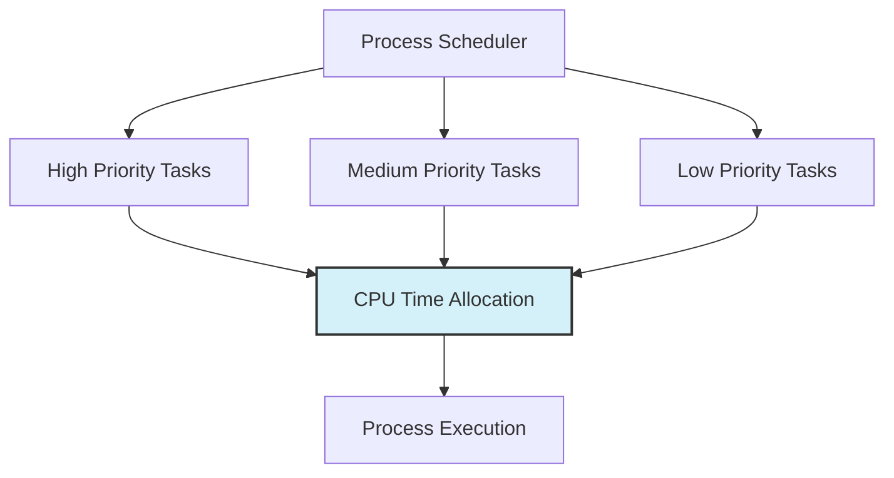
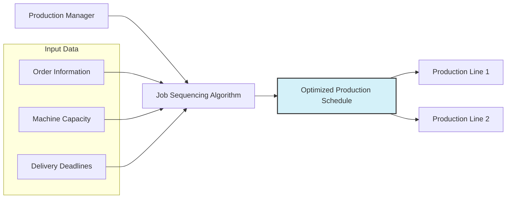
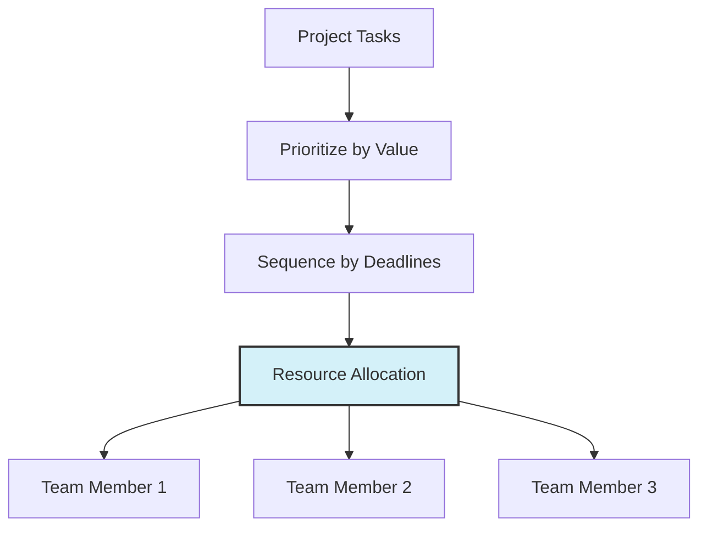
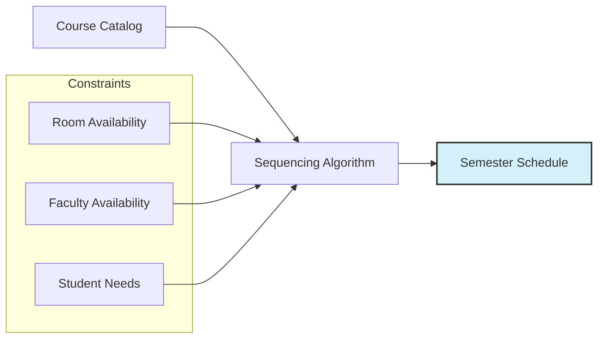

# 🌍 Real-World Applications of Job Sequencing

The Job Sequencing algorithm might seem abstract at first, but it has numerous practical applications across various domains. In this lesson, we'll explore how this algorithm is applied in real-world scenarios.

## Operating Systems: CPU Scheduling ⚙️

Modern operating systems need to efficiently allocate CPU time to different processes and tasks.

### How Job Sequencing Applies:

- **Jobs**: Processes or threads waiting for CPU time
- **Profits**: Priority levels of processes
- **Deadlines**: Maximum wait times before response is required
- **Constraint**: CPU can only execute one process at a time



> [!NOTE]
> In real-time operating systems, meeting deadlines is critical for tasks like controlling machinery or processing sensor data.

## Cloud Computing: Resource Allocation ☁️

Cloud service providers need to allocate computing resources to maximize revenue while meeting service-level agreements.

### How Job Sequencing Applies:

- **Jobs**: Client requests for virtual machines or compute resources
- **Profits**: Revenue from different service tiers
- **Deadlines**: Promised provisioning times in service-level agreements
- **Constraint**: Limited physical servers and resources

<details>
<summary>Example Scenario</summary>

A cloud provider receives these requests:
- Enterprise Client: $500/hour, must be deployed within 4 hours
- Standard Business: $200/hour, must be deployed within 2 hours
- Small Business: $100/hour, must be deployed within 1 hour

With limited resources, the provider would use Job Sequencing to maximize revenue while meeting all deployment deadlines.
</details>

## Manufacturing: Production Scheduling 🏭

Factory floors need to schedule production jobs optimally to maximize output and profits.

### How Job Sequencing Applies:

- **Jobs**: Manufacturing orders
- **Profits**: Revenue or priority of different orders
- **Deadlines**: Delivery dates promised to customers
- **Constraint**: Limited production lines



> [!TIP]
> Modern manufacturing execution systems (MES) often use variations of Job Sequencing to optimize production scheduling in real-time.

## Healthcare: Operating Room Scheduling 🏥

Hospitals need to schedule surgeries and procedures to maximize utilization of operating rooms while accommodating urgent cases.

### How Job Sequencing Applies:

- **Jobs**: Scheduled surgeries or procedures
- **Profits**: Critical nature of the procedure (or actual billing amount)
- **Deadlines**: Patient condition and how soon the procedure needs to be performed
- **Constraint**: Limited number of operating rooms and staff

<details>
<summary>Healthcare Adaptation</summary>

In healthcare, the "profit" is often translated to patient priority or urgency, where:
- Emergency cases get highest priority
- Urgent cases get medium priority
- Elective procedures get lower priority

This ensures that life-threatening conditions are treated first, even if it means rescheduling less urgent procedures.
</details>

## Project Management: Task Allocation 📋

Project managers need to allocate resources to tasks efficiently to maximize project value.

### How Job Sequencing Applies:

- **Jobs**: Project tasks that need to be completed
- **Profits**: Value contribution of each task to the project
- **Deadlines**: Latest completion times for tasks
- **Constraint**: Limited team capacity



> [!WARNING]
> Unlike our simple model, real project management often has to deal with task dependencies, where some tasks cannot start until others are completed.

## Advertising: Ad Slot Allocation 📺

Online advertising platforms need to determine which ads to show to maximize revenue while respecting campaign deadlines.

### How Job Sequencing Applies:

- **Jobs**: Ad campaigns waiting to be displayed
- **Profits**: Revenue from displaying each ad
- **Deadlines**: Campaign end dates
- **Constraint**: Limited ad slots per page or time period

<details>
<summary>Real-World Example: Google AdWords</summary>

Google's ad auction system uses sophisticated algorithms derived from concepts like Job Sequencing to determine:
- Which ads to show
- In what order to display them
- How to balance immediate revenue with long-term advertiser satisfaction

This is a much more complex implementation involving machine learning and prediction models, but the core concept of maximizing value while respecting constraints remains the same.
</details>

## Academic Scheduling: Course Planning 🎓

Universities need to schedule courses across limited classrooms and time slots.

### How Job Sequencing Applies:

- **Jobs**: Courses that need to be scheduled
- **Profits**: Course enrollment or priority
- **Deadlines**: Academic term requirements
- **Constraint**: Limited classrooms and time slots



## Adaptations for Real-World Complexity 🔄

In practice, real-world applications often require adaptations to the basic Job Sequencing algorithm:

### 1. Multiple Resources

Most real-world scenarios involve multiple resources (machines, rooms, staff) rather than a single resource processing one job at a time.

```javascript
// Multi-resource job scheduling
function multiResourceJobScheduling(jobs, resources) {
  // Sort jobs by profit (highest first)
  jobs.sort((a, b) => b.profit - a.profit);
  
  // Initialize resource schedules
  const schedules = Array.from({ length: resources }, () => []);
  
  for (const job of jobs) {
    // Find the resource with the earliest available slot
    // that can still meet the job's deadline
    const resourceIndex = findBestResource(schedules, job);
    
    if (resourceIndex !== -1) {
      schedules[resourceIndex].push(job);
    }
  }
  
  return schedules;
}
```

### 2. Variable Job Durations

Real jobs don't all take the same amount of time:

```javascript
// Job sequencing with variable durations
function jobSequencingWithDurations(jobs) {
  // Sort jobs by profit/duration ratio (highest first)
  jobs.sort((a, b) => (b.profit / b.duration) - (a.profit / a.duration));
  
  // Timeline to track when resources are available
  let currentTime = 0;
  const result = [];
  
  for (const job of jobs) {
    if (currentTime + job.duration <= job.deadline) {
      result.push(job.id);
      currentTime += job.duration;
    }
  }
  
  return result;
}
```

### 3. Dynamic Arrivals

In many real-world scenarios, jobs arrive continuously rather than all being known upfront:

```javascript
// Online job scheduling
class JobScheduler {
  constructor() {
    this.schedule = [];
    this.currentTime = 0;
  }
  
  addJob(job) {
    // Find the best place to insert the new job
    const insertIndex = this.findOptimalPosition(job);
    
    if (insertIndex !== -1) {
      this.schedule.splice(insertIndex, 0, job);
      return true;
    }
    
    return false;  // Couldn't schedule the job
  }
  
  findOptimalPosition(job) {
    // Implementation depends on specific constraints
    // ...
  }
}
```

## Future Trends in Scheduling Algorithms 🚀

Modern applications of job scheduling are seeing several enhancements:

### 1. Machine Learning Integration

Machine learning models can predict:
- Job durations more accurately
- Resource requirements
- Priority adjustments based on historical data

### 2. Real-time Adaptation

Modern scheduling systems can:
- Reoptimize schedules as conditions change
- Respond to disruptions (resource failures, new urgent jobs)
- Proactively adjust to prevent bottlenecks

### 3. Human-in-the-Loop Scheduling

Combining algorithmic efficiency with human judgment:
- Algorithms propose optimal schedules
- Human operators review and can override decisions
- System learns from operator adjustments

> [!TIP]
> When applying job sequencing concepts to real-world problems, start with the basic algorithm as a foundation, then adapt it to address the specific constraints and objectives of your domain.

## Reflection Questions ✨

1. Can you think of other real-world domains where the Job Sequencing algorithm (or a variation of it) might be useful?

2. What additional constraints might you need to consider when adapting the algorithm for a specific application like hospital scheduling?

3. How might you modify the algorithm to handle uncertain or probabilistic deadlines, which are common in real-world scenarios?

In our final lesson, we'll summarize what we've learned about the Job Sequencing algorithm and explore some additional resources for further study. 