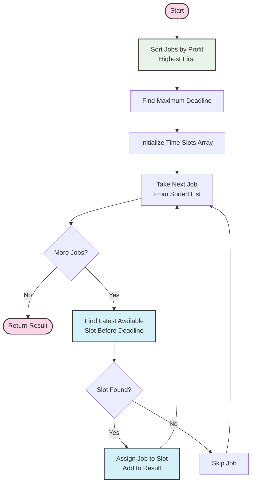

# 🎓 Conclusion: Job Sequencing with Deadlines

Congratulations on completing this comprehensive exploration of the Job Sequencing with Deadlines algorithm! Let's recap what we've learned and discuss where you can go from here.

## Key Takeaways 📝

### 1. Problem Understanding

The Job Sequencing problem challenges us to:
- Schedule jobs to maximize total profit
- Ensure each job is completed before its deadline
- Handle the constraint that only one job can be processed at a time
- Assume each job takes exactly one unit of time to complete

### 2. Greedy Approach

We learned that this problem can be efficiently solved using a greedy approach:
- Sort jobs by profit in decreasing order
- For each job, assign it to the latest available slot before its deadline
- Skip jobs that cannot be scheduled within their deadlines

> [!NOTE]
> The greedy approach works for this specific problem because of its unique constraints. Not all scheduling problems can be solved optimally with greedy algorithms.

### 3. Core Algorithm Steps

Our algorithm involves these key steps:
1. Sort jobs by profit in non-increasing order
2. Find the maximum deadline
3. Initialize time slots and result tracking
4. Assign each job to the latest available slot before its deadline
5. Return the sequence of scheduled jobs

### 4. Implementation Insights

We explored several implementation details:
- Proper sorting to prioritize high-profit jobs
- Handling 0-indexed vs. 1-indexed time slots
- Searching backward from the deadline for available slots
- Handling edge cases like empty input and tie-breaking

### 5. Complexity Analysis

We analyzed the algorithm's efficiency:
- Time Complexity: O(n²) in the worst case
- Space Complexity: O(n)
- Potential optimization to O(n log n) using disjoint set data structures

### 6. Real-World Applications

We discovered how Job Sequencing concepts are applied in various domains:
- Operating Systems: CPU scheduling
- Cloud Computing: Resource allocation
- Manufacturing: Production scheduling
- Healthcare: Operating room management
- Project Management: Task prioritization

## Summary Visualization 🖼️

Here's a visual summary of the Job Sequencing algorithm:

## Common Misunderstandings Clarified ❓

Let's address some common points of confusion:

### "Why not assign jobs to the earliest possible slot?"

Assigning jobs to the latest possible slot before their deadline preserves earlier slots for jobs with tighter deadlines, allowing us to potentially schedule more jobs overall.

### "Does the result array show execution order?"

No, the result array simply lists which jobs were selected for scheduling, not necessarily the order they'll be executed. The actual execution order is determined by the time slots assigned.

### "Can we handle jobs with different durations?"

The basic algorithm assumes all jobs take exactly one unit of time. For variable durations, we would need to adapt the algorithm to track time intervals rather than discrete slots.

## Next Steps for Learning 🚀

### 1. Advanced Variations

Consider exploring these more complex variations:
- Job scheduling with variable processing times
- Preemptive job scheduling (jobs can be interrupted)
- Job scheduling with dependencies
- Multi-resource job scheduling

### 2. Related Algorithms

Deepen your understanding with these related algorithmic concepts:
- Interval Scheduling
- Task Scheduling with Precedence Constraints
- Resource Constrained Project Scheduling
- Online Scheduling Algorithms

### 3. Implementation Practice

To solidify your understanding:
- Implement the optimized version using disjoint sets
- Create a visualization tool for the algorithm
- Apply the algorithm to a real-world problem in your field
- Modify the algorithm to handle additional constraints

## Additional Resources 📚

### Books

- **Introduction to Algorithms** by Cormen, Leiserson, Rivest, and Stein
  - Chapter on Greedy Algorithms covers Job Sequencing
  
- **Algorithm Design** by Kleinberg and Tardos
  - Provides theoretical foundation for greedy algorithms

### Online Courses

- **Algorithms Specialization** on Coursera by Stanford University
- **Algorithmic Toolbox** on Coursera by University of California San Diego

### Video Tutorials

- [Abdul Bari's YouTube Channel](https://www.youtube.com/watch?v=zPtI8q9gvX8) - Excellent visualizations of algorithms
- [MIT OpenCourseWare](https://ocw.mit.edu/courses/electrical-engineering-and-computer-science/6-046j-design-and-analysis-of-algorithms-spring-2015/) - Deep dive into algorithm design

### Practice Platforms

- [LeetCode](https://leetcode.com/) - Search for problems related to job scheduling
- [HackerRank](https://www.hackerrank.com/) - Greedy algorithms practice
- [CodeForces](https://codeforces.com/) - Competitive programming with algorithmic challenges

## Final Thoughts ✨

The Job Sequencing with Deadlines algorithm demonstrates how a relatively simple greedy approach can solve complex scheduling problems optimally under certain constraints. The concepts you've learned here extend far beyond this specific algorithm.

Remember these key principles:
- Understand the problem thoroughly before attempting to solve it
- Consider whether a greedy approach is appropriate for your problem
- Pay attention to edge cases and implementation details
- Always analyze the time and space complexity
- Look for opportunities to optimize your solution

As you encounter scheduling problems in the real world, you now have a powerful tool in your algorithmic toolkit. The insights gained from studying this algorithm will serve you well in tackling similar optimization challenges.

> [!TIP]
> The best way to solidify your understanding is to teach it to someone else. Try explaining the Job Sequencing algorithm to a colleague or friend!

Keep exploring, keep learning, and keep developing your algorithmic thinking skills! 