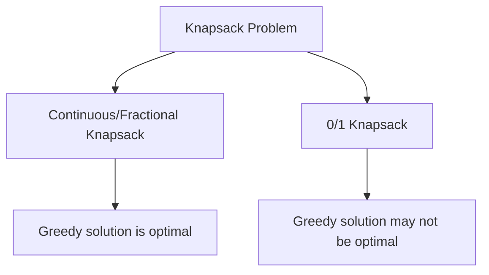

# 🏃‍♂️ Exploring Greedy Approaches

Before diving into the optimal solution, let's explore some intuitive approaches and understand why they might not always work for the 0/1 Knapsack problem.

## What is a Greedy Approach? 🤲

A greedy algorithm makes the locally optimal choice at each step, hoping to find the global optimum. It's like climbing a mountain by always going up the steepest path available, which may not always lead to the highest peak.

## Three Common Greedy Strategies 📊

Let's consider three greedy strategies for our knapsack problem:

### 1. Select items with the highest value first 💎

**Strategy**: Sort items by value in descending order and add them to the knapsack as long as they fit.

#### Example Analysis:

```
Items:
- Item 0: Weight = 8, Value = 50
- Item 1: Weight = 2, Value = 150
- Item 2: Weight = 6, Value = 210
- Item 3: Weight = 1, Value = 30

Knapsack capacity: 10
```

Sorted by value:
1. Item 2 (Value 210, Weight 6)
2. Item 1 (Value 150, Weight 2)
3. Item 0 (Value 50, Weight 8)
4. Item 3 (Value 30, Weight 1)

Greedy selection:
- Add Item 2: Weight 6, Value 210
- Add Item 1: Total weight 8, Total value 360
- Can't add Item 0 (exceeds capacity)
- Add Item 3: Total weight 9, Total value 390

In this example, the highest-value-first approach gives us the optimal solution of 390.

> [!WARNING]
> However, this approach doesn't always work! Consider this counter-example:

```
Items:
- Item 0: Weight = 1, Value = 10
- Item 1: Weight = 4, Value = 15
- Item 2: Weight = 5, Value = 25

Knapsack capacity: 5
```

Greedy selection by value:
- Add Item 2: Weight 5, Value 25 (Full capacity)
- Total value: 25

Optimal solution:
- Add Item 0 and Item 1: Weight 1 + 4 = 5, Value 10 + 15 = 25
- Total value: 25

In this case, both give the same result, but what if we change Item 0's value slightly?

```
Items:
- Item 0: Weight = 1, Value = 11
- Item 1: Weight = 4, Value = 15
- Item 2: Weight = 5, Value = 25

Knapsack capacity: 5
```

Greedy selection by value:
- Add Item 2: Weight 5, Value 25 (Full capacity)
- Total value: 25

Optimal solution:
- Add Item 0 and Item 1: Weight 1 + 4 = 5, Value 11 + 15 = 26
- Total value: 26

The greedy approach misses the optimal solution!

### 2. Select items with lowest weight first 🪶

**Strategy**: Sort items by weight in ascending order and add them to the knapsack as long as they fit.

Using our counter-example:

```
Items:
- Item 0: Weight = 1, Value = 11
- Item 1: Weight = 4, Value = 15
- Item 2: Weight = 5, Value = 25

Knapsack capacity: 5
```

Sorted by weight:
1. Item 0 (Weight 1, Value 11)
2. Item 1 (Weight 4, Value 15)
3. Item 2 (Weight 5, Value 25)

Greedy selection:
- Add Item 0: Weight 1, Value 11
- Add Item 1: Total weight 5, Total value 26
- Can't add Item 2 (exceeds capacity)
- Total value: 26

This matches the optimal solution for this specific example, but it's not always correct.

### 3. Select items with highest value-to-weight ratio first 📈

**Strategy**: Sort items by value/weight ratio in descending order and add them to the knapsack as long as they fit.

```
Items:
- Item 0: Weight = 1, Value = 11, Ratio = 11
- Item 1: Weight = 4, Value = 15, Ratio = 3.75
- Item 2: Weight = 5, Value = 25, Ratio = 5

Knapsack capacity: 5
```

Sorted by value-to-weight ratio:
1. Item 0 (Ratio 11)
2. Item 2 (Ratio 5)
3. Item 1 (Ratio 3.75)

Greedy selection:
- Add Item 0: Weight 1, Value 11
- Add Item 2: Total weight 6 (exceeds capacity)
- Add Item 1: Total weight 5, Total value 26
- Total value: 26

This also gives us the optimal solution for this example.

## Why Greedy Doesn't Always Work 🤷‍♂️



While greedy approaches can sometimes find the optimal solution by chance, they cannot guarantee optimality for the 0/1 Knapsack problem. Here's why:

1. **No Second Chances**: Greedy algorithms make irrevocable decisions without considering the future impact.
2. **Local vs. Global Optimization**: What's best now might not lead to the best overall solution.
3. **Combinatorial Nature**: The 0/1 Knapsack problem requires considering different combinations of items, not just individual items.

> [!NOTE]
> Interestingly, for the *Fractional Knapsack* problem (where you can take fractions of items), a greedy approach using the value-to-weight ratio *does* always yield the optimal solution.

## Think About It 🧠

1. Can you create your own example where none of the three greedy approaches find the optimal solution?
2. What characteristics make a problem suitable for greedy algorithms?
3. Why does the fractional knapsack problem work with greedy approaches while the 0/1 knapsack problem doesn't?

In the next lesson, we'll explore how to approach the 0/1 Knapsack problem using a more systematic method: **dynamic programming**. 