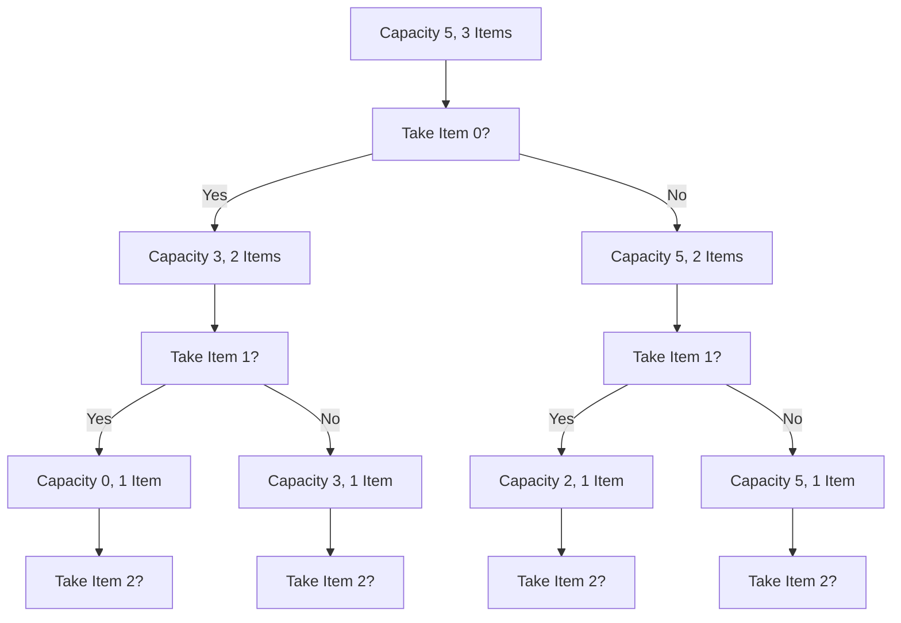

# 🧩 Understanding Dynamic Programming

Now that we've seen why greedy approaches don't consistently yield optimal solutions for the 0/1 Knapsack problem, let's introduce a more reliable technique: **Dynamic Programming (DP)**.

## What is Dynamic Programming? 🤔

Dynamic Programming is a method for solving complex problems by breaking them down into simpler subproblems. It's based on two key principles:

1. **Optimal Substructure**: The optimal solution to the problem can be constructed from optimal solutions of its subproblems.
2. **Overlapping Subproblems**: The same subproblems are solved multiple times, so we can store their solutions to avoid redundant calculations.

> [!TIP]
> Think of dynamic programming as "remembering to avoid repeating." We solve each subproblem once and store its solution in a table (often called "memoization").

## Why DP is Perfect for the Knapsack Problem 👌

The 0/1 Knapsack problem exhibits both optimal substructure and overlapping subproblems:

- **Optimal Substructure**: The best solution for capacity W with n items can be built from the best solutions for smaller capacities and fewer items.
- **Overlapping Subproblems**: When exploring different combinations, we frequently encounter the same subproblems (e.g., "What's the best value for capacity 3 with the first 2 items?").

## Key Insight: The Decision Tree 🌳

For each item, we have exactly two choices:
1. **Take the item** (if it fits in our remaining capacity)
2. **Leave the item** (don't put it in the knapsack)

We can visualize this as a decision tree:



The problem with a naive recursive approach is that we would end up solving the same subproblems multiple times, leading to exponential time complexity of O(2^n).

## The DP Solution Framework 🏗️

In dynamic programming, we'll use a table to store solutions to subproblems. Let's define our subproblem:

> **DP[i][w]** = Maximum value that can be obtained using the first i items and with a knapsack capacity of w.

Our goal is to find **DP[n][W]**, where n is the number of items and W is the knapsack capacity.

## The Recurrence Relation 📝

The key to solving any DP problem is defining how solutions to larger problems relate to solutions of smaller ones. For the 0/1 Knapsack, we have:

For each item i and capacity w, we have two choices:
1. **Don't take item i**: The value remains DP[i-1][w]
2. **Take item i** (if it fits): The value becomes values[i-1] + DP[i-1][w-weights[i-1]]

We take the maximum of these two options:

```
DP[i][w] = max(DP[i-1][w], values[i-1] + DP[i-1][w-weights[i-1]]) if weights[i-1] <= w
DP[i][w] = DP[i-1][w] otherwise
```

## Base Cases 🧱

We need to define what happens when:
- We have 0 items: DP[0][w] = 0 for all w (no items means no value)
- We have 0 capacity: DP[i][0] = 0 for all i (no capacity means no value)

## Visualization of the DP Table 📊

Here's how we would build the DP table for our example:

```
Items:
- Item 0: Weight = 2, Value = 3
- Item 1: Weight = 3, Value = 4
- Item 2: Weight = 4, Value = 5
- Item 3: Weight = 5, Value = 6

Knapsack capacity: 5
```

<details>
<summary>View the DP table construction</summary>

```
DP Table:
       Capacity (w)
       0  1  2  3  4  5
Items 0  0  0  0  0  0  0
(i)   1  0  0  3  3  3  3
      2  0  0  3  4  7  7
      3  0  0  3  4  7  7
      4  0  0  3  4  7  9
```

Here's how we fill the table:
1. Row 0 (0 items): All values are 0
2. Row 1 (Item 0): For w=2,3,4,5, we can fit Item 0, so value is 3
3. Row 2 (Item 1): For w=3, we take Item 1; for w=4,5, we take both Items 0 and 1
4. And so on...

The final answer is in the bottom-right corner: 9.
Wait, that's not 7 as we expected. Let me trace through the calculations again...

Actually, the expected answer for this example is 7, not 9. Let me recalculate:

```
DP Table (corrected):
       Capacity (w)
       0  1  2  3  4  5
Items 0  0  0  0  0  0  0
(i)   1  0  0  3  3  3  3
      2  0  0  3  4  4  7
      3  0  0  3  4  5  7
      4  0  0  3  4  5  7
```

The answer is 7, which matches our expectation.
</details>

## Think About It 🧠

1. How does the DP approach guarantee finding the optimal solution, unlike the greedy approach?
2. Can you trace through the DP approach manually for the second example we saw in Lesson 1?
3. What would happen if we had items with the same weights but different values?

In the next lesson, we'll implement the dynamic programming solution with a bottom-up (tabulation) approach and walk through it step by step. 