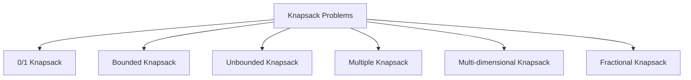

# 🔄 Knapsack Variations and Related Problems

The 0/1 Knapsack problem we've been studying is just one of many variations in the Knapsack family. In this lesson, we'll explore different variations of the problem and how our solution can be adapted to solve them.

## The Knapsack Family 👪



### 1. Bounded Knapsack Problem 🔢

In the Bounded Knapsack problem, each item can be taken a limited number of times (not just once).

- **Problem**: Given weights, values, and a maximum number of copies for each item, maximize the value without exceeding capacity.
- **Adaptation**: We can adapt our DP approach by considering each copy as a separate item, or more efficiently, by adding a third loop for the number of copies.

```javascript
function boundedKnapsack(weights, values, counts, capacity) {
  const n = weights.length;
  const dp = Array(capacity + 1).fill(0);
  
  for (let i = 0; i < n; i++) {
    for (let w = capacity; w >= weights[i]; w--) {
      for (let k = 1; k <= counts[i] && k * weights[i] <= w; k++) {
        dp[w] = Math.max(dp[w], dp[w - k * weights[i]] + k * values[i]);
      }
    }
  }
  
  return dp[capacity];
}
```

### 2. Unbounded Knapsack Problem ♾️

In the Unbounded Knapsack problem, each item can be taken any number of times.

- **Problem**: Given weights and values, maximize the value without exceeding capacity. You can use each item any number of times.
- **Adaptation**: Simplify to a 1D DP, but iterate from left to right to allow reusing items.

```javascript
function unboundedKnapsack(weights, values, capacity) {
  const n = weights.length;
  const dp = Array(capacity + 1).fill(0);
  
  for (let w = 1; w <= capacity; w++) {
    for (let i = 0; i < n; i++) {
      if (weights[i] <= w) {
        dp[w] = Math.max(dp[w], dp[w - weights[i]] + values[i]);
      }
    }
  }
  
  return dp[capacity];
}
```

> [!TIP]
> Notice the key difference: In the 0/1 Knapsack, we iterate w from right to left to ensure each item is used at most once. In Unbounded Knapsack, we iterate from left to right to allow reusing items.

### 3. Multiple Knapsack Problem 🎒🎒

The Multiple Knapsack problem involves multiple knapsacks with different capacities.

- **Problem**: Given n items and m knapsacks with capacities W₁, W₂, ..., Wₘ, find the maximum value that can be achieved by filling these knapsacks.
- **Adaptation**: This is significantly more complex and typically requires advanced techniques like branch and bound or more complex DP formulations.

### 4. Multi-dimensional Knapsack Problem 📊

The Multi-dimensional Knapsack problem has multiple constraints (not just weight).

- **Problem**: In addition to weight, items might have other constraints like volume, and the knapsack has limits on both.
- **Adaptation**: The DP table expands to multiple dimensions to handle each constraint.

### 5. Fractional Knapsack Problem ✂️

The Fractional Knapsack allows taking fractions of items.

- **Problem**: Items can be divided, so you can take any fraction of an item.
- **Solution**: This actually doesn't require DP! A greedy approach using value-to-weight ratio is optimal.

```javascript
function fractionalKnapsack(weights, values, capacity) {
  const n = weights.length;
  const items = [];
  
  // Calculate value-to-weight ratio
  for (let i = 0; i < n; i++) {
    items.push({
      weight: weights[i],
      value: values[i],
      ratio: values[i] / weights[i]
    });
  }
  
  // Sort by ratio in descending order
  items.sort((a, b) => b.ratio - a.ratio);
  
  let totalValue = 0;
  let remainingCapacity = capacity;
  
  for (let i = 0; i < n; i++) {
    if (remainingCapacity >= items[i].weight) {
      // Take the whole item
      totalValue += items[i].value;
      remainingCapacity -= items[i].weight;
    } else {
      // Take a fraction of the item
      totalValue += items[i].ratio * remainingCapacity;
      break; // Knapsack is full
    }
  }
  
  return totalValue;
}
```

## Related Problems 🔗

Many classic problems are variations or applications of the Knapsack concept:

### 1. Subset Sum Problem

- **Problem**: Given a set of numbers, is there a subset that sums exactly to a target value?
- **Relationship**: It's a special case of 0/1 Knapsack where each item's value equals its weight, and we're looking for a specific sum rather than a maximum.

```javascript
function subsetSum(nums, target) {
  const dp = Array(target + 1).fill(false);
  dp[0] = true; // Empty subset sums to 0
  
  for (const num of nums) {
    for (let i = target; i >= num; i--) {
      dp[i] = dp[i] || dp[i - num];
    }
  }
  
  return dp[target];
}
```

### 2. Partition Equal Subset Sum

- **Problem**: Can the array be divided into two subsets with equal sum?
- **Relationship**: It's a subset sum problem where the target is half the total sum.

```javascript
function canPartition(nums) {
  const sum = nums.reduce((a, b) => a + b, 0);
  
  // If sum is odd, can't divide equally
  if (sum % 2 !== 0) return false;
  
  const target = sum / 2;
  return subsetSum(nums, target);
}
```

### 3. Coin Change Problem

- **Problem**: Given coins of different denominations and a total amount, find the minimum number of coins needed to make that amount.
- **Relationship**: It's similar to Unbounded Knapsack, but we're minimizing the number of items rather than maximizing value.

```javascript
function coinChange(coins, amount) {
  const dp = Array(amount + 1).fill(Infinity);
  dp[0] = 0;
  
  for (let i = 1; i <= amount; i++) {
    for (const coin of coins) {
      if (i >= coin) {
        dp[i] = Math.min(dp[i], dp[i - coin] + 1);
      }
    }
  }
  
  return dp[amount] === Infinity ? -1 : dp[amount];
}
```

### 4. Rod Cutting Problem

- **Problem**: Given a rod of length n and an array of prices for different lengths, find the maximum value obtainable by cutting the rod.
- **Relationship**: It's essentially an Unbounded Knapsack where the capacity is the rod length.

## Optimization Techniques for Knapsack Problems 🚀

### 1. Branch and Bound

For large-scale Knapsack problems, branch and bound techniques can be more efficient than pure DP, especially if good bounds can be established.

### 2. Approximation Algorithms

For very large instances, approximation algorithms can provide near-optimal solutions in polynomial time.

### 3. Preprocessing and Special Cases

- **Preprocessing**: Sorting items, discarding items that don't fit, etc.
- **Dominance Relations**: If item A is both lighter and more valuable than item B, we can always prefer A.

## Think About It 🧠

1. How would the solution change if the knapsack had to be filled to exactly capacity W, not just at most W?
2. Can you think of a real-world scenario that could be modeled as a Multiple Knapsack problem?
3. Why is the greedy approach optimal for Fractional Knapsack but not for 0/1 Knapsack?

In the next lesson, we'll discuss practical applications and implementations of the Knapsack problem in various domains. 