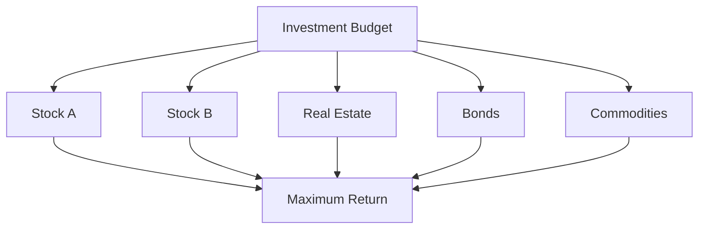

# 🌎 Knapsack in the Real World

The 0/1 Knapsack problem isn't just a theoretical exercise—it has numerous practical applications across various domains. In this lesson, we'll explore how this algorithm is used to solve real-world problems.

## Finance and Investment 💰

### Portfolio Optimization

Investment portfolio management is a classic application of the Knapsack problem.

- **Weights**: Investment amounts or allocations
- **Values**: Expected returns or risk-adjusted returns
- **Capacity**: Total investment budget
- **Goal**: Maximize returns while staying within budget constraints



### Capital Budgeting

Companies often need to decide which projects to fund with limited capital.

- **Weights**: Project costs
- **Values**: Expected net present value (NPV)
- **Capacity**: Available capital
- **Goal**: Maximize total NPV while staying within the budget

> [!NOTE]
> In practice, these problems often have additional constraints, making them more complex variations of the basic Knapsack problem.

## Resource Allocation 📊

### Computing Resources

In cloud computing and server management, resources need to be allocated efficiently.

- **Weights**: CPU, memory, or storage requirements
- **Values**: Priority or business value of tasks
- **Capacity**: Available server resources
- **Goal**: Maximize value of executed tasks without exceeding resource limits

### Manufacturing Planning

Manufacturers must decide which products to make with limited resources.

- **Weights**: Resource consumption (machine time, raw materials)
- **Values**: Profit margins
- **Capacity**: Available production capacity
- **Goal**: Maximize profit while respecting resource constraints

## Logistics and Transportation 🚚

### Cargo Loading

The original "knapsack" metaphor directly applies to cargo loading problems.

- **Weights**: Weight or volume of cargo items
- **Values**: Importance, priority, or value of cargo
- **Capacity**: Weight or volume capacity of the vehicle
- **Goal**: Maximize cargo value while staying within vehicle capacity

<details>
<summary>Example: A Delivery Truck Problem</summary>

```javascript
const items = [
  { id: "Electronics", weight: 10, value: 200 },
  { id: "Furniture", weight: 20, value: 300 },
  { id: "Books", weight: 5, value: 100 },
  { id: "Food", weight: 15, value: 250 },
  { id: "Clothing", weight: 8, value: 150 }
];

const truckCapacity = 30;

// Using our knapsack algorithm
const result = knapsack01WithItems(
  items.map(item => item.weight),
  items.map(item => item.value),
  truckCapacity
);

console.log(`Maximum value: $${result.maxValue}`);
console.log("Items to load:");
result.selectedItems.forEach(index => {
  console.log(`- ${items[index].id}: ${items[index].weight}kg, $${items[index].value}`);
});
```

Output:
```
Maximum value: $550
Items to load:
- Electronics: 10kg, $200
- Books: 5kg, $100
- Food: 15kg, $250
```
</details>

### Trip Planning

Travel itineraries often involve selecting activities with time constraints.

- **Weights**: Time required for activities
- **Values**: Enjoyment or significance of activities
- **Capacity**: Available time
- **Goal**: Maximize enjoyment while fitting within the available time

## Healthcare 🏥

### Medical Treatment Selection

With limited resources, healthcare providers must prioritize treatments.

- **Weights**: Resource consumption (staff time, equipment usage)
- **Values**: Patient benefit
- **Capacity**: Available resources
- **Goal**: Maximize patient outcomes with limited resources

### Organ Transplant Matching

Matching organ donors to recipients with complex constraints.

- **Weights**: Compatibility factors
- **Values**: Expected success rate or life extension
- **Capacity**: Available donors
- **Goal**: Maximize successful transplants and patient outcomes

## Technology 💻

### Feature Selection in Software Development

Product managers need to decide which features to include in a release.

- **Weights**: Development time or effort
- **Values**: Business value or customer satisfaction
- **Capacity**: Available development time
- **Goal**: Maximize product value while meeting release deadlines

### Data Compression

Certain data compression techniques use Knapsack-like algorithms.

- **Weights**: Space required for data elements
- **Values**: Importance of data elements
- **Capacity**: Target compressed size
- **Goal**: Maximize important information while meeting size constraints

## Curriculum Design 📚

### Course Selection

Students selecting courses with credit hour limitations.

- **Weights**: Credit hours or time commitments
- **Values**: Interest level, grade potential, or career relevance
- **Capacity**: Maximum credit hours allowed
- **Goal**: Maximize educational value within credit hour limits

## Energy Management 🔋

### Renewable Energy Scheduling

Optimal scheduling of energy production and consumption.

- **Weights**: Energy consumption
- **Values**: Utility or importance of energy-consuming tasks
- **Capacity**: Available energy
- **Goal**: Maximize utility while staying within energy budget

## Implementing for Real-World Problems 🛠️

When adapting the Knapsack algorithm for real-world use, several considerations are important:

### 1. Multiple Constraints

Real-world problems often have multiple constraints beyond just one "weight" dimension.

- **Approach**: Use multi-dimensional Knapsack variants or alternative methods like linear programming.

### 2. Dynamic Values and Weights

In some applications, values and weights may change over time.

- **Approach**: Periodically re-run the algorithm or use online algorithms that can adapt to changes.

### 3. Uncertainty

Real-world inputs often involve uncertainty or randomness.

- **Approach**: Use stochastic programming or robust optimization techniques.

### 4. Scale

Real problems might involve thousands or millions of items.

- **Approach**: Use approximation algorithms, heuristics, or specialized solvers.

## Performance Considerations 📈

For large-scale applications:

1. **Preprocessing**: Sort items by value-to-weight ratio for better branching heuristics
2. **Approximation**: Use approximation algorithms for very large instances
3. **Parallel Processing**: Divide the problem for parallel computation
4. **Specialized Libraries**: Use specialized optimization libraries for industrial applications

## Think About It 🧠

1. Can you identify a Knapsack-like problem in your daily life or work?
2. How would you adapt the algorithm for a problem with uncertain weights (where the exact weight is not known in advance)?
3. In what scenarios might a greedy approach be "good enough" for a Knapsack-like problem, even if it doesn't guarantee optimality?

In our final lesson, we'll summarize what we've learned about the 0/1 Knapsack problem and provide tips for mastering this important algorithm. 