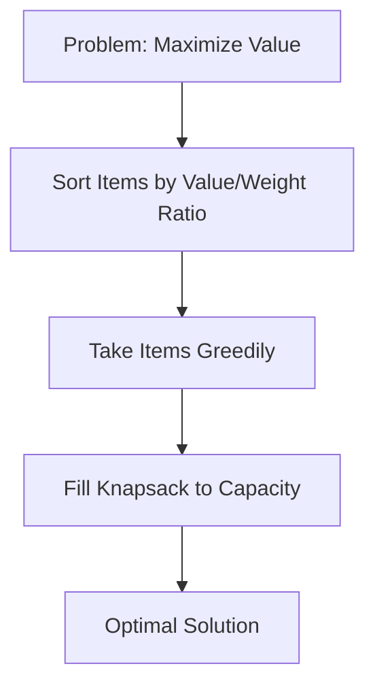

# The Fractional Knapsack Problem 🎒

> [!NOTE]
> In this lesson, we'll learn about the Fractional Knapsack Problem, a classic optimization problem that serves as an excellent introduction to greedy algorithms.

## What is the Fractional Knapsack Problem? 🤔

Imagine you're a treasure hunter who has discovered a cache of valuable items. Each item has two properties:
- A **weight** (how heavy it is)
- A **value** (how much it's worth)

However, you have a limited-capacity knapsack that can only hold a certain maximum weight. The challenge? Fill your knapsack to maximize the total value of items you take.

**The key twist:** Unlike the classic 0-1 Knapsack problem (where you must take an item completely or leave it), in the **Fractional Knapsack** problem, you can take fractions of items. 

Think of the items as gold dust, liquid medicines, or grain - divisible resources where taking a portion is perfectly valid!

## Real-World Applications 🌎

> [!TIP]
> Understanding the Fractional Knapsack problem helps solve many practical resource allocation challenges!

- **Investment portfolio optimization** - allocating limited funds across different investments
- **Manufacturing resource planning** - deciding how much of each product to make with limited materials
- **Cargo loading** - filling shipping containers with divisible goods
- **Time management** - allocating limited time across various tasks
- **Budget allocation** - distributing limited funds across departments or projects

## Mathematical Formulation ✏️

Given:
- `n` items with weights `w₁, w₂, ..., wₙ`
- Values `v₁, v₂, ..., vₙ`
- Knapsack capacity `W`

The goal is to:
- Choose fractions `f₁, f₂, ..., fₙ` (where `0 ≤ fᵢ ≤ 1`)
- Maximize `∑(fᵢ × vᵢ)` for all `i` from `1` to `n`
- Subject to the constraint `∑(fᵢ × wᵢ) ≤ W`

## An Intuitive Example 💡

Let's say you have three items:

| Item | Weight | Value | Value/Weight Ratio |
|------|--------|-------|-------------------|
| A    | 10 kg  | $60   | $6/kg             |
| B    | 20 kg  | $100  | $5/kg             |
| C    | 30 kg  | $120  | $4/kg             |

With a knapsack capacity of 50 kg, how would you maximize value?

Think about it before revealing the answer!

To maximize value, we take items in order of their value-to-weight ratio:
1. Take all of item A (10 kg, $60)
2. Take all of item B (20 kg, $100)
3. Take 20/30 (or 2/3) of item C (20 kg, $80)

Total: 50 kg with value $240

## Let's Think Critically 🧠

> [!TIP]
> Understanding why a particular approach works is as important as knowing how to implement it!

Ask yourself:
1. Why does taking items in order of value-to-weight ratio lead to the optimal solution?
2. How would your strategy change if you couldn't take fractions of items?
3. What's the intuition behind always preferring items with higher value-to-weight ratios?

In the next lesson, we'll explore the greedy approach that solves this problem efficiently!

