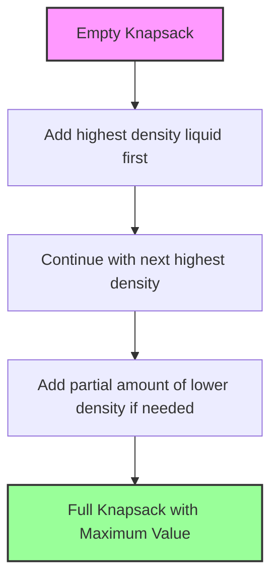

# The Greedy Approach 🧠

> [!NOTE]
> In this lesson, we'll explore why a greedy approach works perfectly for the Fractional Knapsack problem and how it guarantees an optimal solution.

## Why Greedy Works Here ✅

Unlike many optimization problems where greedy strategies fail to find the optimal solution, the Fractional Knapsack problem can be solved optimally using a greedy approach!

> [!TIP]
> The key insight: **Always choose the item with the highest value-to-weight ratio first**.

This works because:
1. We can take fractions of items
2. Each item has a constant "value density" (value per unit weight)
3. Taking the most valuable items per unit weight first will always lead to maximum total value

## The Greedy Strategy 📝

Here's the strategy in simple terms:

1. Calculate the value-to-weight ratio for each item
2. Sort all items by their value-to-weight ratio (in descending order)
3. Start taking items from highest ratio to lowest:
   - If the entire item fits, take all of it
   - If only a fraction fits, take that fraction and stop (knapsack is full)

## Visual Explanation 👁️

Imagine your knapsack as an empty container and each item as a liquid with different "value densities":

## Proving It's Optimal 🔍

> [!NOTE]
> Understanding why this approach is optimal helps build intuition for algorithm design.

Let's prove that this greedy approach is optimal:

1. Assume we have two items with value-to-weight ratios r₁ > r₂
2. If we take x weight of item 2, the value gained is x × r₂
3. If we replace it with x weight of item 1, the value would be x × r₁
4. Since r₁ > r₂, we get more value by choosing item 1 first
5. This holds true for any pair of items, so selecting in descending order of ratios is optimal

## An Example Walkthrough 🚶‍♂️

Let's revisit our example with three items:

| Item | Weight | Value | Value/Weight Ratio |
|------|--------|-------|-------------------|
| A    | 10 kg  | $60   | $6/kg             |
| B    | 20 kg  | $100  | $5/kg             |
| C    | 30 kg  | $120  | $4/kg             |

With a 50 kg knapsack:

Greedy approach step by step

1. **Sort by ratio**: A ($6/kg), B ($5/kg), C ($4/kg)
2. **Take item A**: 10 kg used, 40 kg remaining, $60 value
3. **Take item B**: 30 kg used, 20 kg remaining, $160 value
4. **Take fraction of C**: 50 kg used, 0 kg remaining, $240 value
   - We can take 20/30 = 2/3 of item C
   - This gives us 2/3 × $120 = $80 additional value

## Edge Cases to Consider ⚠️

> [!WARNING]
> Always think about edge cases when implementing algorithms!

- **Empty input**: If there are no items, the maximum value is 0
- **Zero capacity**: If the knapsack capacity is 0, the maximum value is 0
- **Zero weights**: Items with zero weight have infinite value-to-weight ratio (handle with care!)
- **Items larger than capacity**: The algorithm still works - we'll take the appropriate fraction

## Why Not Dynamic Programming? 🤔

For the **0-1 Knapsack** problem (where you can't take fractions), a greedy approach doesn't work, and we need dynamic programming.

For **Fractional Knapsack**, however:
- Greedy is simpler to implement
- Greedy runs faster (O(n log n) vs O(n × W) for dynamic programming)
- Greedy is guaranteed to find the optimal solution

Think about why these two similar problems require different approaches!

## Key Takeaways 🔑

1. The Fractional Knapsack problem can be solved optimally using a greedy approach
2. Always choose items in descending order of value-to-weight ratio
3. This algorithm runs in O(n log n) time due to the sorting step
4. Greedy works here because we can take fractions of items

In the next lesson, we'll implement this algorithm in code! 