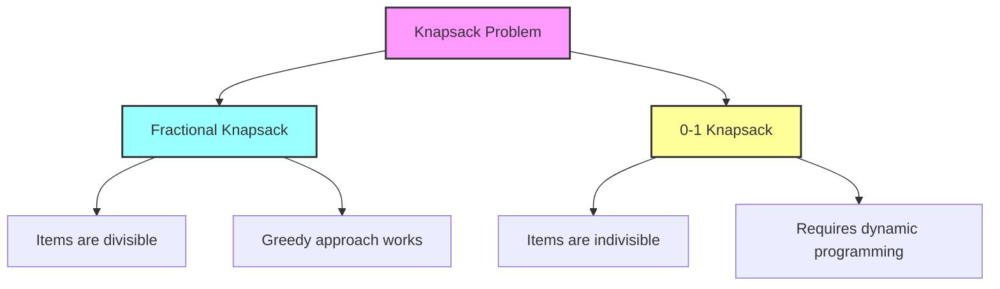

# Fractional vs 0-1 Knapsack Problems 🔄

> [!NOTE]
> In this lesson, we'll compare the Fractional Knapsack problem with its cousin, the 0-1 Knapsack problem, highlighting their differences and when to use each approach.

## Two Variations of the Same Problem 👯‍♂️

While both problems involve maximizing value within a weight constraint, they differ in one critical aspect:

| Fractional Knapsack | 0-1 Knapsack |
|---------------------|--------------|
| Items can be broken into fractions | Items must be taken entirely or left behind |
| Solved optimally using greedy approach | Requires dynamic programming for optimal solution |
| O(n log n) time complexity | O(n × W) time complexity |
| Continuous solution space | Discrete solution space |

## Visual Comparison 👁️



## Same Example, Different Approaches 📊

Let's revisit our example with three items, but solve it using both approaches:

| Item | Weight | Value | Value/Weight Ratio |
|------|--------|-------|-------------------|
| A    | 10 kg  | $60   | $6/kg             |
| B    | 20 kg  | $100  | $5/kg             |
| C    | 30 kg  | $120  | $4/kg             |

With a knapsack capacity of 50 kg:

<details>
<summary>Fractional Knapsack Solution</summary>

1. Take item A: 10 kg, $60
2. Take item B: 20 kg, $100
3. Take 2/3 of item C: 20 kg, $80
4. Total: 50 kg, $240
</details>

<details>
<summary>0-1 Knapsack Solution</summary>

We can't take fractions, so we must decide whether to include or exclude each item.

The optimal solution:
1. Take item A: 10 kg, $60
2. Take item B: 20 kg, $100
3. We can't take item C entirely (30 kg), and we can't take a fraction
4. Total: 30 kg, $160
</details>

Notice the significant difference in total value!

## Why Greedy Fails for 0-1 Knapsack ⚠️

> [!WARNING]
> Understanding when greedy algorithms fail is as important as knowing when they work!

For the 0-1 Knapsack problem, a greedy approach doesn't guarantee an optimal solution. Consider this example:

| Item | Weight | Value | Value/Weight Ratio |
|------|--------|-------|-------------------|
| A    | 10 kg  | $60   | $6/kg             |
| B    | 50 kg  | $280  | $5.6/kg           |
| C    | 30 kg  | $160  | $5.3/kg           |

With a 50 kg capacity:

- **Greedy would choose:** Item A (10 kg, $60) and then can't fit item B
- **Optimal solution:** Item B alone (50 kg, $280)

This happens because, without fractions, we need to consider all possible combinations of items.

## Algorithmic Approaches 🧩

### Fractional Knapsack: Greedy Algorithm

```javascript
// Sort by value/weight ratio (descending)
// Take items in that order, using fractions when needed
```

### 0-1 Knapsack: Dynamic Programming

```javascript
// Create a 2D array dp[i][w] representing the maximum value
// with first i items and capacity w
// Fill using recurrence relation:
// dp[i][w] = max(dp[i-1][w], dp[i-1][w-weights[i-1]] + values[i-1])
```

## Real-World Applications: When to Use Each 🌎

> [!TIP]
> Choosing the right algorithm depends on the nature of your items!

### Fractional Knapsack Use Cases:
- Budget allocation across departments
- Resource allocation for continuous resources
- Investment portfolio optimization
- Time allocation across tasks
- Liquid or divisible materials

### 0-1 Knapsack Use Cases:
- Cargo loading with indivisible packages
- Project selection with fixed costs
- Inventory packing with discrete items
- Course selection with fixed credit hours
- Manufacturing where partial products aren't valuable

## Time Complexity Comparison ⏱️

- **Fractional Knapsack**:
  - Time Complexity: O(n log n) - dominated by sorting
  - Space Complexity: O(n)

- **0-1 Knapsack**:
  - Time Complexity: O(n × W) - where W is the knapsack capacity
  - Space Complexity: O(n × W)

The 0-1 Knapsack is **pseudo-polynomial** in time - its complexity depends on the numeric value of the input (W), not just its size (n).

## Key Takeaways 🔑

1. Fractional Knapsack allows taking fractions of items, 0-1 Knapsack doesn't
2. Fractional Knapsack can be solved optimally with a greedy approach
3. 0-1 Knapsack requires dynamic programming for an optimal solution
4. The choice between algorithms depends on whether your items are divisible
5. Fractional Knapsack is generally more efficient in terms of time complexity

## Think Critically 🧠

Ask yourself:
1. Can you think of a real-world scenario where you need to decide between these two approaches?
2. What happens if some items are divisible and others aren't?
3. How would you approach a variation where each item can be taken at most k times?

In the next lesson, we'll explore common applications and variations of the Knapsack problem! 