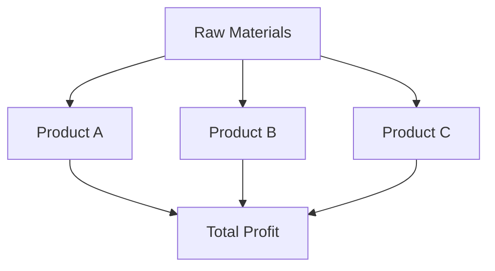
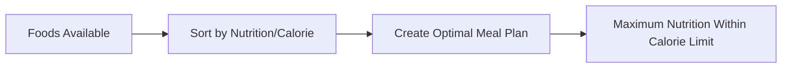

# Real-World Applications of Fractional Knapsack 🌍

> [!NOTE]
> In this lesson, we'll explore how the Fractional Knapsack algorithm is applied in various real-world scenarios, demonstrating its practical value beyond theoretical understanding.

## Beyond the Algorithm: Practical Applications 🔍

The beauty of the Fractional Knapsack algorithm lies in its practical utility across various domains. Let's explore how this algorithm helps solve real-world problems:

## 1. Investment Portfolio Optimization 💼

Investment managers must allocate limited capital across multiple investment opportunities to maximize returns.

**Problem Mapping:**
- **Items**: Investment opportunities (stocks, bonds, real estate)
- **Weights**: Capital required for each investment
- **Values**: Expected returns
- **Capacity**: Total available capital

**Example Scenario:**
A portfolio manager has $100,000 to invest across various options:

| Investment | Capital Required | Expected Return | Return/Capital Ratio |
|------------|------------------|-----------------|----------------------|
| Stock A    | $30,000          | $4,500          | 0.15                 |
| Stock B    | $50,000          | $6,000          | 0.12                 |
| Bond C     | $40,000          | $2,800          | 0.07                 |
| REIT D     | $25,000          | $3,250          | 0.13                 |

> [!TIP]
> In investment scenarios, "fractions" of assets can often be purchased, making this a perfect fit for the Fractional Knapsack approach!

## 2. Resource Allocation in Manufacturing 🏭

Manufacturers must decide how to allocate limited raw materials to different products to maximize profit.

**Problem Mapping:**
- **Items**: Products to manufacture
- **Weights**: Raw materials required per product
- **Values**: Profit per product
- **Capacity**: Available raw materials



## 3. Cargo Loading Problems 🚢

Shipping companies must decide which goods to load onto a vessel with limited capacity.

**Problem Mapping:**
- **Items**: Various types of cargo
- **Weights**: Weight or volume of each cargo type
- **Values**: Revenue generated by each cargo type
- **Capacity**: Ship's maximum carrying capacity

**Real-Life Application:**
Oil tankers often carry different grades of petroleum products. Companies must decide the optimal mix to maximize revenue while respecting the ship's capacity constraints.

## 4. Time Management ⏰

Professionals must allocate limited time across various tasks to maximize productivity or value.

**Problem Mapping:**
- **Items**: Tasks or projects
- **Weights**: Time required for each task
- **Values**: Importance or value of completing each task
- **Capacity**: Available time (e.g., 8-hour workday)

<details>
<summary>Example: Allocating a work day</summary>

| Task               | Time Required (hrs) | Value | Value/Hour |
|--------------------|---------------------|-------|------------|
| Client Meeting     | 1.5                 | 90    | 60         |
| Code Review        | 2                   | 70    | 35         |
| Documentation      | 3                   | 60    | 20         |
| Feature Development| 4                   | 120   | 30         |

With an 8-hour workday, the optimal allocation would be:
1. Client Meeting (1.5 hrs)
2. Feature Development (4 hrs)
3. Code Review (2 hrs)
4. Documentation (0.5 hrs) - partial task

</details>

## 5. Budget Allocation 💰

Organizations must distribute limited budgets across departments or projects to maximize overall benefit.

**Problem Mapping:**
- **Items**: Departments or projects
- **Weights**: Budget required
- **Values**: Expected benefit or return
- **Capacity**: Total available budget

> [!NOTE]
> In budget allocation, partial funding is often possible, making it a natural fit for the Fractional Knapsack approach.

## 6. Healthcare Resource Allocation 🏥

Hospitals and healthcare systems must allocate limited resources (beds, staff, equipment) across different treatments and patients.

**Problem Mapping:**
- **Items**: Medical treatments or services
- **Weights**: Resources required for each treatment
- **Values**: Health outcomes or quality-adjusted life years (QALYs)
- **Capacity**: Available healthcare resources

This application is particularly relevant during resource-constrained situations like pandemics.

## 7. Nutritional Planning 🥗

Dietitians can use Fractional Knapsack to create optimal meal plans that maximize nutritional value within calorie constraints.

**Problem Mapping:**
- **Items**: Food items
- **Weights**: Calories
- **Values**: Nutritional value
- **Capacity**: Daily calorie limit



## Variations in Practice 🔄

Real-world applications often require modifications to the basic algorithm:

### Multi-Constraint Knapsack

In practice, you might face multiple constraints, not just weight:

```javascript
// Instead of just checking against capacity:
if (remainingCapacity >= weight && remainingVolume >= volume) {
  // Take the item
}
```

### Dynamic Value-to-Weight Ratios

In some scenarios, the value-to-weight ratio might change based on how much of an item you've already taken:

```javascript
// The marginal utility might decrease:
const currentRatio = calculateRatio(takenSoFar);
```

## Implementation Considerations 💭

When applying Fractional Knapsack to real problems:

1. **Data Accuracy**: Ensure weights and values are accurately measured
2. **Constraints Modeling**: Carefully model all relevant constraints
3. **Divisibility Assumption**: Verify that items can truly be taken in fractions
4. **Changing Conditions**: Be prepared to rerun the algorithm as conditions change

## Challenge: Design Your Own Application! 🚀

> [!TIP]
> Try identifying a problem in your field that could be solved using the Fractional Knapsack algorithm!

Think about:
1. What are the "items" in your problem?
2. What constitutes the "weights" and "values"?
3. What is the "capacity" constraint?
4. Can items truly be taken in fractions?

## Key Takeaways 🔑

1. The Fractional Knapsack algorithm has wide-ranging applications across numerous fields
2. The algorithm is particularly useful for resource allocation problems with divisible resources
3. Real-world applications often require adapting the basic algorithm to handle multiple constraints
4. When applying the algorithm, always verify that the fractional assumption is valid

In our next and final lesson, we'll summarize everything we've learned and provide strategies for mastering the Fractional Knapsack algorithm! 