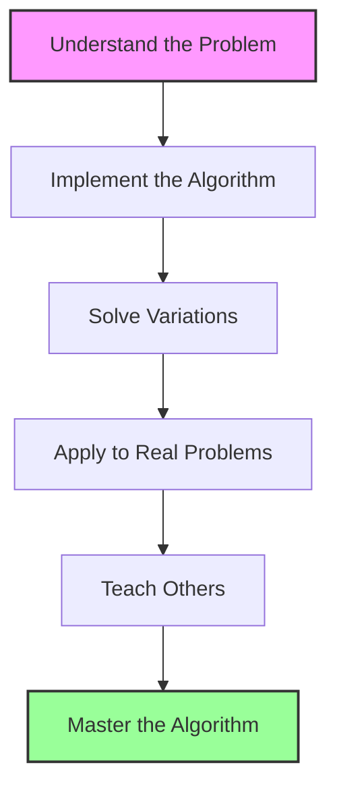

# Mastering the Fractional Knapsack Algorithm: A Summary 🏆

> [!NOTE]
> Congratulations on reaching the final lesson in our exploration of the Fractional Knapsack algorithm! Let's consolidate what we've learned and explore strategies for mastering this important algorithm.

## Journey Recap: What We've Covered 🗺️

We've covered a lot of ground in our exploration of the Fractional Knapsack algorithm:

1. **Problem Understanding**: We learned about the Fractional Knapsack problem and how it differs from other knapsack variants.

2. **Greedy Approach**: We discovered why a greedy strategy works for this problem and how it guarantees an optimal solution.

3. **Algorithm Implementation**: We implemented the algorithm step by step, breaking down each component.

4. **Comparison with 0-1 Knapsack**: We contrasted the Fractional Knapsack with the 0-1 Knapsack problem, understanding when each approach is appropriate.

5. **Real-World Applications**: We explored practical applications across various domains, demonstrating the algorithm's utility.

## The Big Picture: Why Fractional Knapsack Matters 🔭

The Fractional Knapsack algorithm is more than just a theoretical concept—it's a powerful tool for resource allocation problems. It exemplifies several important algorithmic principles:

- **Greedy algorithms can be optimal** for certain problem types
- **Problem formulation** significantly impacts solution approach
- **Resource allocation problems** are ubiquitous in real-world scenarios
- **Algorithm efficiency** matters in practical applications

## Key Insights: What Makes This Algorithm Special 💡

Here are the key insights that make the Fractional Knapsack algorithm special:

1. **Optimality of Greedy Approach**: One of the few optimization problems where a greedy approach yields the optimal solution

2. **Value Density Prioritization**: The algorithm's success hinges on prioritizing items by their value-to-weight ratio

3. **Fractional Selection**: The ability to take fractions of items is what enables the greedy approach to work

4. **Efficiency**: O(n log n) time complexity makes it practical for large-scale problems

## Common Pitfalls and How to Avoid Them ⚠️

> [!WARNING]
> Even with a seemingly straightforward algorithm, there are pitfalls to watch out for!

- **Forgetting to Sort**: Always sort items by value-to-weight ratio first
- **Division by Zero**: Handle zero-weight items carefully
- **Assuming Indivisibility**: Make sure your problem truly allows for fractional selection
- **Confusing with 0-1 Knapsack**: Remember the critical difference between the two problems

## Beyond the Basics: Advanced Topics 🚀

For those looking to deepen their understanding, consider these advanced topics:

<details>
<summary>Multi-Constraint Knapsack Problems</summary>

Real-world problems often involve multiple constraints (weight, volume, time, etc.). Extending the Fractional Knapsack algorithm to handle multiple constraints is an interesting challenge.

```javascript
// Multi-constraint example pseudocode
function multiConstraintFractionalKnapsack(weights, volumes, values, weightCapacity, volumeCapacity) {
  // Calculate value-to-resource ratios and sort accordingly
  // Take items greedily while respecting both constraints
}
```
</details>

<details>
<summary>Continuous Knapsack Problems</summary>

In some versions, both the items and the knapsack capacity are represented as continuous functions rather than discrete values, requiring calculus-based approaches.
</details>

<details>
<summary>Online Knapsack Problems</summary>

In these variants, items arrive one by one, and decisions must be made immediately without knowledge of future items, requiring probabilistic approaches.
</details>

## Practice Makes Perfect: How to Master This Algorithm 🏋️‍♂️

To truly master the Fractional Knapsack algorithm:

1. **Implement It Yourself**: Code the algorithm from scratch in your preferred language

2. **Solve Variations**: Try solving different variants of the problem

3. **Apply to Real Problems**: Identify problems in your field that can be modeled as Fractional Knapsack

4. **Experiment with Data**: Test the algorithm with different datasets to build intuition

5. **Explain to Others**: Teaching the algorithm to someone else solidifies your understanding



## Self-Assessment Questions 🤔

Test your understanding with these questions:

1. Why does the greedy approach work for Fractional Knapsack but not for 0-1 Knapsack?

2. What is the time complexity of the Fractional Knapsack algorithm, and what operation dominates it?

3. How would you handle an item with zero weight in the Fractional Knapsack algorithm?

4. In what real-world scenario would you prefer Fractional Knapsack over 0-1 Knapsack?

5. How would you modify the Fractional Knapsack algorithm to handle an additional constraint?

## Final Challenge: Design Your Own Variant! 🏆

> [!TIP]
> The best way to test your understanding is to create your own variant of the problem!

Try designing a variant of the Fractional Knapsack problem with an interesting twist, such as:
- Items with diminishing returns
- Dynamic capacity constraints
- Multiple knapsacks
- Items with dependencies

## Key Takeaways 🔑

1. The Fractional Knapsack algorithm is a powerful tool for resource allocation problems with divisible resources
2. A greedy approach works because we can take fractions of items, always prioritizing the highest value-to-weight ratio
3. The algorithm has applications across diverse fields, from finance to healthcare
4. Understanding when to use Fractional vs. 0-1 Knapsack is crucial for tackling real-world problems
5. The algorithm's efficiency (O(n log n)) makes it suitable for large-scale applications

## What's Next? 🛣️

Now that you've mastered the Fractional Knapsack algorithm, you can:

- Explore other greedy algorithms (Dijkstra's, Huffman coding, etc.)
- Dive into dynamic programming to solve the 0-1 Knapsack problem
- Apply your knowledge to solve real-world resource allocation problems
- Explore more complex variants of the Knapsack problem

Remember, algorithms are tools to solve problems. The more tools you have in your toolkit, the more problems you can solve effectively!

> [!NOTE]
> Thank you for joining us on this journey through the Fractional Knapsack algorithm. Keep exploring, keep learning, and keep applying these concepts to real-world problems!

🎉 **Congratulations on completing this course!** 🎉 