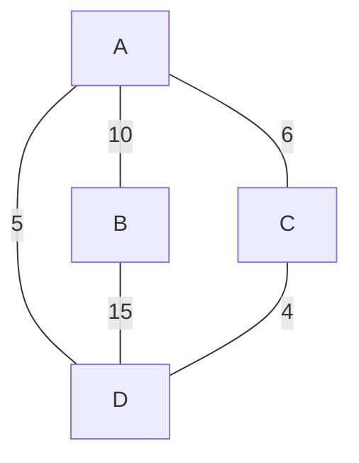

# 🌳 Minimum Spanning Tree Problem 🌳

> [!NOTE]
> A **Minimum Spanning Tree (MST)** is a subset of the edges of a connected, undirected, weighted graph that connects all vertices together with the minimum possible total edge weight, without creating any cycles.

## 🤔 The Challenge

Imagine you're designing a network that needs to connect several locations. You want to ensure all locations are connected while minimizing the total cost of connections. How would you determine which connections to establish?

This is exactly the problem that Kruskal's algorithm solves!

## 🎯 Problem Statement

Given an undirected weighted graph:
- We need to find a subset of edges that forms a tree
- This tree must include every vertex in the graph
- The total weight of all the edges in the tree should be minimized

## 🌟 Real-World Applications

> [!TIP]
> Understanding the real-world applications can help you grasp why this algorithm matters!

- 🏙️ **City Planning**: Designing road networks to connect all neighborhoods with minimal construction costs
- 🖥️ **Network Design**: Creating computer networks that connect all devices with minimal cable length
- 💡 **Electrical Grid Design**: Minimizing the amount of electrical wiring needed while ensuring all homes are connected
- 🚰 **Water Supply Networks**: Designing efficient water distribution systems

## 💭 Thinking About the Problem

Before diving into the algorithm, ask yourself:

1. How would you manually solve this for a small graph with 4-5 vertices?
2. What would happen if you always chose the cheapest available connection?
3. What might go wrong if you don't carefully check each connection you add?

Visual Example

Consider this simple graph with 4 vertices:

The minimum spanning tree would include edges:
- C-D (weight 4)
- A-D (weight 5)
- A-B (weight 10)

With a total weight of 19 - the smallest possible weight that connects all vertices!

In the next section, we'll explore Kruskal's algorithm - a clever approach to solving this problem efficiently. 