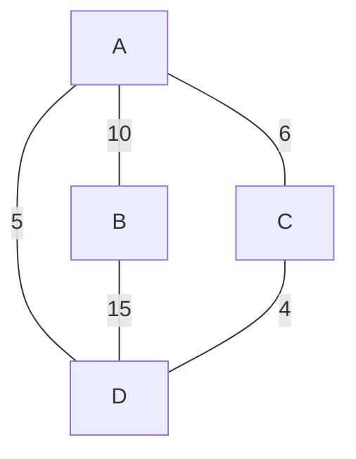
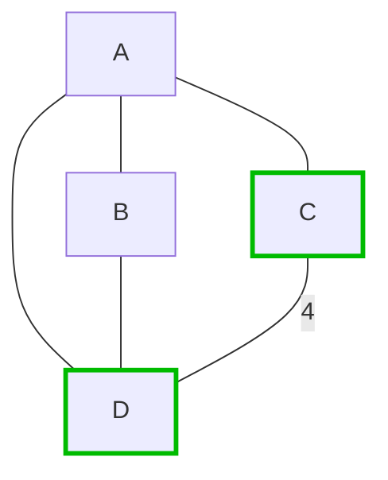
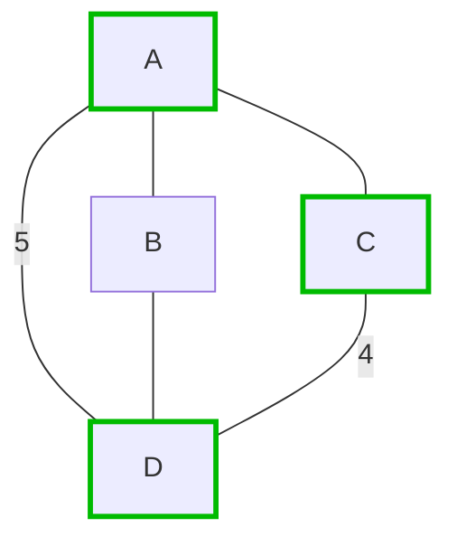
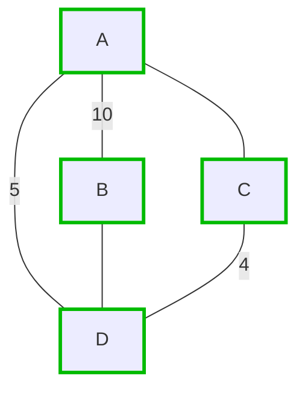
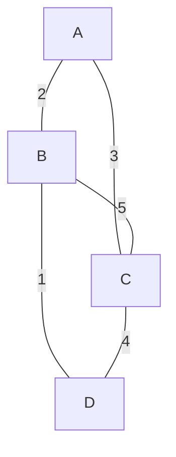

# 🧩 Kruskal's Algorithm: A Greedy Approach 🧩

## 💡 The Core Idea

Kruskal's algorithm takes a **greedy approach** to find the minimum spanning tree. But what does "greedy" mean in this context?

> [!NOTE]
> A **greedy algorithm** makes the locally optimal choice at each step, hoping that these local choices will lead to a globally optimal solution.

In Kruskal's case, the greedy choice is simple:
- **Always pick the edge with the lowest weight that doesn't create a cycle**

## 🔄 The Basic Process

1. **Sort** all edges in non-decreasing order of their weight
2. **Pick** the smallest edge that doesn't form a cycle with the edges already included
3. **Repeat** step 2 until we have (V-1) edges in our tree, where V is the number of vertices

## 🧠 Why This Works

You might wonder: "Why does always picking the cheapest edge lead to the optimal solution?"

The key insight is that any minimum spanning tree must include the smallest weight edge that connects two separate components of the graph. If we didn't include this edge, we would need to use a heavier edge later, resulting in a non-minimal tree.

## 🎬 Example Walkthrough

Let's visualize how Kruskal's algorithm works with a simple example:

<details open>
<summary>Initial Graph</summary>



1. Sort edges by weight: C-D(4), A-D(5), A-C(6), A-B(10), B-D(15)
2. Process edges in order:
</details>

<details>
<summary>Step 1: Add Edge C-D (Weight 4)</summary>



We add the edge C-D with weight 4.
</details>

<details>
<summary>Step 2: Add Edge A-D (Weight 5)</summary>



We add the edge A-D with weight 5.
</details>

<details>
<summary>Step 3: Consider Edge A-C (Weight 6)</summary>

```mermaid
graph TD;
    A---B;
    A---C;
    A--5---D;
    B---D;
    C--4---D;
    
    style A stroke:#0b0,stroke-width:3px
    style C stroke:#0b0,stroke-width:3px
    style D stroke:#0b0,stroke-width:3px
    style A--C stroke:#f00,stroke-width:2px,stroke-dasharray: 5 5
```

We **skip** the edge A-C because it would create a cycle A-D-C-A.
</details>

<details>
<summary>Step 4: Add Edge A-B (Weight 10)</summary>



We add the edge A-B with weight 10. Now all vertices are connected!
</details>

<details>
<summary>Step 5: Consider Edge B-D (Weight 15)</summary>

```mermaid
graph TD;
    A--10---B;
    A---C;
    A--5---D;
    B---D;
    C--4---D;
    
    style A stroke:#0b0,stroke-width:3px
    style B stroke:#0b0,stroke-width:3px
    style C stroke:#0b0,stroke-width:3px
    style D stroke:#0b0,stroke-width:3px
    style B--D stroke:#f00,stroke-width:2px,stroke-dasharray: 5 5
```

We **skip** the edge B-D because it would create a cycle B-A-D-B.
</details>

## 🤔 But Wait... How Do We Detect Cycles?

The trickiest part of Kruskal's algorithm is efficiently determining whether adding an edge will create a cycle. For this, we use a clever data structure called the **Disjoint-Set** or **Union-Find**, which we'll explore in the next section.

> [!TIP]
> Can you think of why simply checking if both endpoints of an edge are already in our MST isn't sufficient for cycle detection?

## 🧪 Exercise

Try to trace through Kruskal's algorithm manually for this small graph:



<details>
<summary>Answer</summary>

The MST should include:
1. B-D (weight 1)
2. A-B (weight 2)
3. A-C (weight 3)

Total weight: 6
</details> 