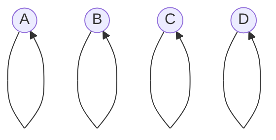
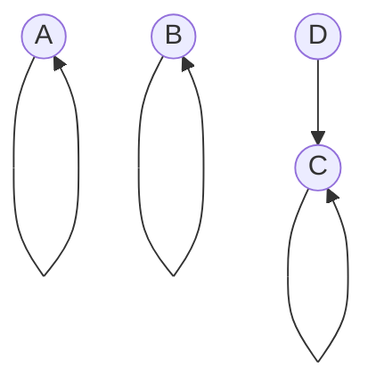
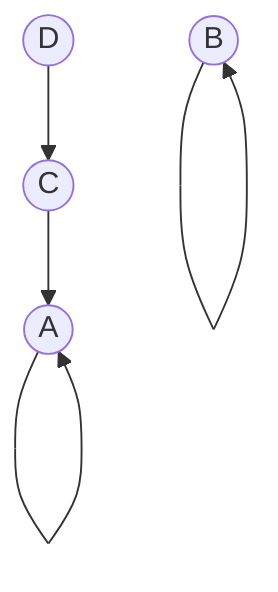

# 🧰 The Disjoint-Set Data Structure 🧰

## 🔍 The Cycle Detection Challenge

In Kruskal's algorithm, we need to efficiently determine whether adding an edge would create a cycle. This is where the **Disjoint-Set** (also called **Union-Find**) data structure comes to our rescue!

## 💡 What is a Disjoint-Set?

> [!NOTE]
> A **Disjoint-Set** is a data structure that keeps track of a set of elements partitioned into several disjoint (non-overlapping) subsets.

It supports three main operations:
1. **MakeSet**: Create a new set containing a single element
2. **Find**: Determine which set an element belongs to
3. **Union**: Merge two sets into a single set

## 🧩 How Does It Help with Kruskal's Algorithm?

In Kruskal's algorithm, we use the Disjoint-Set to:
1. Initially consider each vertex as a separate component (MakeSet)
2. For each edge (u, v), check if u and v belong to the same component (Find)
3. If they don't, add the edge to our MST and merge their components (Union)

This elegantly solves the cycle detection problem because a cycle would only form if we add an edge between two vertices that are already in the same connected component.

## 🔄 Implementation Details

Let's break down how we can implement this structure:

### 1. Representation

The simplest way to represent a Disjoint-Set is using an array:
- Each element initially points to itself (it's its own parent)
- When sets are merged, elements in one set point to the representative of the other set

### 2. Find Operation

```javascript
function find(i) {
  if (parent[i] === i) {
    return i;  // This element is the representative of its set
  }
  return find(parent[i]);  // Recursively find the representative
}
```

### 3. Union Operation

```javascript
function union(i, j) {
  const rootI = find(i);
  const rootJ = find(j);
  parent[rootI] = rootJ;  // Make rootI point to rootJ
}
```

## ⚡ Optimization Techniques

Two important optimizations make Disjoint-Set operations nearly constant time:

1. **Path Compression**: When doing a find operation, make each visited node point directly to the root.

```javascript
function find(i) {
  if (parent[i] === i) {
    return i;
  }
  return (parent[i] = find(parent[i]));  // Path compression
}
```

2. **Union by Rank/Size**: Always attach the smaller tree to the root of the larger tree.

> [!TIP]
> With these optimizations, the amortized time complexity of each operation becomes nearly constant - specifically O(α(n)), where α is the incredibly slow-growing inverse Ackermann function.

## 🎬 Visual Example

Let's visualize how the Disjoint-Set evolves during Kruskal's algorithm:

<details>
<summary>Initial State (Every vertex is its own set)</summary>



Parent array: `[0, 1, 2, 3]` (each vertex points to itself)
</details>

<details>
<summary>After Adding Edge C-D</summary>



We perform `union(2, 3)` which makes D's parent point to C.  
Parent array: `[0, 1, 2, 2]`
</details>

<details>
<summary>After Adding Edge A-D</summary>



We perform `union(0, 3)` which makes C's parent point to A.  
Parent array: `[0, 1, 0, 2]`
</details>

<details>
<summary>When Considering Edge A-C</summary>


We check if A and C are in the same set:  
`find(0) = 0` and `find(2) = 0` (after path compression)  
Since they're in the same set, adding edge A-C would create a cycle!
</details>

## 🧠 Think About It

- What would happen if we didn't use the Disjoint-Set data structure? How else might we detect cycles?
- Can you see how path compression flattens the tree structure over time?
- Why is it important that the Find operation returns the same value for all elements in a connected component?

## 🧪 Exercise

Trace through the following operations on a Disjoint-Set with 5 elements (0-4):
1. Initially, each element is in its own set
2. Union(0, 2)
3. Union(1, 4)
4. Union(0, 3)
5. Check if 2 and 3 are in the same set
6. Union(1, 3)
7. Check if 1 and 0 are in the same set

<details>
<summary>Answer</summary>

Initial parent array: `[0, 1, 2, 3, 4]`

After Union(0, 2): `[0, 1, 0, 3, 4]`

After Union(1, 4): `[0, 1, 0, 3, 1]`

After Union(0, 3): `[0, 1, 0, 0, 1]`

Check if 2 and 3 are in the same set:
- find(2) = 0
- find(3) = 0
- Yes, they are in the same set!

After Union(1, 3):
- find(1) = 1
- find(3) = 0
- Make parent[1] = 0
- `[0, 0, 0, 0, 1]`

Check if 1 and 0 are in the same set:
- find(1) = 0
- find(0) = 0
- Yes, they are in the same set!
</details> 