# 🔄 Comparing MST Algorithms 🔄

Kruskal's algorithm is just one of several approaches to finding a Minimum Spanning Tree. Let's compare it with other popular algorithms to understand when each might be most appropriate.

## 🏆 The Main Contenders

### 1. Kruskal's Algorithm (1956)

> [!NOTE]
> **Core Idea**: Process edges in order of increasing weight, adding each edge that doesn't create a cycle.

- **Approach**: Edge-based, globally greedy
- **Time Complexity**: O(E log E) or O(E log V)
- **Space Complexity**: O(E + V)
- **Implementation Difficulty**: Medium (requires Union-Find)

### 2. Prim's Algorithm (1957)

> [!NOTE]
> **Core Idea**: Grow a single tree starting from an arbitrary vertex, always adding the lowest-weight edge connecting the tree to a new vertex.

- **Approach**: Vertex-based, locally greedy
- **Time Complexity**: O(E log V) with binary heap, O(V² + E) with array
- **Space Complexity**: O(V)
- **Implementation Difficulty**: Medium (requires priority queue)

### 3. Borůvka's Algorithm (1926)

> [!NOTE]
> **Core Idea**: Grow multiple trees simultaneously by finding the minimum-weight edge from each tree to any other tree.

- **Approach**: Forest-based, locally greedy
- **Time Complexity**: O(E log V)
- **Space Complexity**: O(E + V)
- **Implementation Difficulty**: High (more complex logic)

## 🔍 Head-to-Head Comparison

```mermaid
graph TD;
    A["Input Graph"]
    A -->|"Edge-Centric"| K["Kruskal's Algorithm"]
    A -->|"Vertex-Centric"| P["Prim's Algorithm"]
    A -->|"Component-Centric"| B["Borůvka's Algorithm"]
    
    K -->|"O(E log E)"| MST["Minimum Spanning Tree"]
    P -->|"O(E log V)"| MST
    B -->|"O(E log V)"| MST
```



<details>
<summary>Detailed Visual Comparison</summary>

### Same Graph Processed by Different Algorithms

Consider this graph:


#### Kruskal's Approach
1. Sort edges: B-C(1), A-B(2), B-D(3), A-C(4), C-D(5)
2. Add B-C(1), A-B(2), B-D(3) to MST
3. MST complete with weight 6

#### Prim's Approach (starting from A)
1. Add cheapest edge from A: A-B(2)
2. Add cheapest edge from {A,B}: B-C(1)
3. Add cheapest edge from {A,B,C}: B-D(3)
4. MST complete with weight 6

#### Borůvka's Approach
1. First iteration:
   - A selects edge A-B(2)
   - B selects edge B-C(1)
   - C selects edge B-C(1)
   - D selects edge B-D(3)
2. After merging: Two components {A,B,C} and {D}
3. Second iteration:
   - {A,B,C} selects edge B-D(3)
4. MST complete with weight 6
</details>

## 🧠 When to Use Each Algorithm

### Kruskal's Algorithm Shines When:

- The graph is **sparse** (E ≈ V)
- Edges can be efficiently sorted
- Implementing Union-Find is straightforward
- You need to process edges in a specific order

```javascript
// Kruskal's algorithm is elegant for sparse graphs
function kruskal(vertices, edges) {
  edges.sort((a, b) => a[2] - b[2]);
  // Union-Find operations here...
}
```

### Prim's Algorithm is Better When:

- The graph is **dense** (E ≈ V²)
- The graph is represented as an adjacency matrix
- You need to start from a specific vertex
- You want to build the MST incrementally

```javascript
// Prim's algorithm works well for dense graphs
function prim(graph, startVertex) {
  const visited = new Set([startVertex]);
  const minHeap = new PriorityQueue();
  // Add all edges from startVertex to minHeap
  // ...
}
```

### Borůvka's Algorithm is Preferred When:

- You need a highly **parallelizable** solution
- You're working with distributed systems
- The graph is very large
- You want to avoid sorting all edges

## 🎯 Performance Comparison

> [!TIP]
> These performance characteristics are theoretical. In practice, the simplicity of implementation often matters more!

### By Graph Density

| Algorithm | Sparse Graph (E ≈ V) | Dense Graph (E ≈ V²) |
|-----------|----------------------|----------------------|
| Kruskal   | ⭐⭐⭐ O(E log V)     | ⭐⭐ O(E log E)       |
| Prim      | ⭐⭐ O(E log V)       | ⭐⭐⭐ O(V² + E)       |
| Borůvka   | ⭐⭐ O(E log V)       | ⭐⭐ O(E log V)       |

### By Implementation Complexity

| Algorithm | Implementation Difficulty | Additional Data Structures Required |
|-----------|---------------------------|-------------------------------------|
| Kruskal   | Medium                    | Disjoint-Set (Union-Find)           |
| Prim      | Medium                    | Priority Queue (Min Heap)           |
| Borůvka   | High                      | Component Tracking                  |

## 🚀 Advanced Considerations

### Parallelization Potential

Borůvka's algorithm has natural parallelism since each component can independently select its minimum-weight edge. Kruskal's algorithm can parallelize the sorting step, but the edge addition is sequential. Prim's algorithm is inherently sequential.

### Memory Locality

Prim's algorithm typically has better memory locality as it focuses on vertices that are close to each other. Kruskal's algorithm might jump around the graph more.

### Special Cases

- **Fully Connected Graph**: Prim's algorithm typically performs better.
- **Nearly Tree-Like Graph**: Kruskal's algorithm often performs better.
- **Distributed Setting**: Borůvka's algorithm may be preferred.

## 🧪 Hybrid Approaches

Research has shown that hybrid approaches can be effective:

```javascript
function hybridMST(vertices, edges) {
  // Start with Borůvka to reduce components rapidly
  const components = runBoruvkaIterations(vertices, edges, 2);
  
  // Use Kruskal for the remaining edges
  return finishWithKruskal(components, remainingEdges);
}
```

## 💭 Think About It

Which algorithm would you choose for the following scenarios?

1. Finding the minimum-cost network to connect houses in a small neighborhood
2. Determining the shortest possible fiber optic network to connect cities across a country
3. Building a backbone network for a massive social network with billions of users
4. Creating a minimum spanning tree in a 2D grid-based game

<details>
<summary>Suggested Answers</summary>

1. **Small Neighborhood**: Any algorithm works well due to small size, but Kruskal's simplicity makes it a good choice.
2. **Country-wide Fiber**: Kruskal's algorithm is great as the graph is sparse (not every city connects directly to every other).
3. **Social Network**: Prim's algorithm might be better due to the dense nature of social connections, or a parallel Borůvka for the massive scale.
4. **Grid-based Game**: Prim's algorithm often works well for grid-based structures due to locality.
</details>

## 🔄 In Practice

In real-world implementations, the differences between these algorithms often matter less than:

1. The quality of the implementation
2. How well the algorithm fits the specific problem constraints
3. Data structure optimizations
4. Hardware and system considerations

The best approach is often to understand all three algorithms and select the most appropriate one based on your specific requirements! 