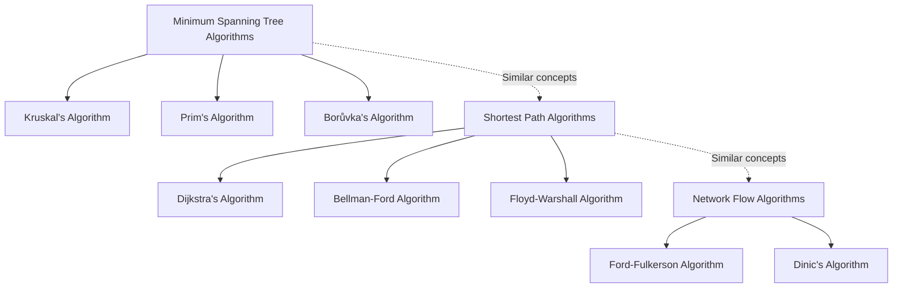

# 🎓 Kruskal's Algorithm: Conclusion and Next Steps 🎓

## 🔍 Summary of What We've Learned

Congratulations on making it through this step-by-step explanation of Kruskal's algorithm! Let's recap the key points we've covered:

1. **The Problem**: Finding a Minimum Spanning Tree (MST) - a tree that connects all vertices with minimum total edge weight.

2. **The Core Approach**: Kruskal's algorithm uses a greedy strategy to build the MST by:
   - Sorting all edges by weight (smallest first)
   - Adding edges to the MST as long as they don't create cycles
   - Continuing until we have V-1 edges (a complete tree)

3. **The Union-Find Data Structure**: An efficient way to detect cycles using:
   - MakeSet: Initialize each vertex as its own component
   - Find: Determine which component a vertex belongs to
   - Union: Merge two components when an edge connects them

4. **Implementation Details**:
   - Time Complexity: O(E log E) due to the sorting step
   - Space Complexity: O(E + V) for storing edges and disjoint sets

5. **Optimizations**:
   - Path compression and union by rank for faster Union-Find operations
   - Early termination when V-1 edges are added
   - Handling edge cases like disconnected graphs

6. **Comparisons**: Understanding how Kruskal's algorithm compares to other MST algorithms like Prim's and Borůvka's.

## 💡 Key Insights

> [!TIP]
> The real value in learning Kruskal's algorithm goes beyond just implementing it. It teaches important concepts in algorithm design:

- **Greedy Algorithms**: Sometimes making the locally optimal choice at each step leads to a globally optimal solution.
- **Graph Theory**: Understanding fundamental properties of trees and cycles.
- **Data Structure Design**: The Union-Find structure demonstrates how the right data structure can dramatically improve performance.
- **Problem Reduction**: Complex problems can often be broken down into simpler sub-problems.

## 🚀 Where to Go Next

Now that you understand Kruskal's algorithm, here are some directions to deepen your knowledge:

### 1. Related Graph Algorithms

### 2. Advanced Applications

- **Network Design**: Apply MST algorithms to design efficient computer, electrical, or transportation networks.
- **Clustering**: Use modified versions for cluster analysis in machine learning.
- **Approximation Algorithms**: Study how MST is used to approximate solutions to hard problems like the Traveling Salesman Problem.
- **Image Segmentation**: Explore how MST algorithms help in computer vision.

### 3. Implementation Challenges

Challenge yourself with these advanced implementations:

- Implement a parallel version of Kruskal's algorithm
- Build a visualization tool that shows the algorithm in action
- Create a dynamic version that can efficiently update the MST when edges are added or removed
- Apply Kruskal's algorithm to real-world datasets, like road networks or social networks

## 📚 Recommended Resources

### Books

- **Introduction to Algorithms** by Cormen, Leiserson, Rivest, and Stein
- **Algorithm Design Manual** by Steven Skiena
- **Competitive Programmer's Handbook** by Antti Laaksonen

### Online Courses

- [Algorithms Specialization](https://www.coursera.org/specializations/algorithms) on Coursera by Stanford
- [Graph Theory and Algorithms](https://www.edx.org/course/graph-algorithms) on edX
- [Algorithms, Part II](https://www.coursera.org/learn/algorithms-part2) on Coursera by Princeton

### Interactive Learning

- [VisuAlgo - MST Visualization](https://visualgo.net/en/mst)
- [Algorithm Visualizer](https://algorithm-visualizer.org/)
- [LeetCode Graph Problems](https://leetcode.com/tag/graph/)

## 🧩 Real-World Applications

Kruskal's algorithm isn't just a theoretical concept - it's actively used to solve real problems:

- **Telecommunications**: Designing network infrastructure with minimal cable length
- **Transportation**: Planning road or railway networks to connect cities efficiently
- **Circuit Design**: Minimizing wire length in electrical circuits
- **Cluster Analysis**: Finding natural groupings in data
- **Image Processing**: Segmenting images for computer vision tasks

## 💭 Final Thoughts

The beauty of Kruskal's algorithm lies in its simplicity and elegance. From just a few lines of code emerges a powerful solution that has applications across numerous fields.

As you continue your journey in algorithm design, remember that understanding the fundamental principles behind algorithms like Kruskal's provides you with powerful tools to solve a wide range of problems.

> [!NOTE]
> The best way to truly master an algorithm is to implement it yourself and apply it to real problems. Don't stop at just understanding the theory!

## 🧪 Challenge Yourself

As a final exercise, try to answer these questions:

1. How would you modify Kruskal's algorithm to find the Maximum Spanning Tree instead?
2. Can Kruskal's algorithm work with directed graphs? Why or why not?
3. What happens if there are multiple edges with the same weight?
4. How would you adapt Kruskal's algorithm if some edges must be included in the MST?

Answers

1. To find the Maximum Spanning Tree, simply sort the edges in descending order of weight instead of ascending.
2. Kruskal's algorithm is designed for undirected graphs. For directed graphs, the concept changes to a Minimum Spanning Arborescence, which requires a different approach.
3. If multiple edges have the same weight, Kruskal's algorithm can take them in any order (the result will still be a valid MST, though there might be multiple valid MSTs).
4. To force inclusion of certain edges, add those edges to the MST first, then run the algorithm on the remaining edges while also merging the components of the forced edges in the Union-Find structure.

Thank you for exploring Kruskal's algorithm with us! May your paths always be minimum spanning! 🌳🌟 