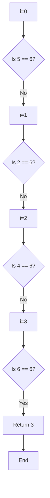

# 🔄 Implementing Linear Search Iteratively

Now that we understand the core concept of linear search, let's look at how to implement it using a basic iterative approach.

## 🛠️ The Iterative Implementation

The most common way to implement linear search is using a simple loop:

```js
function linearSearch(nums, target) {
  for (let i = 0; i < nums.length; i++) {
    if (nums[i] === target) {
      return i;
    }
  }
  return -1;
}
```

This implementation is:
- ✅ Straightforward and easy to understand
- ✅ Efficient in its simplicity
- ✅ Widely applicable across programming languages

## 📝 Understanding the Code Line by Line

Let's break down the implementation:

1. `function linearSearch(nums, target)`: We define a function that takes an array of numbers and a target value.

2. `for (let i = 0; i < nums.length; i++)`: We iterate through each element in the array from index 0 to the last index.

3. `if (nums[i] === target)`: For each element, we check if it matches our target value.

4. `return i`: If we find a match, we immediately return the current index.

5. `return -1`: If we complete the loop without finding a match, we return -1 to indicate the target wasn't found.

## 🎯 Tracing the Execution

Let's visualize how this code executes with our previous example:

Array: `[5, 2, 4, 6, 1, 3]`  
Target: `6`



> [!NOTE]
> Notice how we stop as soon as we find a match. This is an important optimization - we don't waste time checking the rest of the array once we've found what we're looking for.

## 🧪 Testing Edge Cases

<details>
<summary>How does our algorithm handle these edge cases?</summary>

1. **Empty array**: The loop condition `i < nums.length` will evaluate to `i < 0`, which is false. The loop won't execute, and we'll directly return -1.

2. **Single element array**: We'll check that single element and return its index if it matches, or -1 if it doesn't.

3. **Target in first position**: This is our best-case scenario - we'll return 0 after just one comparison.

4. **Target in last position**: This is one of our worst-case scenarios - we'll check every element before finding it.

5. **Target not in array**: Another worst-case scenario - we'll check every element and then return -1.

</details>

## 💭 Think Deeper

> [!TIP]
> Could we optimize this further? For specific use cases, yes! For example, if we know the array is sorted, we could potentially stop early when we pass the value we're looking for. However, that would change the algorithm from a pure linear search to a modified version.

In the next lesson, we'll explore an alternative implementation using recursion, which offers a different perspective on the same algorithm. 