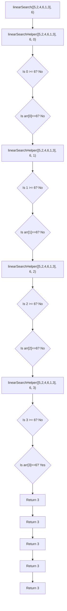

# 🔁 The Power of Recursion in Linear Search

While iteration is the most common approach to implementing linear search, recursion offers an elegant alternative that can deepen our understanding of both linear search and recursive thinking.

## 🔄 Recursion vs. Iteration

Before we dive into the code, let's understand what makes recursion different from iteration:

- **Iteration**: Uses loops to repeat a process
- **Recursion**: A function that calls itself to repeat a process

Both can accomplish the same tasks, but they represent different ways of thinking about problems.

## 📝 The Recursive Implementation

Here's how we can implement linear search using recursion:

```js
function linearSearch(nums, target) {
  return linearSearchHelper(nums, target, 0);
}

function linearSearchHelper(nums, target, index) {
  // Base case 1: If we've checked all elements and didn't find the target
  if (index >= nums.length) {
    return -1;
  }
  
  // Base case 2: If we found the target
  if (nums[index] === target) {
    return index;
  }
  
  // Recursive case: Check the next element
  return linearSearchHelper(nums, target, index + 1);
}
```

## 🧩 Breaking Down the Recursion

In recursive algorithms, we always need:
1. A **base case** (or cases) to stop the recursion
2. A **recursive case** that moves us closer to the base case

In our implementation:
- We have two base cases:
  - When we've checked all elements without finding the target
  - When we've found the target
- Our recursive case moves to the next index

## 🔍 Tracing the Recursion

Let's trace through our recursive solution using the same example:

Array: `[5, 2, 4, 6, 1, 3]`  
Target: `6`



> [!NOTE]
> Notice how each recursive call builds up a "stack" of function calls. Once we find our answer, that value is passed back up through each level of the stack.

## ⚖️ Comparing the Approaches

<details>
<summary>Recursive vs. Iterative: Pros and Cons</summary>

**Recursive Approach:**
- ✅ Can be more elegant and easier to understand for some problems
- ✅ Mirrors the problem's natural structure in some cases
- ❌ Consumes more memory due to function call stack
- ❌ Can lead to stack overflow for large inputs
- ❌ Generally slower due to function call overhead

**Iterative Approach:**
- ✅ More memory efficient
- ✅ Usually faster due to less overhead
- ✅ No risk of stack overflow
- ❌ Can be more complex for some problems
- ❌ May require managing more variables

For linear search specifically, the iterative approach is generally preferred for its simplicity and efficiency, but understanding both approaches enhances your algorithmic toolkit.

</details>

## 🤔 Challenge Your Understanding

> [!TIP]
> Try tracing through both implementations with different examples:
> - An empty array
> - A target that doesn't exist in the array
> - A target at the beginning of the array
>
> How does each implementation behave in these cases?

In the next lesson, we'll explore the efficiency of linear search and understand its time and space complexity. 