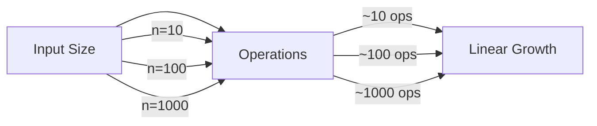

# ⏱️ Understanding the Efficiency of Linear Search

When analyzing algorithms, we need to understand how they perform as input sizes grow. This helps us make informed decisions about which algorithm to use in different scenarios.

## 🕒 Time Complexity

The time complexity of an algorithm measures how the runtime grows as the input size increases.

### For Linear Search:

- **Best Case**: O(1) - When the target is at the first position
- **Worst Case**: O(n) - When the target is at the last position or not present
- **Average Case**: O(n) - On average, we need to check n/2 elements, but in Big O notation, this is still O(n)

Let's visualize how the number of operations grows with the input size:

> [!NOTE]
> The straight line on a graph of operations vs. input size gives Linear Search its name!

## 🧮 Space Complexity

Space complexity measures the amount of memory an algorithm uses as input size increases.

### For Linear Search:

- **Iterative Implementation**: O(1) - We only need a few variables regardless of input size
- **Recursive Implementation**: O(n) - In the worst case, the recursion stack can grow to size n

## 🔄 Comparing Linear Search with Other Search Algorithms

Linear Search vs. Binary Search vs. Hash-based Search

| Algorithm | Time Complexity | Space Complexity | Requires Sorting | Can Handle Duplicates |
|-----------|-----------------|------------------|------------------|------------------------|
| Linear Search | O(n) | O(1) | No | Yes |
| Binary Search | O(log n) | O(1) | Yes | Yes* |
| Hash-based Search | O(1) average | O(n) | No | Depends on implementation |

*Binary search can find a match, but may not find the first occurrence in case of duplicates without modification.

> [!TIP]
> While linear search is slower than other algorithms for large datasets, its simplicity and lack of prerequisites (like sorting) make it useful in many scenarios.

## 📊 Visual Comparison of Growth Rates

To understand why time complexity matters, let's see how different algorithms scale as the dataset grows:

| Input Size (n) | Linear Search (O(n)) | Binary Search (O(log n)) | Hash-based Search (O(1)) |
|----------------|----------------------|--------------------------|--------------------------|
| 10 | 10 | 3-4 | 1 |
| 100 | 100 | 6-7 | 1 |
| 1,000 | 1,000 | 10 | 1 |
| 1,000,000 | 1,000,000 | 20 | 1 |

The difference becomes dramatic as the dataset grows larger!

## 💡 Real-world Implications

> [!WARNING]
> For very large datasets (millions of elements), a linear search can become prohibitively slow.

However, there are many scenarios where linear search remains practical:

- Small datasets (less than 100 elements)
- Unsorted data where sorting would be expensive
- One-time searches where preprocessing isn't justified
- When simplicity and code readability are priorities

## 🤔 Think About It

When would you choose linear search over faster alternatives?

You might choose linear search when:

1. The dataset is small
2. The data is unsorted and you only need to search once (sorting first would be more expensive)
3. The search needs to find all occurrences of a value, not just the first one
4. You're working with memory constraints and can't afford extra space for hash tables
5. You need a simple, fool-proof algorithm with minimal chance of implementation errors

Remember, the "best" algorithm isn't always the fastest one - it's the one that best fits your specific needs and constraints.

In the next lesson, we'll explore variations of the linear search algorithm that address specific use cases and optimize for different scenarios. 