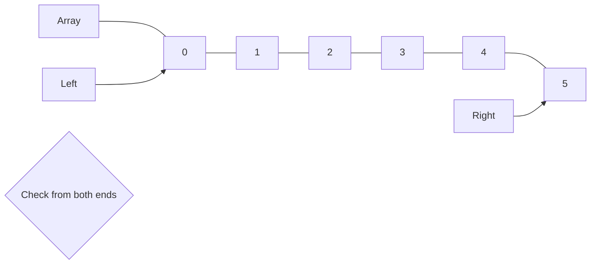

# 🔧 Improving Linear Search: Variations and Optimizations

While the basic linear search algorithm is straightforward, several variations and optimizations can improve its performance in specific scenarios.

## 1. 🛡️ Sentinel Linear Search

One common optimization is to use a **sentinel value** to eliminate the need for boundary checking in each iteration.

```js
function sentinelLinearSearch(nums, target) {
  const n = nums.length;
  
  // Save the last element
  const last = nums[n - 1];
  
  // Place the target as sentinel at the end
  nums[n - 1] = target;
  
  // Start search
  let i = 0;
  while (nums[i] !== target) {
    i++;
  }
  
  // Restore the last element
  nums[n - 1] = last;
  
  // Check if we found the element or just the sentinel
  if (i < n - 1 || last === target) {
    return i;
  }
  return -1;
}
```

> [!TIP]
> By placing the target as a sentinel at the end of the array, we eliminate the need to check the array boundary in each iteration of the loop, making the code faster.

<details>
<summary>How does this improve performance?</summary>

In the standard linear search, each iteration requires two checks:
1. Is the current index within bounds? (`i < nums.length`)
2. Is the current element the target? (`nums[i] === target`)

With a sentinel, we only need one check per iteration:
1. Is the current element the target? (`nums[i] === target`)

This reduces the number of comparisons by nearly half, improving performance, especially for large arrays.

</details>

## 2. 🏃‍♂️ Two-Pointer Linear Search (Binary Linear Search)

For arrays with unknown size but accessible by index, we can use a two-pointer approach to reduce the number of comparisons:

```js
function binaryLinearSearch(nums, target) {
  if (nums.length === 0) return -1;
  
  // Start with two pointers at both ends
  let left = 0;
  let right = nums.length - 1;
  
  while (left <= right) {
    // Check left pointer
    if (nums[left] === target) return left;
    left++;
    
    // Check right pointer (if they haven't crossed)
    if (left <= right && nums[right] === target) return right;
    right--;
  }
  
  return -1;
}
```



This approach can reduce the average number of comparisons by checking from both ends simultaneously.

## 3. 🔍 Sorted Linear Search

If the array is sorted, we can optimize linear search by stopping early when we find an element greater than our target:

```js
function sortedLinearSearch(nums, target) {
  for (let i = 0; i < nums.length; i++) {
    if (nums[i] === target) {
      return i;
    }
    if (nums[i] > target) {
      return -1; // Target not in array
    }
  }
  return -1;
}
```

> [!NOTE]
> This optimization is only valid for sorted arrays, but it can significantly reduce the number of comparisons for targets that don't exist in the array.

## 4. 🔄 Circular Linear Search

For circular or rotated arrays (like `[4, 5, 6, 1, 2, 3]`), a modified linear search can be useful:

```js
function circularLinearSearch(nums, target) {
  for (let i = 0; i < nums.length; i++) {
    if (nums[i] === target) {
      return i;
    }
  }
  return -1;
}
```

While this looks identical to standard linear search, the insight is that we don't need a special algorithm for circular arrays - linear search works regardless of how the array is arranged.

## 5. 🔢 Linear Search with Skip Steps

For very large arrays, we can improve average performance by checking elements with a step size and then performing a detailed search in the promising area:

```js
function jumpLinearSearch(nums, target, step = Math.floor(Math.sqrt(nums.length))) {
  const n = nums.length;
  
  // Find the block where the element may be present
  let prev = 0;
  while (prev < n && nums[Math.min(prev, n-1)] < target) {
    prev += step;
  }
  
  // Perform linear search in the identified block
  const startIndex = Math.max(0, prev - step);
  const endIndex = Math.min(prev, n);
  
  for (let i = startIndex; i < endIndex; i++) {
    if (nums[i] === target) {
      return i;
    }
  }
  
  return -1;
}
```

This approach is similar to Jump Search, which is more efficient than linear search but less efficient than binary search for sorted arrays.

## 💭 Choosing the Right Variation

The best variation to use depends on your specific scenario:

- **Standard Linear Search**: Best for small or unsorted arrays
- **Sentinel Linear Search**: Good for performance optimization with arrays that can be modified
- **Two-Pointer Search**: Useful for reducing average comparison count
- **Sorted Linear Search**: Best when working with sorted data but don't want to implement binary search
- **Jump Linear Search**: For large, sorted arrays where binary search is too complex

> [!WARNING]
> Always consider the constraints of your specific problem when choosing an optimization. Some optimizations may introduce complexity that isn't justified for small arrays or infrequent searches.

In the next lesson, we'll look at real-world applications of linear search and see how it's used in practice. 