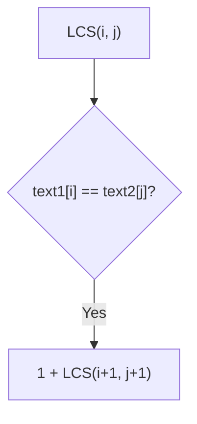
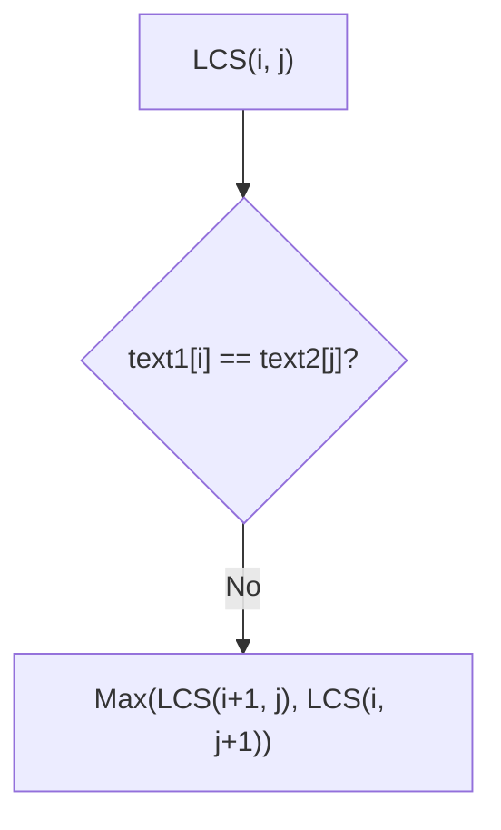

# Developing Intuition for LCS 💡

> [!NOTE]
> In this lesson, we'll build intuition for how to approach the LCS problem by breaking it down into smaller, more manageable subproblems.

## Let's Solve a Small Example Step by Step 👣

Consider two simple strings:

```
text1 = "ABCD"
text2 = "ACBD"
```

How would we find the LCS by hand? Let's walk through it:

1. Compare the first characters: 'A' and 'A' match! ✅
   - So 'A' is part of our LCS.
   - Now we need to find the LCS of "BCD" and "CBD".

2. Compare the next characters: 'B' and 'C' don't match. ❌
   - We have two choices:
     - Either skip a character in text1 and compare "CD" with "CBD"
     - Or skip a character in text2 and compare "BCD" with "BD"
   - We'll need to try both and take the better result!

3. Let's follow both paths:
   - Path 1 (skip in text1): Find LCS of "CD" and "CBD" → This gives "CD" (length 2)
   - Path 2 (skip in text2): Find LCS of "BCD" and "BD" → This gives "BD" (length 2)
   - Both paths give the same length, so either is fine.

4. So our final LCS is "A" + "CD" = "ACD" or "A" + "BD" = "ABD", both with length 3.

## The Key Insight: Optimal Substructure 🔑

What we just did showcases the **optimal substructure** property of this problem:

> [!TIP]
> The solution to the original problem can be constructed from solutions to its subproblems.

When we find two matching characters, we know they'll be part of our LCS. The rest of the LCS comes from solving the problem for the remaining characters.

## Breaking Down the Decision Process 🧠

For any position in our two strings, we always face one of two scenarios:

### Scenario 1: Characters Match

If `text1[i] == text2[j]`, then this character is definitely part of the LCS. Our LCS length increases by 1, and we continue with the rest of both strings.



### Scenario 2: Characters Don't Match

If `text1[i] != text2[j]`, we have two options:
1. Skip the current character in text1
2. Skip the current character in text2

We need to try both options and pick the better one:



## A Generalized Recursive Formula 📏

Based on our insights, we can write a recursive formula:

```
LCS(i, j) = 
    • 0, if i = length(text1) or j = length(text2)
    • 1 + LCS(i+1, j+1), if text1[i] = text2[j]
    • max(LCS(i+1, j), LCS(i, j+1)), otherwise
```

Where `i` and `j` are the current positions we're considering in text1 and text2.

## Visualizing the Process 👁️

Let's visualize finding the LCS of "ABCD" and "ACBD":

<details>
<summary>Step-by-step visualization</summary>

Starting at position (0,0) - comparing 'A' and 'A':
- Match! Add to LCS and move to position (1,1)

At position (1,1) - comparing 'B' and 'C':
- No match! We explore two paths:
  - Path 1: Skip 'B' in text1, move to (2,1)
  - Path 2: Skip 'C' in text2, move to (1,2)

Following Path 1 - at position (2,1):
- Comparing 'C' and 'C' - Match! Move to (3,2)
- At (3,2): Comparing 'D' and 'B' - No match!
  - Try both (4,2) and (3,3)
  - Eventually leads to LCS = "AC" + "D" = "ACD" (length 3)

Following Path 2 - at position (1,2):
- Comparing 'B' and 'B' - Match! Move to (2,3)
- At (2,3): Comparing 'C' and 'D' - No match!
  - Try both (3,3) and (2,4)
  - Eventually leads to LCS = "AB" + "D" = "ABD" (length 3)

Both paths lead to an LCS of length 3.
</details>

## Wait, There's a Problem... 🤔

If you tried to implement this recursive approach directly, you'd quickly discover it's extremely inefficient! Many subproblems are solved multiple times.

For example, when processing "ABCD" and "ACBD", after the first step, we need to find the LCS of:
1. "BCD" and "CBD" 
2. Then we might need to find the LCS of "CD" and "BD" multiple times

This redundancy leads to an exponential time complexity of O(2^(m+n)), which is impractical for all but the smallest inputs.

## The Solution: Dynamic Programming ✨

To avoid recalculating the same subproblems, we can use **dynamic programming**. There are two approaches:

1. **Top-down (Memoization)**: Enhance the recursive approach by storing solutions to subproblems
2. **Bottom-up (Tabulation)**: Build up the solution iteratively, starting from the smallest subproblems

In the next lesson, we'll implement both approaches and see how they drastically improve efficiency!

## Think About It 💭

Before moving on, consider:

1. How would you implement the recursive formula we derived?
2. Can you identify situations where the LCS problem might be easier to solve?
3. What's the maximum possible length of an LCS between two strings of lengths m and n? 