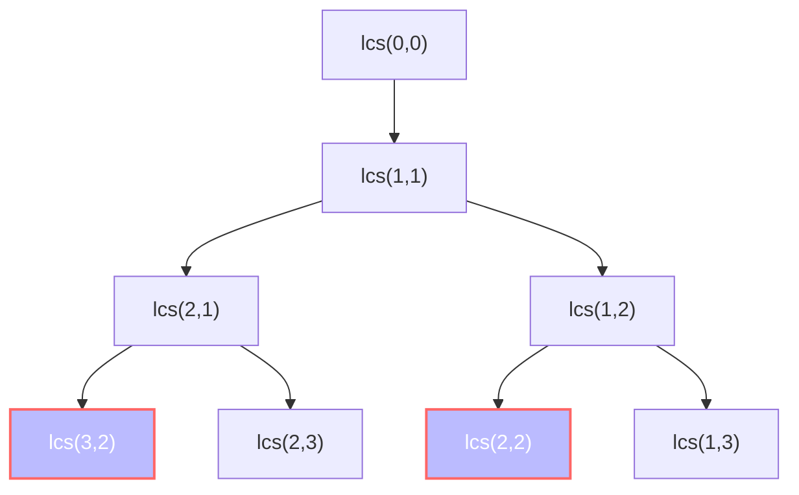

# Implementing LCS: The Recursive Approach 🔄

> [!NOTE]
> In this lesson, we'll implement our recursive formula using the top-down approach with memoization to efficiently solve the LCS problem.

## The Naive Recursive Approach ⚠️

Let's start by translating our recursive formula directly into code:

```javascript
function longestCommonSubsequence(text1, text2) {
  function lcs(i, j) {
    // Base case: if we've reached the end of either string
    if (i === text1.length || j === text2.length) {
      return 0;
    }
    
    // If characters match, include them in LCS
    if (text1[i] === text2[j]) {
      return 1 + lcs(i + 1, j + 1);
    } 
    // If they don't match, take the maximum of two possibilities
    else {
      return Math.max(lcs(i + 1, j), lcs(i, j + 1));
    }
  }
  
  return lcs(0, 0);
}
```

While this solution correctly implements our formula, it suffers from a crucial problem: **redundant calculations**.

<details>
<summary>Let's trace the execution for a small example</summary>

If we run this function with `text1 = "AB"` and `text2 = "AC"`:

1. Start with `lcs(0, 0)`:
   - Check if 'A' equals 'A' → Yes! → Return 1 + `lcs(1, 1)`
   
2. Calculate `lcs(1, 1)`:
   - Check if 'B' equals 'C' → No! → Return max(`lcs(2, 1)`, `lcs(1, 2)`)

3. Calculate `lcs(2, 1)`:
   - Base case (i === text1.length) → Return 0

4. Calculate `lcs(1, 2)`:
   - Base case (j === text2.length) → Return 0

5. Back to `lcs(1, 1)`:
   - Return max(0, 0) = 0
   
6. Back to `lcs(0, 0)`:
   - Return 1 + 0 = 1

So the LCS has length 1 (just the character 'A').
</details>

Even with this tiny example, we can see the recursive calls branching out. With larger inputs, the number of recursive calls grows exponentially!

## The Power of Memoization 💪

Memoization is a simple yet powerful technique: **store the results of function calls and return the cached result when the same inputs occur again**.

Let's enhance our recursive solution with memoization:

```javascript
function longestCommonSubsequence(text1, text2) {
  // Object to store previously computed results
  const memo = {};
  
  function lcs(i, j) {
    // Base case
    if (i === text1.length || j === text2.length) {
      return 0;
    }
    
    // Create a unique key for this subproblem
    const key = i + ',' + j;
    
    // If we've already solved this subproblem, return the cached result
    if (memo.hasOwnProperty(key)) {
      return memo[key];
    }
    
    let result;
    if (text1[i] === text2[j]) {
      result = 1 + lcs(i + 1, j + 1);
    } else {
      result = Math.max(lcs(i + 1, j), lcs(i, j + 1));
    }
    
    // Cache the result before returning
    memo[key] = result;
    return result;
  }
  
  return lcs(0, 0);
}
```

This approach dramatically improves efficiency because:
1. Each subproblem is solved exactly once
2. Results are stored and reused
3. Time complexity becomes O(m × n) instead of O(2^(m+n))

## Visualizing the Memoization Process 📊

Let's visualize how memoization reduces the number of calculations for the LCS of "ABCD" and "ACBD":



In the diagram above, the highlighted nodes (with red borders) represent subproblems that would be calculated multiple times in the naive approach but are only calculated once with memoization.

## Let's Analyze the Code 🔍

- **Memoization Dictionary**: `memo` stores computed results using a string key like "1,2" to represent the position (i,j)
- **Base Case**: We return 0 when we reach the end of either string
- **Recursion with Cache Check**: We always check if we've already solved the subproblem before calculating it
- **Character Matching Logic**: If characters match, we include them and move both pointers; otherwise, we try both possibilities

## Time and Space Complexity ⏱️

- **Time Complexity**: O(m × n) - We solve each subproblem only once, and there are m × n possible subproblems
- **Space Complexity**: O(m × n) - We need to store the results of each subproblem, plus the recursion stack

## Common Pitfalls to Avoid ⚠️

> [!WARNING]
> When implementing recursive solutions with memoization, watch out for:

1. **Using Incorrect Keys**: Make sure your key uniquely identifies the subproblem
2. **Forgetting Base Cases**: Incorrect base cases can lead to infinite recursion
3. **Not Handling Edge Cases**: Remember to handle empty strings or other special cases
4. **Stack Overflow**: Very long strings might cause a stack overflow in languages with limited call stack

## Alternative Implementations 🔄

While JavaScript is shown above, here's how the same approach looks in Python:

```python
def longest_common_subsequence(text1, text2):
    memo = {}
    
    def lcs(i, j):
        if i == len(text1) or j == len(text2):
            return 0
            
        key = (i, j)
        if key in memo:
            return memo[key]
            
        if text1[i] == text2[j]:
            memo[key] = 1 + lcs(i + 1, j + 1)
        else:
            memo[key] = max(lcs(i + 1, j), lcs(i, j + 1))
            
        return memo[key]
        
    return lcs(0, 0)
```

Notice how Python allows tuples as dictionary keys, making the key creation more elegant.

## Think About It 💭

1. How would the memoization approach behave with strings that have many repeated characters?
2. What would happen if one of the input strings was extremely long but the other was very short?
3. Can you modify the code to not just return the length, but also the actual LCS string?

In the next lesson, we'll explore the iterative dynamic programming approach, which builds the solution from the bottom up without using recursion! 