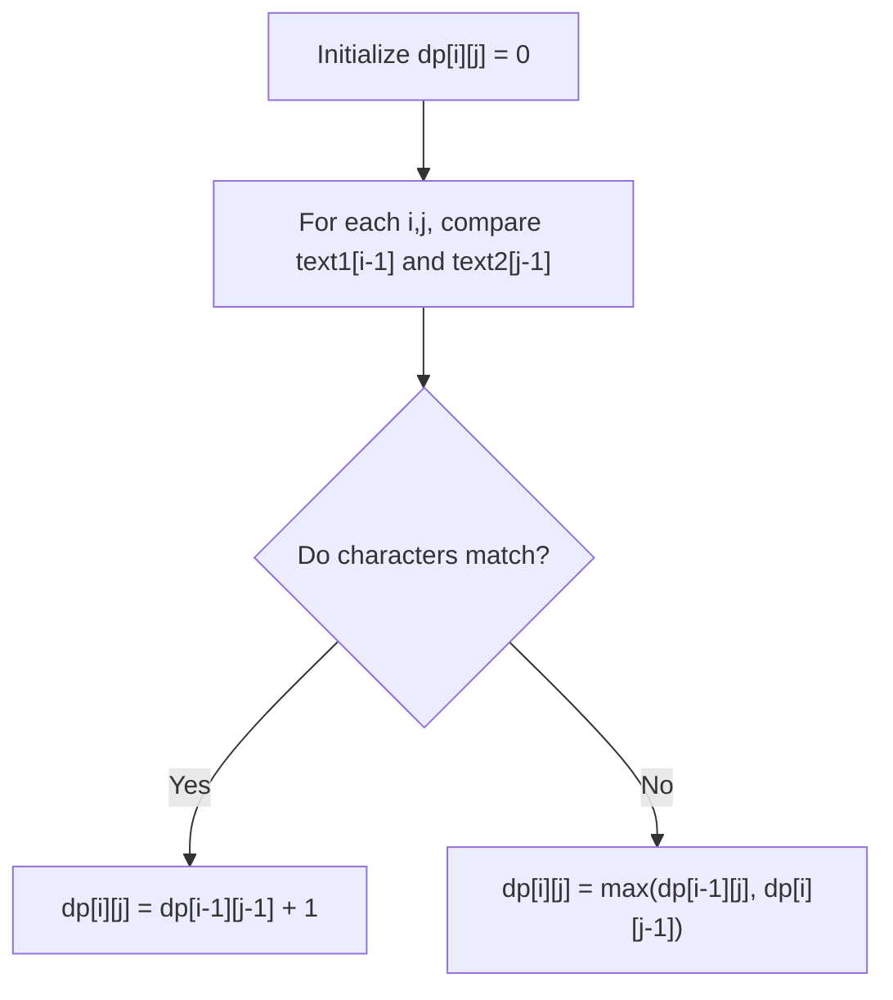

# Implementing LCS: The Iterative Approach 🔄

> [!NOTE]
> In this lesson, we'll implement the LCS algorithm using the bottom-up dynamic programming approach with tabulation. This eliminates recursion and further optimizes our solution.

## From Recursion to Iteration 🔄

While memoization greatly improves our recursive solution, there's another approach that can be even more efficient: **bottom-up dynamic programming**.

Instead of starting from the original problem and breaking it down (top-down), the bottom-up approach:
1. Identifies the smallest subproblems
2. Solves them first
3. Uses those solutions to build up to larger subproblems
4. Eventually solves the original problem

This eliminates the overhead of recursion and is typically more efficient.

## Building the DP Table 📊

For the LCS problem, we'll use a 2D table (matrix) where:
- Rows correspond to characters in text1
- Columns correspond to characters in text2
- Cell (i,j) represents the length of the LCS for the substrings text1[0...i-1] and text2[0...j-1]

Let's see how to implement this:

```javascript
function longestCommonSubsequence(text1, text2) {
  const m = text1.length;
  const n = text2.length;
  
  // Create a table of size (m+1) x (n+1)
  // dp[i][j] represents the LCS length for text1[0...i-1] and text2[0...j-1]
  const dp = Array(m + 1).fill().map(() => Array(n + 1).fill(0));
  
  // Fill the table bottom-up
  for (let i = 1; i <= m; i++) {
    for (let j = 1; j <= n; j++) {
      if (text1[i - 1] === text2[j - 1]) {
        // If current characters match, add 1 to the LCS formed without these characters
        dp[i][j] = dp[i - 1][j - 1] + 1;
      } else {
        // If they don't match, take the maximum LCS by either excluding current character
        // from text1 or from text2
        dp[i][j] = Math.max(dp[i - 1][j], dp[i][j - 1]);
      }
    }
  }
  
  // The bottom-right cell contains the length of the LCS for the entire strings
  return dp[m][n];
}
```

> [!TIP]
> The key insight here is that we're building the solution incrementally, starting from smaller subproblems (shorter prefixes of the strings) and working our way up to the complete problem.

## Visualizing the DP Table 👁️

Let's visualize how the table gets filled for `text1 = "ABCD"` and `text2 = "ACBD"`:

1. First, we initialize the table with 0s:

<details>
<summary>Initial DP Table</summary>

|   |   | A | C | B | D |
|---|---|---|---|---|---|
|   | 0 | 0 | 0 | 0 | 0 |
| A | 0 | 0 | 0 | 0 | 0 |
| B | 0 | 0 | 0 | 0 | 0 |
| C | 0 | 0 | 0 | 0 | 0 |
| D | 0 | 0 | 0 | 0 | 0 |

</details>

2. Then we fill it according to our algorithm:

<details>
<summary>Filling Process</summary>

Considering `text1[0] = 'A'` and `text2[0] = 'A'`:
- Characters match, so dp[1][1] = dp[0][0] + 1 = 0 + 1 = 1

|   |   | A | C | B | D |
|---|---|---|---|---|---|
|   | 0 | 0 | 0 | 0 | 0 |
| A | 0 | 1 | 0 | 0 | 0 |
| B | 0 | 0 | 0 | 0 | 0 |
| C | 0 | 0 | 0 | 0 | 0 |
| D | 0 | 0 | 0 | 0 | 0 |

Considering `text1[0] = 'A'` and `text2[1] = 'C'`:
- Characters don't match, so dp[1][2] = max(dp[0][2], dp[1][1]) = max(0, 1) = 1

|   |   | A | C | B | D |
|---|---|---|---|---|---|
|   | 0 | 0 | 0 | 0 | 0 |
| A | 0 | 1 | 1 | 0 | 0 |
| B | 0 | 0 | 0 | 0 | 0 |
| C | 0 | 0 | 0 | 0 | 0 |
| D | 0 | 0 | 0 | 0 | 0 |

We continue this process for all cells:

|   |   | A | C | B | D |
|---|---|---|---|---|---|
|   | 0 | 0 | 0 | 0 | 0 |
| A | 0 | 1 | 1 | 1 | 1 |
| B | 0 | 1 | 1 | 2 | 2 |
| C | 0 | 1 | 2 | 2 | 2 |
| D | 0 | 1 | 2 | 2 | 3 |

</details>

The final answer is in dp[4][4] = 3, indicating that the LCS of "ABCD" and "ACBD" has length 3.

## Tracing Through the Table 🔍

Here's a step-by-step visualization of how we fill in the DP table:



## Understanding the Index Mapping 🧩

> [!WARNING]
> One common source of confusion: The indices in the DP table are shifted by 1 from the string indices!

- dp[i][j] refers to the LCS of text1[0...i-1] and text2[0...j-1]
- When we access text1[i-1] or text2[j-1], we're translating from DP table indices to string indices

This offset is because we include an extra row and column for the base cases (empty strings).

## Reconstructing the Actual LCS ✏️

Often, you might not just want the length of the LCS, but the actual subsequence itself. We can modify our algorithm to reconstruct it:

```javascript
function longestCommonSubsequence(text1, text2) {
  const m = text1.length;
  const n = text2.length;
  const dp = Array(m + 1).fill().map(() => Array(n + 1).fill(0));
  
  // Fill the DP table
  for (let i = 1; i <= m; i++) {
    for (let j = 1; j <= n; j++) {
      if (text1[i - 1] === text2[j - 1]) {
        dp[i][j] = dp[i - 1][j - 1] + 1;
      } else {
        dp[i][j] = Math.max(dp[i - 1][j], dp[i][j - 1]);
      }
    }
  }
  
  // Reconstruct the LCS
  let i = m, j = n;
  let lcs = "";
  
  while (i > 0 && j > 0) {
    if (text1[i - 1] === text2[j - 1]) {
      // Current characters are part of LCS
      lcs = text1[i - 1] + lcs;
      i--;
      j--;
    } else if (dp[i - 1][j] > dp[i][j - 1]) {
      // Move in the direction of larger value
      i--;
    } else {
      j--;
    }
  }
  
  return { length: dp[m][n], sequence: lcs };
}
```

<details>
<summary>Example Reconstruction</summary>

For our example with `text1 = "ABCD"` and `text2 = "ACBD"`:

1. Start at cell (4,4) with LCS = ""
2. Since text1[3] = 'D' equals text2[3] = 'D', add 'D' to LCS and move to (3,3)
3. Since text1[2] = 'C' equals text2[1] = 'C', add 'C' to LCS and move to (2,1)
4. Since text1[1] = 'B' does not equal text2[0] = 'A', compare dp[1][1] and dp[2][0]
5. dp[1][1] = 1 is greater than dp[2][0] = 0, so move to (1,1)
6. Since text1[0] = 'A' equals text2[0] = 'A', add 'A' to LCS
7. Final LCS = "ACD" with length 3

</details>

## Space Optimization 🚀

We can optimize our solution further by observing that to fill each cell, we only need values from the current and previous rows. This means we can reduce our space complexity from O(m×n) to O(min(m,n)):

```javascript
function longestCommonSubsequence(text1, text2) {
  // Ensure text1 is the shorter string for space optimization
  if (text1.length > text2.length) {
    [text1, text2] = [text2, text1];
  }
  
  const m = text1.length;
  const n = text2.length;
  
  // Use two arrays instead of a 2D matrix
  let prev = Array(m + 1).fill(0);
  let curr = Array(m + 1).fill(0);
  
  for (let j = 1; j <= n; j++) {
    for (let i = 1; i <= m; i++) {
      if (text1[i - 1] === text2[j - 1]) {
        curr[i] = prev[i - 1] + 1;
      } else {
        curr[i] = Math.max(prev[i], curr[i - 1]);
      }
    }
    // Swap arrays for next iteration
    [prev, curr] = [curr, prev];
  }
  
  // The result is in prev after the final swap
  return prev[m];
}
```

This optimization is particularly useful when dealing with very long strings!

## Time and Space Complexity ⏱️

For the standard iterative approach:
- **Time Complexity**: O(m × n) - We need to fill each cell in our DP table
- **Space Complexity**: O(m × n) - We need to store the entire DP table

For the space-optimized version:
- **Time Complexity**: Still O(m × n)
- **Space Complexity**: Reduced to O(min(m, n))

## Advantages of the Iterative Approach 🏆

1. **No Recursion Overhead**: Eliminates function call overhead and stack usage
2. **Predictable Memory Usage**: Memory requirements are clear and consistent
3. **No Risk of Stack Overflow**: Perfect for very long input strings
4. **Often Faster in Practice**: Generally more efficient than memoized recursion

## Think About It 💭

1. Can you think of any other ways to optimize the space usage even further?
2. How would you modify the algorithm if you needed to find all possible LCSs (there can be multiple with the same length)?
3. What's the difference in performance between the recursive and iterative approaches when the input strings are very different vs. when they're very similar?

In the next lesson, we'll explore some variations of the LCS problem and practical applications! 