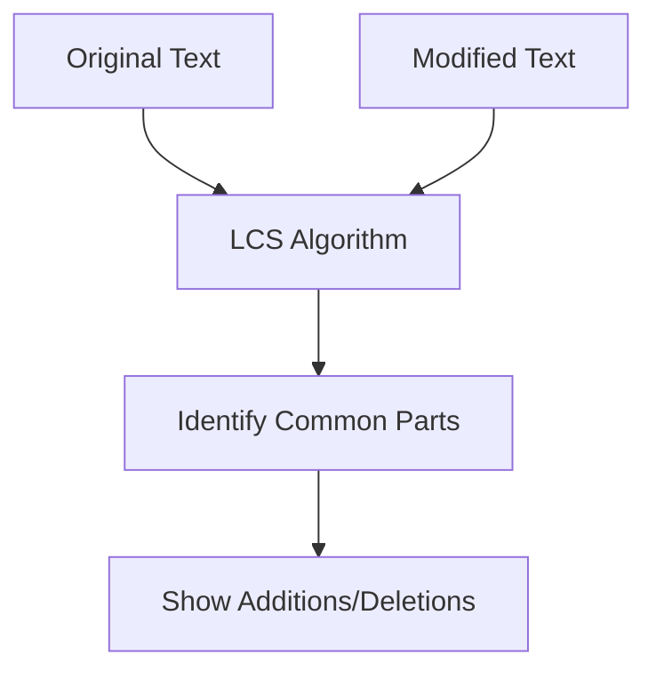

# LCS Variations and Real-World Applications 🌐

> [!NOTE]
> In this lesson, we'll explore some variations of the Longest Common Subsequence problem, discover related algorithms, and see how LCS is applied in real-world scenarios.

## Variations of the LCS Problem 🧩

The LCS problem has several interesting variations and extensions, each with its own applications.

### 1. Longest Common Substring 📚

Unlike a subsequence, a **substring** must be contiguous. The Longest Common Substring problem finds the longest string that appears as a contiguous segment in both input strings.

<details>
<summary>How is this different from LCS?</summary>

- **Subsequence**: Characters can be from non-adjacent positions (e.g., "ace" is a subsequence of "abcde")
- **Substring**: Characters must be adjacent (e.g., "bcd" is a substring of "abcde")

The dynamic programming approach is similar, but the recurrence relation is different:
```
dp[i][j] = 
    • 0, if i = 0 or j = 0
    • dp[i-1][j-1] + 1, if text1[i-1] = text2[j-1]
    • 0, otherwise
```

The answer is the maximum value in the entire DP table, not just the bottom-right cell.
</details>

### 2. Shortest Common Supersequence (SCS) 🔄

The SCS problem asks for the shortest string that has both input strings as subsequences.

<details>
<summary>Connection to LCS</summary>

The length of the shortest common supersequence can be calculated using the LCS:
```
length(SCS) = length(text1) + length(text2) - length(LCS)
```

Why? Because the SCS contains all characters from both strings, but we only need to include the characters from the LCS once.
</details>

### 3. Longest Increasing Subsequence (LIS) 📈

The LIS problem finds the longest subsequence where each element is greater than the previous one. While it seems different from LCS, it can actually be solved using LCS techniques!

<details>
<summary>How to solve LIS using LCS</summary>

1. Create a sorted copy of the original array
2. Find the LCS between the original array and its sorted version
3. This LCS is the longest increasing subsequence

For example, for [10, 9, 2, 5, 3, 7, 101, 18]:
- Sorted array: [2, 3, 5, 7, 9, 10, 18, 101]
- LCS: [2, 5, 7, 101] or [2, 3, 7, 18] or [2, 3, 7, 101]
- Any of these is a valid LIS
</details>

### 4. Diff Utilities and Edit Distance 🔍

File comparison tools like `diff` use LCS-like algorithms to identify changes between files. This is related to the **Edit Distance** problem, which measures the minimum number of operations (insertions, deletions, replacements) needed to transform one string into another.



## Applications in Different Fields 🌍

The LCS algorithm and its variations have applications across many domains:

### 1. Bioinformatics and Genetic Analysis 🧬

In computational biology, LCS is used to:
- Compare DNA, RNA, or protein sequences
- Identify similar genetic patterns across species
- Study evolutionary relationships
- Analyze mutations and genetic variations

> [!TIP]
> When analyzing genetic sequences, biologists often use variations of LCS that account for different mutation costs (known as "alignment scoring").

### 2. Version Control Systems 📝

Tools like Git use LCS-based algorithms to:
- Track changes between file versions
- Highlight additions and deletions
- Merge changes from different branches
- Resolve conflicts when multiple users edit the same file

<details>
<summary>How Git uses LCS-like algorithms</summary>

When you run `git diff`, the tool:
1. Finds common lines between versions (similar to LCS)
2. Shows lines that were added (prefixed with +)
3. Shows lines that were removed (prefixed with -)
4. Uses heuristics to optimize for typical text file structures

This helps developers understand what changed between commits.
</details>

### 3. Plagiarism Detection 🕵️‍♀️

Academic and code plagiarism detection systems use LCS to:
- Find similarities between submissions
- Identify copied segments
- Calculate similarity scores
- Flag potentially plagiarized content

> [!WARNING]
> Simple LCS-based plagiarism detection can be fooled by reordering paragraphs or making superficial changes. Most modern systems use more sophisticated techniques in addition to LCS.

### 4. Text and Code Editors 📄

Features like:
- Syntax highlighting
- Auto-complete suggestions
- Code refactoring tools
- "Smart" paste functionality

All can leverage LCS and its variations to provide better user experiences.

### 5. Natural Language Processing 🗣️

LCS and related algorithms help with:
- Text summarization
- Machine translation
- Spelling correction
- Sentence alignment in parallel texts

## Implementing Real-World Applications 💻

Let's implement a simple diff utility using our LCS knowledge:

```javascript
function simpleDiff(text1, text2) {
  const lcsResult = longestCommonSubsequence(text1, text2);
  const lcsSequence = lcsResult.sequence;
  
  // Track positions in both texts
  let i = 0, j = 0, k = 0;
  const diff = [];
  
  while (i < text1.length || j < text2.length) {
    // If we've reached a character from the LCS in both texts
    if (k < lcsSequence.length && 
        i < text1.length && 
        j < text2.length && 
        text1[i] === lcsSequence[k] && 
        text2[j] === lcsSequence[k]) {
      // Common character, keep it
      diff.push({ type: 'common', value: text1[i] });
      i++; j++; k++;
    } 
    // If current character in text1 isn't part of LCS
    else if (i < text1.length && (k >= lcsSequence.length || text1[i] !== lcsSequence[k])) {
      diff.push({ type: 'removed', value: text1[i] });
      i++;
    } 
    // If current character in text2 isn't part of LCS
    else if (j < text2.length && (k >= lcsSequence.length || text2[j] !== lcsSequence[k])) {
      diff.push({ type: 'added', value: text2[j] });
      j++;
    }
  }
  
  return diff;
}
```

This simplified diff utility identifies which characters were kept, added, or removed between two texts.

<details>
<summary>Example Usage</summary>

```javascript
const diff = simpleDiff("ABCDEF", "ACBDEGF");
console.log(diff);
/*
[
  { type: 'common', value: 'A' },
  { type: 'removed', value: 'B' },
  { type: 'common', value: 'C' },
  { type: 'added', value: 'B' },
  { type: 'common', value: 'D' },
  { type: 'common', value: 'E' },
  { type: 'added', value: 'G' },
  { type: 'common', value: 'F' }
]
*/

// Format the output nicely
const formatted = diff.map(d => {
  if (d.type === 'common') return d.value;
  if (d.type === 'added') return `+${d.value}`;
  if (d.type === 'removed') return `-${d.value}`;
}).join('');

console.log(formatted); // "A-BC+BDE+GF"
```
</details>

## Performance Considerations for Real Applications 🚀

When implementing LCS for real-world applications, consider:

1. **Space Optimization**: For very long strings (like comparing large text files), the O(min(m,n)) space optimization becomes critical.

2. **Handling Special Cases**: Some applications might need special handling for:
   - Case sensitivity (e.g., "A" vs "a")
   - Whitespace (should it be ignored?)
   - Special characters or formatting

3. **Parallelization**: For extremely large inputs, consider dividing the problem into smaller, parallel tasks.

4. **Approximate Matching**: Sometimes, exact LCS is too strict. Applications might need fuzzy matching or allow for small differences.

## Beyond Basic LCS: Advanced Techniques 🔬

For specialized applications, researchers have developed advanced variations:

1. **Hunt-Szymanski Algorithm**: Optimized for cases with sparse matches

2. **Hirschberg's Algorithm**: Computes LCS in O(min(m,n)) space without sacrificing the ability to reconstruct the actual subsequence

3. **k-LCS Problem**: Finding k disjoint common subsequences with maximum total length

4. **Weighted LCS**: Assigning different weights to matching different characters

## Think About It 💭

1. How would you adapt the LCS algorithm for comparing source code, where whitespace and comments might be less important?

2. Can you think of a way to visualize the differences between two texts using HTML and CSS based on our diff output?

3. What modifications would you make to the LCS algorithm if you were comparing DNA sequences where certain types of mutations are more common than others?

4. How might you optimize the LCS algorithm for very long strings where matches are expected to be clustered (not uniformly distributed)?

## Conclusion 🏁

The Longest Common Subsequence problem is a fascinating example of dynamic programming with widespread applications. By understanding LCS and its variations, you've gained insight into:

1. How to approach sequence comparison problems
2. The power and versatility of dynamic programming
3. How theoretical algorithms translate to practical applications

As you continue your algorithm journey, you'll find that the principles learned here apply to many other problems, and the techniques can be adapted to solve increasingly complex challenges in software development, data analysis, and beyond! 