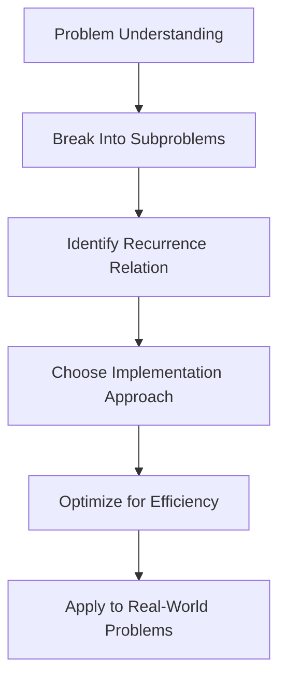

# Mastering the Longest Common Subsequence: Conclusion 🏆

> [!NOTE]
> Congratulations! You've completed our step-by-step guide to the Longest Common Subsequence algorithm. In this final lesson, we'll summarize what you've learned and provide guidance for further exploration.

## Key Concepts Reviewed 📝

Throughout our journey with the Longest Common Subsequence algorithm, we've covered:

### 1. Problem Understanding 🧠
- A subsequence is a sequence that can be derived by deleting some or no elements without changing the order
- LCS finds the longest subsequence common to two strings
- Unlike substrings, subsequences don't need to be contiguous

### 2. Solution Approaches 🛠️
- **Recursive Approach**: Breaking down the problem into smaller subproblems
- **Memoization**: Enhancing recursion by storing solutions to avoid redundant calculations
- **Dynamic Programming**: Building solutions iteratively from the ground up
- **Space Optimization**: Reducing memory usage for large inputs

### 3. Implementation Techniques 💻
- Converting mathematical recurrence relations to code
- Handling edge cases (empty strings, no common characters)
- Efficient data structures for storing intermediate results
- Reconstructing the actual subsequence, not just its length

### 4. Real-World Applications 🌎
- Bioinformatics and DNA sequence analysis
- Version control systems and diff utilities
- Plagiarism detection
- Text processing and natural language applications

## Algorithmic Insights 💡

The LCS problem has provided us with valuable algorithmic insights:

1. **Optimal Substructure**: Solutions to larger problems can be built from solutions to smaller subproblems
2. **Overlapping Subproblems**: The same subproblems are solved multiple times, making dynamic programming efficient
3. **State Transitions**: Clear rules for moving from one state to another in our solution
4. **Trade-offs**: Understanding the balance between time and space complexity



## Common Pitfalls and How to Avoid Them ⚠️

As you work with LCS and similar algorithms, watch out for:

> [!WARNING]
> 1. **Confusing Subsequence and Substring**: Always remember that subsequences don't need to be contiguous
> 2. **Off-by-One Errors**: Be careful with string indices vs. DP table indices
> 3. **Inefficient Implementations**: Don't use exponential approaches without memoization
> 4. **Neglecting Edge Cases**: Handle empty strings and other special cases
> 5. **Reinventing the Wheel**: Many standard libraries already have LCS implementations

## Expanding Your Knowledge 📚

To continue your algorithm journey, here are some related topics to explore:

### Advanced Dynamic Programming
- **Multidimensional DP**: Extending to problems with more variables
- **State Compression**: Reducing space requirements further
- **Digit DP**: Dynamic programming on digits of numbers

### Related Problems
- **Edit Distance (Levenshtein Distance)**: Measuring transformation cost between strings
- **String Alignment**: Optimally aligning sequences with gaps
- **Sequence Alignment with Affine Gap Penalty**: More realistic models for certain applications

### Specialized Algorithms
- **Suffix Trees and Arrays**: Powerful data structures for string processing
- **Approximate String Matching**: Finding similar but not identical strings
- **Parallel Algorithms**: Solving LCS and related problems on multiple processors

## Practical Tips for Implementation 🔧

When implementing LCS in real projects:

> [!TIP]
> 1. **Profile Before Optimizing**: Measure performance to identify bottlenecks
> 2. **Consider Libraries**: Use existing implementations when appropriate
> 3. **Document Assumptions**: Note any special handling of case sensitivity, whitespace, etc.
> 4. **Test Edge Cases**: Empty strings, very long strings, strings with repeated characters
> 5. **Optimize for Your Use Case**: Different applications may require different trade-offs

## Challenge Yourself 🏋️‍♀️

To solidify your understanding, try these extensions to the LCS problem:

<details>
<summary>Find all LCSs, not just one</summary>

Modify the algorithm to return all possible longest common subsequences, not just one. This requires tracking multiple paths through the DP table during reconstruction.

```javascript
function allLongestCommonSubsequences(text1, text2) {
  // First build the DP table as usual
  const m = text1.length;
  const n = text2.length;
  const dp = Array(m + 1).fill().map(() => Array(n + 1).fill(0));
  
  // Fill the DP table
  for (let i = 1; i <= m; i++) {
    for (let j = 1; j <= n; j++) {
      if (text1[i - 1] === text2[j - 1]) {
        dp[i][j] = dp[i - 1][j - 1] + 1;
      } else {
        dp[i][j] = Math.max(dp[i - 1][j], dp[i][j - 1]);
      }
    }
  }
  
  // Function to backtrack and find all LCSs
  function backtrack(i, j, current) {
    if (i === 0 || j === 0) {
      return [current];
    }
    
    if (text1[i - 1] === text2[j - 1]) {
      return backtrack(i - 1, j - 1, text1[i - 1] + current);
    } else {
      const results = [];
      
      if (dp[i - 1][j] >= dp[i][j - 1]) {
        results.push(...backtrack(i - 1, j, current));
      }
      
      if (dp[i][j - 1] >= dp[i - 1][j]) {
        results.push(...backtrack(i, j - 1, current));
      }
      
      return results;
    }
  }
  
  // Start backtracking from the bottom-right cell
  const allLCS = backtrack(m, n, "");
  
  // Remove duplicates
  return [...new Set(allLCS)];
}
```
</details>

<details>
<summary>Implement LCS for multiple strings</summary>

Extend the LCS algorithm to find the longest common subsequence of three or more strings. This requires a higher-dimensional DP array.

```javascript
function longestCommonSubsequence(strings) {
  if (strings.length === 0) return "";
  if (strings.length === 1) return strings[0];
  
  // For three strings, create a 3D DP array
  if (strings.length === 3) {
    const [s1, s2, s3] = strings;
    const m = s1.length, n = s2.length, o = s3.length;
    
    const dp = Array(m + 1).fill().map(() => 
      Array(n + 1).fill().map(() => 
        Array(o + 1).fill(0)
      )
    );
    
    for (let i = 1; i <= m; i++) {
      for (let j = 1; j <= n; j++) {
        for (let k = 1; k <= o; k++) {
          if (s1[i - 1] === s2[j - 1] && s1[i - 1] === s3[k - 1]) {
            dp[i][j][k] = dp[i - 1][j - 1][k - 1] + 1;
          } else {
            dp[i][j][k] = Math.max(
              dp[i - 1][j][k],
              dp[i][j - 1][k],
              dp[i][j][k - 1]
            );
          }
        }
      }
    }
    
    // Reconstruct the LCS
    // This part is more complex for 3+ strings
    // and left as an exercise
    
    return dp[m][n][o]; // Returns length only
  }
  
  // For more than three strings, use a recursive approach
  // Find LCS of first two strings, then find LCS of that result with third string, and so on
  let result = strings[0];
  for (let i = 1; i < strings.length; i++) {
    result = longestCommonSubsequence([result, strings[i]]);
  }
  
  return result;
}
```
</details>

## Final Thoughts 💭

The Longest Common Subsequence problem is more than just an interesting algorithmic challenge—it's a powerful tool with real-world applications. By mastering LCS, you've gained:

1. **Problem-Solving Skills**: The ability to break down complex problems into manageable parts
2. **Dynamic Programming Proficiency**: A fundamental technique applicable to many other problems
3. **Algorithm Analysis Skills**: Understanding time and space complexity trade-offs
4. **Practical Application Knowledge**: Seeing how theoretical algorithms power everyday tools

Remember that the best way to solidify your understanding is through practice. Try implementing LCS in different languages, optimize it for specific use cases, and explore its variations. Each implementation will deepen your understanding and make you a better algorithm designer.

> [!TIP]
> The journey doesn't end here! As you encounter new problems, ask yourself if dynamic programming principles from LCS might apply. You'll be surprised how often these patterns emerge in seemingly unrelated areas.

Happy coding, and congratulations on mastering the Longest Common Subsequence algorithm! 🎉 