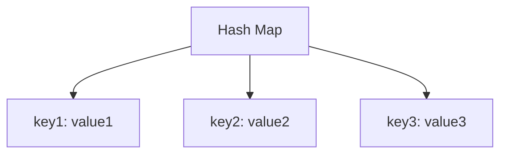
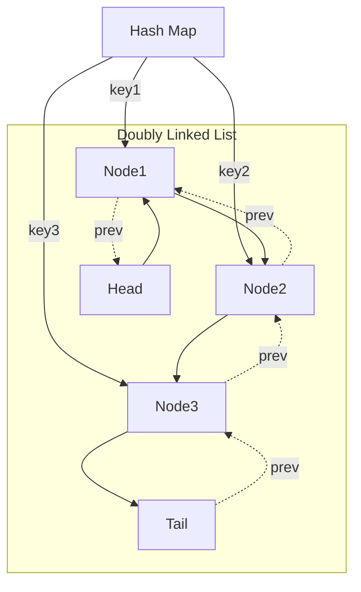

# 🧱 Choosing the Right Data Structures

To implement an efficient LRU Cache, we need to carefully select our data structures. Remember, we have two main requirements:

1. O(1) time for all operations (get and put)
2. Tracking the "recency" of access for all items

## The Challenge of Efficient Access 🎯

Let's think about the operations we need to support:

- **Fast Lookups**: Given a key, find its value quickly
- **Fast Updates**: When a key is accessed, mark it as "recently used"
- **Fast Removal**: When the cache is full, remove the least recently used item

> [!TIP] 
> One data structure alone cannot efficiently handle all these operations!

## Hash Map for Fast Lookups 🔍

For O(1) lookups, a **Hash Map** (or dictionary) is the natural choice:



- ✅ O(1) lookups by key
- ✅ O(1) insertions and updates
- ❌ No inherent ordering - can't easily track "recency"

## Doubly Linked List for Ordering 📊

To track the order of usage, a **Doubly Linked List** is ideal:


- ✅ Easy to move items to the front (mark as recently used)
- ✅ Easy to remove the last item (least recently used)
- ✅ O(1) insertions and deletions
- ❌ O(n) lookups - can't find an element by key quickly

## Combining the Two: The Perfect Solution 💡

By combining these data structures, we can leverage the strengths of each:



Here's how it works:

1. The **Hash Map** maps each key to its node in the linked list
2. The **Doubly Linked List** maintains the order of usage (most recent at the front)

> [!NOTE]
> This combination gives us O(1) time for all operations!

## Node Structure 🧩

Each node in our linked list needs to store:

```
class Node {
  key: number;     // The key (needed for removal from hash map)
  value: number;   // The stored value
  next: Node;      // Reference to the next node
  prev: Node;      // Reference to the previous node
}
```

<details>
<summary>Why do we need to store the key in the node?</summary>

When we remove the least recently used node from the tail of the linked list, we also need to remove its entry from the hash map. To do this, we need to know its key.
</details>

## Think About It ✨

Before moving on, consider these questions:

- Why is a doubly linked list better than a singly linked list for this problem?
- What happens if we use an array instead of a linked list?
- How exactly will we update the "recency" when an item is accessed?

In the next lesson, we'll explore the detailed implementation of our LRU Cache! 