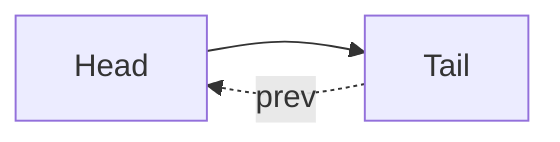
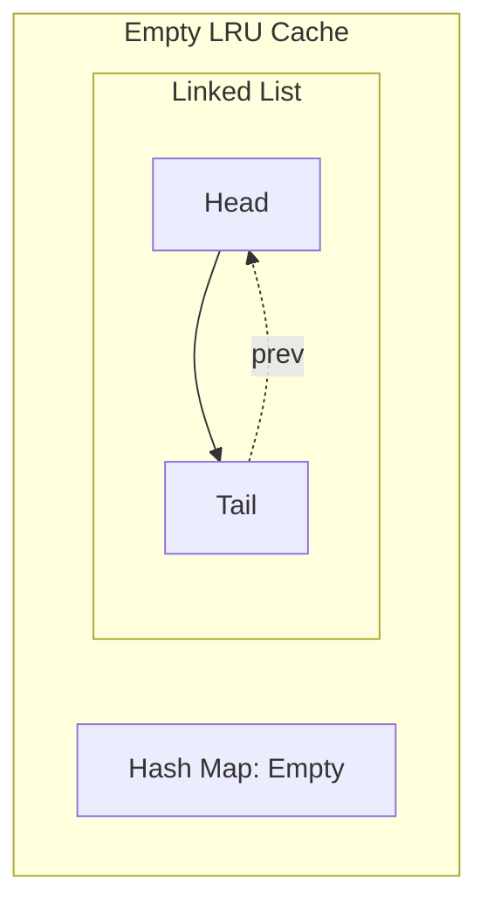

# 🏗️ Setting Up the LRU Cache Structure

Now that we understand the data structures we'll use, let's start building our LRU Cache step by step. We'll begin by setting up the foundation.

## Creating the Node Class 🧩

First, we need a Node class to store our key-value pairs and maintain the links in our doubly linked list:

```typescript
class Node {
  key: number;
  value: number;
  next: Node | null;
  prev: Node | null;

  constructor(key: number, value: number) {
    this.key = key;
    this.value = value;
    this.next = null;
    this.prev = null;
  }
}
```

> [!NOTE]
> Each node stores both the key and value, along with references to the next and previous nodes.

## Initializing the LRU Cache 🚀

Now let's create the main LRU Cache class with its constructor:

```typescript
class LRUCache {
  capacity: number;
  cache: Map<number, Node>;
  head: Node;
  tail: Node;

  constructor(capacity: number) {
    this.capacity = capacity;
    this.cache = new Map();        // Hash map for O(1) lookups
    this.head = new Node(0, 0);    // Dummy head node
    this.tail = new Node(0, 0);    // Dummy tail node
    
    // Connect the head and tail
    this.head.next = this.tail;
    this.tail.prev = this.head;
  }
  
  // methods will come here
}
```

## Visualizing the Initial Structure 📊

After initialization, our LRU Cache looks like this:



<details>
<summary>Why do we use dummy head and tail nodes?</summary>

Dummy nodes simplify our implementation by eliminating edge cases:
- We never have to check if we're at the beginning or end of the list
- We don't have to update the head or tail pointers directly
- It makes insertion and deletion operations uniform
</details>

## Understanding the Components 🔍

Let's break down what each component does:

1. **capacity**: The maximum number of key-value pairs our cache can hold
2. **cache**: A hash map that maps keys to nodes in the linked list
3. **head**: The start of our linked list (items near the head are most recently used)
4. **tail**: The end of our linked list (items near the tail are least recently used)

> [!TIP]
> Using dummy head and tail nodes simplifies our implementation by avoiding null checks and edge cases.

## The Empty State ✨

When we first create the cache, it's empty:
- The dummy head and tail are connected
- The cache map contains no entries
- We're ready to start adding items!



## Think About It 🤔

Before moving on, consider:

- What happens when we add our first item to the cache?
- How will the linked list change as we add more items?
- Why is it important that we stored the key in each node?

In the next lesson, we'll implement the core operations of our LRU Cache! 