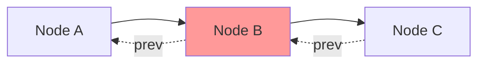
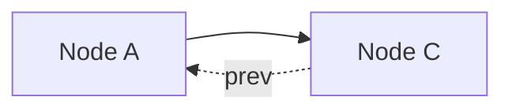
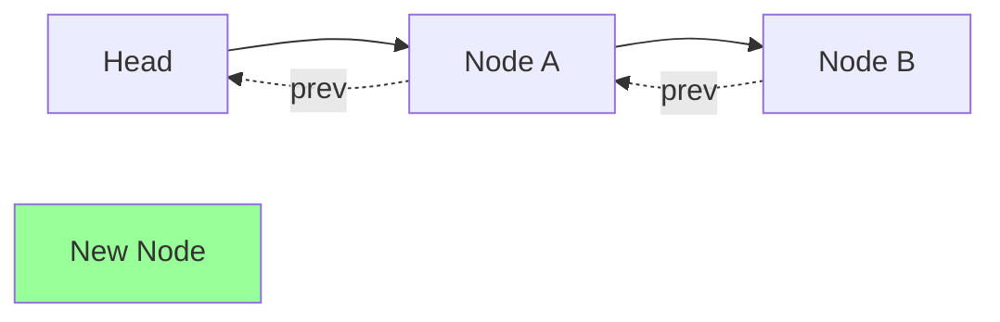
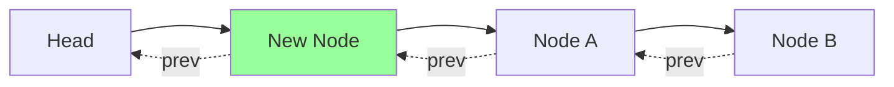

# 🛠️ Essential Helper Methods

Before implementing the main operations (get and put), we need to create two helper methods that will be used frequently:

1. **addToFront**: Places a node at the front of the list (most recently used)
2. **removeNode**: Removes a node from anywhere in the list

These helper methods will abstract away the complex linked list operations, making our main methods cleaner and easier to understand.

## The removeNode Method 🔗

This method detaches a node from its current position in the doubly linked list:

```typescript
private removeNode(node: Node): void {
  node.prev!.next = node.next;
  node.next!.prev = node.prev;
}
```

Let's visualize this operation:



After removing Node B:



> [!NOTE]
> The `!` operator is used in TypeScript to tell the compiler that we're sure `prev` and `next` are not null. This is safe because our dummy head and tail nodes ensure these links always exist.

## The addToFront Method ⬆️

This method adds a node right after the dummy head node (making it the most recently used):

```typescript
private addToFront(node: Node): void {
  node.next = this.head.next;
  node.prev = this.head;
  this.head.next!.prev = node;
  this.head.next = node;
}
```

Visualizing this operation:



After adding the New Node:



<details>
<summary>Why do we have to update four links when adding a node?</summary>

In a doubly linked list, each node has two links: next and prev. When inserting a node, we need to:
1. Set the new node's next and prev links (2 updates)
2. Update the adjacent nodes' links to point to the new node (2 updates)

So, a total of 4 links need to be updated to properly insert a node.
</details>

## The Power of These Helpers 💪

These helper methods might seem simple, but they're the workhorses of our LRU Cache implementation:

- **Abstraction**: They hide the complex linked list operations 
- **Reusability**: They'll be used in both our get and put methods
- **Correctness**: By centralizing these operations, we ensure they're done consistently

> [!TIP]
> Breaking down complex operations into helper methods is a great way to make your code more readable and maintainable.

## Order Matters! ⚠️

When adding or removing nodes, the order of operations is critical:

- When removing a node, update the links of adjacent nodes
- When adding a node, set the new node's links before updating the adjacent nodes

> [!WARNING]
> Getting the order wrong can lead to lost references and broken links in the list!

## Think About It 🤔

Before moving on:

- What would happen if we tried to use these methods on an empty list?
- Why do we need both `removeNode` and `addToFront` methods instead of just a single "move to front" method?
- How do these helper methods contribute to the O(1) time complexity requirement?

In the next lesson, we'll use these helpers to implement the main operations of our LRU Cache! 