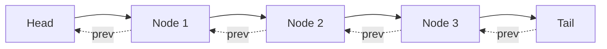
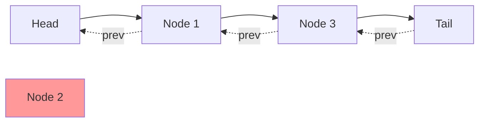
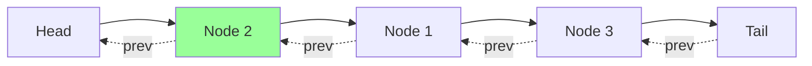

# 🔍 Implementing the Get Operation

Now let's implement the first of our two main operations: the `get` method. This method retrieves a value from the cache by its key and also marks it as recently used.

## The Get Method Requirements 📋

According to our problem description, the `get` method should:

1. Return the value of the key if it exists in the cache
2. Return -1 if the key doesn't exist
3. Mark the accessed key as recently used
4. Complete in O(1) time

## Implementation 💻

Here's how we implement the `get` method:

```typescript
get(key: number): number {
  // If key doesn't exist, return -1
  if (!this.cache.has(key)) {
    return -1;
  }

  // Get the node from the cache
  const node = this.cache.get(key)!;
  
  // Mark as recently used: remove from current position and move to front
  this.removeNode(node);
  this.addToFront(node);
  
  // Return the value
  return node.value;
}
```

## How It Works: Step by Step 🔄

Let's trace through the execution of `get(2)` in a cache that contains keys 1, 2, and 3:

Initial state:



Step 1: We check if key 2 exists in the cache (it does).

Step 2: We get the node for key 2 from the cache.

Step 3: We remove Node 2 from its current position.



Step 4: We add Node 2 to the front of the list (right after the head).



Step 5: We return the value of Node 2.

> [!NOTE]
> After the `get` operation, the key-value pair is now at the front of the list, marking it as the most recently used item.

## Edge Cases 🧪

Let's consider a few edge cases:

1. **Cache is empty**: If the cache is empty, `this.cache.has(key)` returns false, so we correctly return -1.
2. **Key doesn't exist**: Similarly, if the key isn't in the cache, we return -1.
3. **Cache contains only one item**: Our helper methods work correctly even with just one item in the cache.

## Why This Is O(1) ⏱️

Our `get` method performs:
- One hash map lookup (`this.cache.has(key)`) - O(1)
- One hash map retrieval (`this.cache.get(key)`) - O(1)
- One remove operation (`removeNode`) - O(1) because we have direct reference to the node
- One add operation (`addToFront`) - O(1)

Since all operations are O(1), the entire method is O(1) as required.

> [!TIP]
> Notice how we use the helper methods to keep our code clean and focused on the high-level logic!

## Think About It 🤔

Before moving on, consider:

- What happens to the recency ordering when we get an item that's already at the front?
- How does the `get` method contribute to the LRU eviction policy?
- Can you trace what happens if you call `get(4)` on a cache that contains only keys 1, 2, and 3?

In the next lesson, we'll implement the final piece: the `put` operation! 