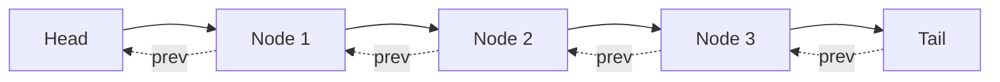

# 📝 Implementing the Put Operation

Now we're ready to implement the second and final main operation: the `put` method. This method adds or updates a key-value pair in the cache and handles eviction if the capacity is exceeded.

## The Put Method Requirements 📋

According to our problem description, the `put` method should:

1. Update the value if the key already exists
2. Add the key-value pair if the key doesn't exist
3. Mark the key as recently used in both cases
4. If adding a new key would exceed capacity, evict the least recently used key
5. Complete in O(1) time

## Implementation 💻

Here's how we implement the `put` method:

```typescript
put(key: number, value: number): void {
  // If key already exists in cache
  if (this.cache.has(key)) {
    // Get the existing node and update its value
    const node = this.cache.get(key)!;
    node.value = value;
    
    // Mark as recently used: remove from current position and move to front
    this.removeNode(node);
    this.addToFront(node);
    return;
  }
  
  // If key doesn't exist in cache
  // Create a new node
  const newNode = new Node(key, value);
  this.cache.set(key, newNode);
  this.addToFront(newNode);
  
  // Check if capacity is exceeded
  if (this.cache.size > this.capacity) {
    // Remove the least recently used node (the one before the tail)
    const lruNode = this.tail.prev!;
    this.removeNode(lruNode);
    this.cache.delete(lruNode.key);
  }
}
```

## How It Works: Step by Step 🔄

Let's trace through two scenarios:

### Scenario 1: Updating an Existing Key

Initial state (capacity = 3):



Executing `put(2, 22)`:

1. Key 2 exists in the cache, so we update Node 2's value to 22
2. We remove Node 2 from its current position
3. We add Node 2 to the front of the list
4. The cache now looks like:

```mermaid
graph LR
    H[Head] --> N2[Node 2<br/>(value: 22)] --> N1[Node 1] --> N3[Node 3] --> T[Tail]
    T -.-> |prev| N3
    N3 -.-> |prev| N1
    N1 -.-> |prev| N2
    N2 -.-> |prev| H
    
    style N2 fill:#ffff99
```

### Scenario 2: Adding a New Key That Exceeds Capacity

Initial state (capacity = 3):


Executing `put(4, 4)`:

1. Key 4 doesn't exist in the cache
2. We create a new node with key 4, value 4
3. We add the new node to the front of the list
4. Cache size (4) now exceeds capacity (3)
5. We identify the least recently used node: Node 3 (the one before the tail)
6. We remove Node 3 from the list and from the hash map
7. The cache now looks like:

```mermaid
graph LR
    H[Head] --> N4[Node 4] --> N1[Node 1] --> N2[Node 2] --> T[Tail]
    T -.-> |prev| N2
    N2 -.-> |prev| N1
    N1 -.-> |prev| N4
    N4 -.-> |prev| H
    
    style N4 fill:#99ff99
    style N3 fill:#ff9999,stroke-dasharray: 5 5
    
    N3[Node 3<br/>(evicted)]
```

> [!NOTE]
> Notice that the least recently used item (Node 3) was evicted to maintain the capacity constraint.

## The Importance of Storing the Key 🔑

Now it's clear why we store the key in each node: when we need to evict the LRU node, we need its key to remove the corresponding entry from the hash map.

```typescript
// Remove the least recently used node (the one before the tail)
const lruNode = this.tail.prev!;
this.removeNode(lruNode);
this.cache.delete(lruNode.key); // We need the key here!
```

<details>
<summary>What if we didn't store the key in the node?</summary>

If we didn't store the key in the node, we would have no way to know which entry to remove from the hash map when evicting the LRU node. We would need to search through the entire hash map to find the key that maps to the node we're evicting, which would be an O(n) operation, violating our O(1) time requirement.
</details>

## Why This Is O(1) ⏱️

Our `put` method performs:
- Hash map operations (lookup, insertion, deletion) - O(1)
- Linked list operations (using our helper methods) - O(1)

Since all operations are O(1), the entire method is O(1) as required.

> [!WARNING]
> A common mistake is to forget to remove the evicted key from the hash map, which would cause a memory leak!

## Think About It 🤔

Before moving on, consider:

- What happens if we `put` an item with a key that already exists but with a different value?
- How would you modify the implementation to support a capacity of 0?
- Can you trace what happens when you make multiple `put` calls that exceed the capacity?

In the next lesson, we'll walk through a complete example to see our LRU Cache in action! 