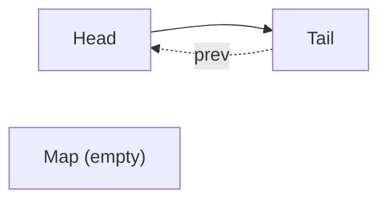
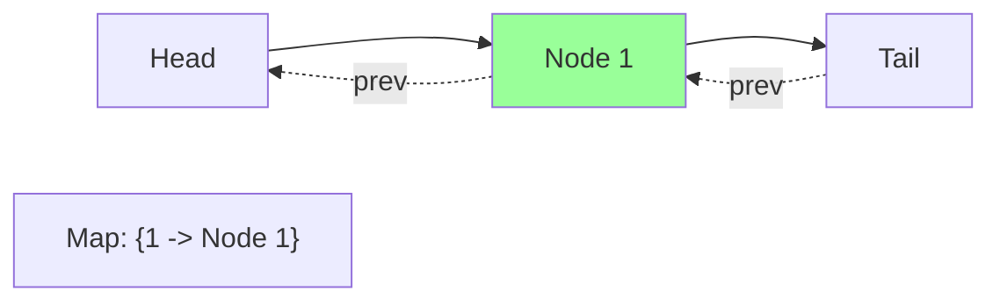
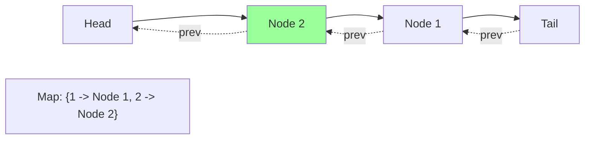
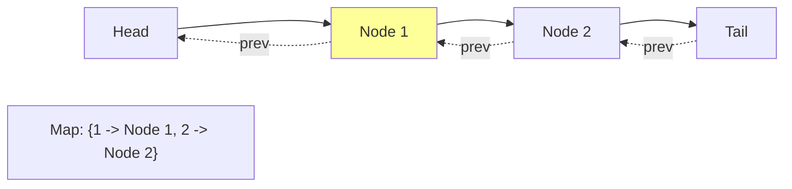
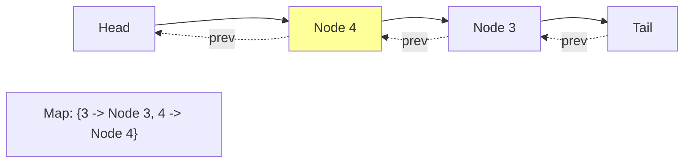

# 🎬 Tracing Through a Complete Example

To solidify our understanding, let's trace through a complete example of how our LRU Cache works with a sequence of operations. This will help us see the algorithm in action and understand how the different parts work together.

## Example Operations 📋

Let's walk through the example from the problem description:

```
LRUCache lRUCache = new LRUCache(2);
lRUCache.put(1, 1); // cache is {1=1}
lRUCache.put(2, 2); // cache is {1=1, 2=2}
lRUCache.get(1);    // return 1
lRUCache.put(3, 3); // LRU key was 2, evicts key 2, cache is {1=1, 3=3}
lRUCache.get(2);    // returns -1 (not found)
lRUCache.put(4, 4); // LRU key was 1, evicts key 1, cache is {4=4, 3=3}
lRUCache.get(1);    // return -1 (not found)
lRUCache.get(3);    // return 3
lRUCache.get(4);    // return 4
```

## Step-by-Step Visualization 📊

### 1. Initialize the LRU Cache with Capacity 2



### 2. Put Key 1, Value 1



### 3. Put Key 2, Value 2



### 4. Get Key 1

First, we check if key 1 exists in the cache (it does).
Then, we move Node 1 to the front of the list and return its value.



Return value: 1

### 5. Put Key 3, Value 3

Key 3 doesn't exist in the cache, so we add it.
The cache size exceeds capacity, so we need to evict the LRU item (Node 2).

```mermaid
graph LR
    H[Head] --> N3[Node 3] --> N1[Node 1] --> T[Tail]
    T -.-> |prev| N1
    N1 -.-> |prev| N3
    N3 -.-> |prev| H
    
    Map["Map: {1 -> Node 1, 3 -> Node 3}"]
    
    style N3 fill:#99ff99
    style N2 fill:#ff9999,stroke-dasharray: 5 5
    
    N2[Node 2<br/>(evicted)]
```

### 6. Get Key 2

We check if key 2 exists in the cache (it doesn't, as it was evicted).

```mermaid
graph LR
    H[Head] --> N3[Node 3] --> N1[Node 1] --> T[Tail]
    T -.-> |prev| N1
    N1 -.-> |prev| N3
    N3 -.-> |prev| H
    
    Map["Map: {1 -> Node 1, 3 -> Node 3}"]
    
    style N2 fill:#ff9999,stroke-dasharray: 5 5
    
    N2[Node 2<br/>(evicted)]
```

Return value: -1

### 7. Put Key 4, Value 4

Key 4 doesn't exist in the cache, so we add it.
The cache size exceeds capacity, so we need to evict the LRU item (Node 1).

```mermaid
graph LR
    H[Head] --> N4[Node 4] --> N3[Node 3] --> T[Tail]
    T -.-> |prev| N3
    N3 -.-> |prev| N4
    N4 -.-> |prev| H
    
    Map["Map: {3 -> Node 3, 4 -> Node 4}"]
    
    style N4 fill:#99ff99
    style N1 fill:#ff9999,stroke-dasharray: 5 5
    
    N1[Node 1<br/>(evicted)]
```

### 8. Get Key 1

We check if key 1 exists in the cache (it doesn't, as it was evicted).

```mermaid
graph LR
    H[Head] --> N4[Node 4] --> N3[Node 3] --> T[Tail]
    T -.-> |prev| N3
    N3 -.-> |prev| N4
    N4 -.-> |prev| H
    
    Map["Map: {3 -> Node 3, 4 -> Node 4}"]
    
    style N1 fill:#ff9999,stroke-dasharray: 5 5
    
    N1[Node 1<br/>(evicted)]
```

Return value: -1

### 9. Get Key 3

Key 3 exists in the cache, so we move Node 3 to the front and return its value.


Return value: 3

### 10. Get Key 4

Key 4 exists in the cache, so we move Node 4 to the front and return its value.



Return value: 4

## Observations 🔎

From this example, we can observe several key behaviors of our LRU Cache:

1. **Most Recently Used Item**: After each operation, the most recently used item is always at the front of the list (right after the head).

2. **Least Recently Used Item**: The item to be evicted is always at the end of the list (right before the tail).

3. **Cache Capacity**: The cache never exceeds its capacity (2 in this example).

4. **Eviction Policy**: When capacity is exceeded, the least recently used item is always evicted.

5. **Access Updates Recency**: Getting a key marks it as recently used, just like putting it.

> [!TIP]
> Pay close attention to how the order of nodes changes with each operation. This is the essence of the LRU algorithm!

## Think About It 🤔

- Can you predict what would happen if we executed `put(3, 30)` at the end of this sequence?
- What about `put(5, 5)`?
- How would the behavior change if the capacity were 3 instead of 2?

In the next lesson, we'll discuss advanced considerations and variations of the LRU Cache algorithm! 