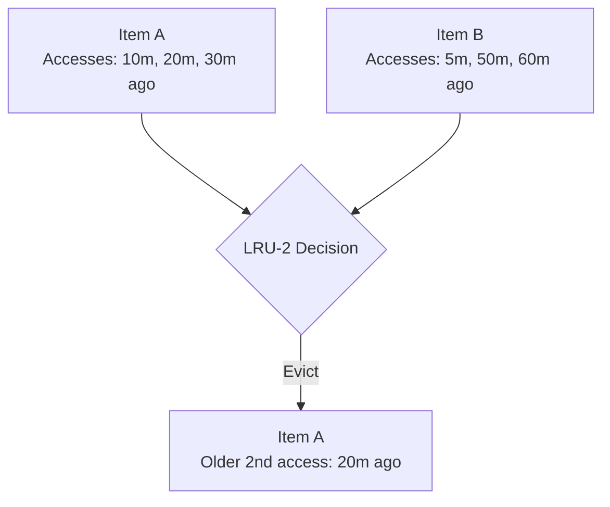
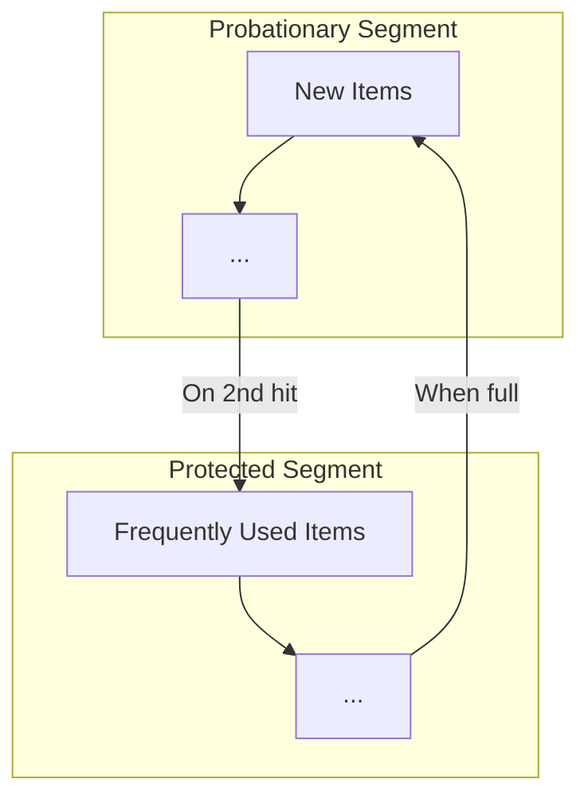

# 🔄 Variations and Optimizations

Now that we understand the basic LRU Cache, let's explore some variations and optimizations that are commonly used in real-world applications.

## LRU Cache Variations 🌈

### 1. LRU-K Cache 🔢

The standard LRU algorithm bases eviction decisions on the most recent access. LRU-K considers the K most recent accesses to make more informed decisions.



> [!NOTE]
> While standard LRU would evict B (last accessed 5m ago), LRU-2 might evict A because its 2nd-to-last access is older (20m vs 50m ago).

### 2. Time-Aware LRU (TLRU) ⏱️

TLRU adds time-based expiration to entries, automatically removing items that haven't been accessed within a time threshold.

```typescript
class TLRUNode extends Node {
  expiresAt: number;
  
  constructor(key: number, value: number, ttl: number) {
    super(key, value);
    this.expiresAt = Date.now() + ttl;
  }
  
  isExpired(): boolean {
    return Date.now() > this.expiresAt;
  }
}
```

### 3. Segmented LRU (SLRU) 🧩

SLRU divides the cache into multiple segments with different priorities:



> [!TIP]
> Items start in the probationary segment and move to the protected segment only when accessed again, providing better protection for frequently used items.

## Performance Optimizations 🚀

### 1. Thread Safety 🔒

The basic implementation isn't thread-safe. For concurrent applications, we can add synchronization:

```typescript
class ThreadSafeLRUCache {
  private mutex = new Mutex();
  
  async get(key: number): Promise<number> {
    return await this.mutex.runExclusive(() => {
      // Existing get implementation
    });
  }
  
  async put(key: number, value: number): Promise<void> {
    await this.mutex.runExclusive(() => {
      // Existing put implementation
    });
  }
}
```

### 2. Batch Operations 📦

For scenarios with high write loads, we can implement batch operations to reduce overhead:

```typescript
putAll(entries: [number, number][]): void {
  for (const [key, value] of entries) {
    this.put(key, value);
  }
}

getAll(keys: number[]): (number | -1)[] {
  return keys.map(key => this.get(key));
}
```

### 3. Size-Aware Caching 📏

Instead of counting entries, we can track the actual memory size:

```typescript
class SizeAwareLRUCache {
  maxBytes: number;
  currentBytes: number = 0;
  
  put(key: number, value: number): void {
    const valueSize = this.calculateSize(value);
    
    // Evict until we have enough space
    while (this.currentBytes + valueSize > this.maxBytes && this.cache.size > 0) {
      this.evictLRU();
    }
    
    // Rest of implementation
  }
  
  private calculateSize(value: any): number {
    // Estimate size of the value
    return JSON.stringify(value).length * 2; // Rough approximation
  }
}
```

## Real-World Implementations 🌍

### 1. Redis LRU Cache

Redis, a popular in-memory data store, implements LRU as one of its eviction policies:

```
maxmemory 100mb
maxmemory-policy allkeys-lru
```

> [!NOTE]
> Redis actually uses an approximation of LRU called "approximated LRU algorithm" for efficiency.

### 2. Browser Cache Management

Web browsers use LRU-like algorithms to decide which resources to keep in memory:

```javascript
// Simplified example of browser cache logic
class BrowserCache {
  evictResourcesIfNeeded(newResourceSize) {
    if (this.availableSpace < newResourceSize) {
      // Sort resources by last accessed timestamp
      const resources = [...this.cachedResources].sort((a, b) => 
        a.lastAccessed - b.lastAccessed
      );
      
      // Evict oldest resources until we have enough space
      while (this.availableSpace < newResourceSize && resources.length > 0) {
        const oldestResource = resources.shift();
        this.evict(oldestResource);
      }
    }
  }
}
```

## When to Use Which Variation? 🤔

- **Basic LRU**: General-purpose caching with good performance
- **LRU-K**: When access patterns show frequent "bursts" of repeated accesses
- **TLRU**: For data with natural expiration (like session data or time-sensitive information)
- **SLRU**: When some items are accessed much more frequently than others

<details>
<summary>Why not always use the most advanced variation?</summary>

Advanced variations come with increased complexity and overhead:
- More complex code = more potential bugs
- Higher memory usage
- More CPU cycles for maintenance operations
- Harder to reason about and debug

The best caching strategy depends on your specific access patterns and requirements.
</details>

## Think About It ✨

- How would you implement the LRU-2 algorithm based on our existing LRU Cache?
- What trade-offs would you consider when choosing between different cache eviction policies?
- Can you think of a real-world scenario where a basic LRU might perform better than a more complex variation?

In the next lesson, we'll explore practical applications and use cases for LRU Caches! 