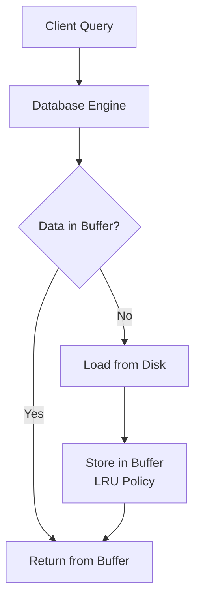
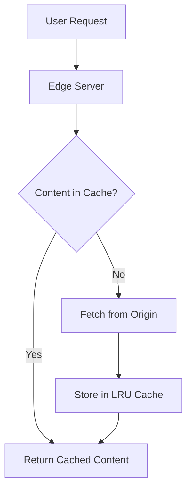

# 🌍 Real-World Applications

Now that we understand how LRU Cache works and its variations, let's explore where and how it's used in real-world systems. Understanding these applications will help you appreciate the importance of this algorithm.

## Database Systems 🗄️

### Database Buffer Pool

Database systems use LRU Caches to manage which data pages stay in memory:



> [!NOTE]
> When the buffer is full, the least recently used pages are written back to disk to make room for new pages.

```sql
-- PostgreSQL buffer settings (simplified)
ALTER SYSTEM SET shared_buffers = '1GB'; -- Size of LRU buffer
```

### Query Result Caching

Databases and ORMs cache query results to avoid repeated expensive queries:

```typescript
class QueryCache extends LRUCache {
  executeQuery(sql: string, params: any[]): Result {
    const cacheKey = this.generateKey(sql, params);
    
    // Check cache first
    const cachedResult = this.get(cacheKey);
    if (cachedResult !== -1) {
      return cachedResult;
    }
    
    // Execute query and cache result
    const result = database.execute(sql, params);
    this.put(cacheKey, result);
    return result;
  }
}
```

## Web Browsers 🌐

### HTTP Cache

Browsers maintain an LRU-like cache of HTTP resources (JS, CSS, images):

```javascript
// Simplified browser resource fetching
async function fetchResource(url) {
  // Check cache first
  if (cache.has(url) && !isExpired(cache.get(url))) {
    return cache.get(url).data;
  }
  
  // Fetch from network
  const response = await fetch(url);
  const data = await response.text();
  
  // Store in cache with LRU eviction
  cache.put(url, {
    data,
    timestamp: Date.now(),
    maxAge: getMaxAge(response.headers)
  });
  
  return data;
}
```

### Back/Forward Navigation

Browsers use LRU to decide which pages to keep in memory for faster back/forward navigation:

```mermaid
graph LR
    A[Homepage] --> B[Search Results] --> C[Product Page]
    
    subgraph "Browser History (LRU Cache)"
    H1[Product Page<br/>(Most Recent)] --> H2[Search Results] --> H3[Homepage<br/>(Least Recent)]
    end
```

## Content Delivery Networks (CDNs) 🌐

CDNs like Cloudflare and Akamai use LRU Caches at edge locations:



```javascript
// CDN configuration example
{
  "caching": {
    "default": {
      "strategy": "LRU",
      "ttl": 86400,
      "capacity": "20GB"
    },
    "rules": [
      {
        "pattern": "*.jpg",
        "ttl": 604800 // 1 week for images
      }
    ]
  }
}
```

## Operating Systems 💻

### Page Replacement

Virtual memory systems use LRU-like algorithms to decide which memory pages to swap to disk:

```c
// Simplified OS page fault handler
void handle_page_fault(address_t virtual_address) {
  // Find a physical frame for the page
  if (free_frames_available()) {
    frame_t free_frame = get_free_frame();
    map_page_to_frame(virtual_address, free_frame);
  } else {
    // No free frames, use LRU to evict a page
    frame_t lru_frame = page_table.get_least_recently_used_frame();
    if (page_is_dirty(lru_frame)) {
      write_to_disk(lru_frame); // Write changes back to disk
    }
    map_page_to_frame(virtual_address, lru_frame);
  }
  
  // Mark the page as recently used
  page_table.mark_as_used(virtual_address);
}
```

### File System Caching

Operating systems cache recently accessed file data in memory:

```c
// Linux-like file read behavior
ssize_t read_file(int fd, void *buffer, size_t count) {
  // Check if data is in page cache (LRU-managed)
  if (data_in_page_cache(fd, current_position)) {
    copy_from_page_cache(fd, current_position, buffer, count);
    update_lru_status(pages);
    return count;
  }
  
  // Read from disk and add to page cache
  ssize_t bytes_read = read_from_disk(fd, current_position, temp_buffer, count);
  add_to_page_cache(fd, current_position, temp_buffer, bytes_read);
  memcpy(buffer, temp_buffer, bytes_read);
  return bytes_read;
}
```

## Mobile Applications 📱

### Image Caching

Mobile apps use LRU Caches to manage loaded images:

```kotlin
// Android image caching with Glide (simplified)
val imageCache = LruCache<String, Bitmap>(
    maxSize = calculateCacheSize(), // e.g., 1/8 of available memory
    sizeOf = { _, bitmap -> bitmap.byteCount }
)

fun loadImage(url: String, imageView: ImageView) {
    // Check cache first
    val cachedBitmap = imageCache.get(url)
    if (cachedBitmap != null) {
        imageView.setImageBitmap(cachedBitmap)
        return
    }
    
    // Load from network
    networkLoader.loadImage(url) { bitmap ->
        imageCache.put(url, bitmap)
        imageView.setImageBitmap(bitmap)
    }
}
```

### API Response Caching

Mobile apps cache API responses to reduce network usage:

```swift
// iOS API response caching
class APIClient {
    let responseCache = LRUCache<String, APIResponse>(capacity: 100)
    
    func fetchData(endpoint: String, completion: @escaping (Result<Data, Error>) -> Void) {
        // Check cache
        if let cachedResponse = responseCache.get(endpoint) {
            if !cachedResponse.isExpired() {
                completion(.success(cachedResponse.data))
                return
            }
        }
        
        // Fetch from network
        networkFetch(endpoint) { result in
            if case .success(let data) = result {
                self.responseCache.put(endpoint, APIResponse(data: data, timestamp: Date()))
            }
            completion(result)
        }
    }
}
```

## Think About It ✨

- Which of these applications is most relevant to your work or interests?
- How would you need to modify the basic LRU Cache for each specific application?
- Can you think of a use case for LRU Cache in your own projects?

In the next and final lesson, we'll summarize what we've learned and discuss how to build on this knowledge! 