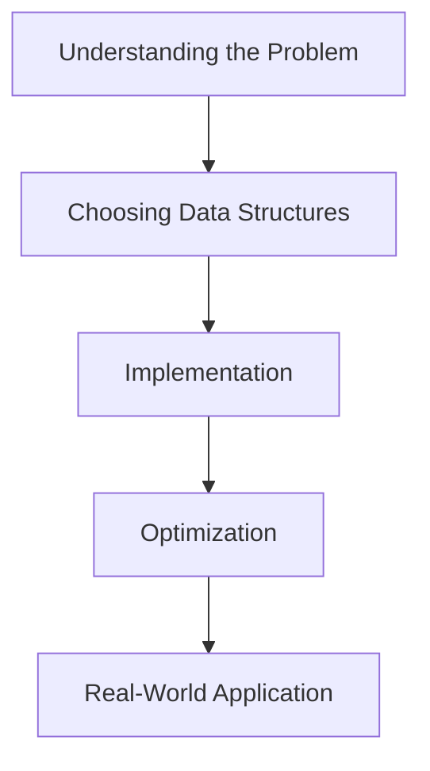

# 🎯 Conclusion and Next Steps

Congratulations! You've now learned all about the LRU Cache algorithm, from understanding the basic concept to implementing it and exploring its real-world applications. Let's take a moment to recap what we've covered and discuss where you can go from here.

## What We've Learned 📚

Throughout this series of lessons, we've covered:

1. **The LRU Cache Problem**: We learned what an LRU Cache is and why it's important in computing systems.

2. **Core Data Structures**: We discovered how combining a hash map and a doubly linked list creates an efficient solution.

3. **Implementation Details**: We implemented the core operations (get and put) and helper methods.

4. **Algorithm Walkthrough**: We traced through examples to see how the cache behaves in different scenarios.

5. **Variations and Optimizations**: We explored several variations like LRU-K, TLRU, and SLRU that address specific use cases.

6. **Real-World Applications**: We saw how LRU Caches are used in databases, browsers, CDNs, operating systems, and mobile apps.

## Key Takeaways 🔑

1. **Effective Design**: LRU Cache demonstrates how combining simple data structures can create powerful algorithms.

2. **Time-Space Tradeoff**: We use extra space (hash map + linked list) to achieve better time complexity.

3. **Abstraction**: Helper methods abstract away the implementation details, making the main operations cleaner.

4. **Real-World Relevance**: This algorithm appears in many critical systems we use daily.

5. **Eviction Policies**: The choice of what to remove when capacity is reached is a fundamental concept in caching.

> [!TIP]
> The principles you learned while studying LRU Cache apply to many other algorithms and data structures!

## Common Pitfalls to Avoid ⚠️

As you work with LRU Cache in the future, watch out for these common mistakes:

1. **Forgetting to update recency on access**: Remember that both `get` and `put` operations should update the "recently used" status.

2. **Missing edge cases**: Always consider empty caches, full caches, and repeated operations.

3. **Memory leaks**: Make sure to remove evicted keys from both the linked list and the hash map.

4. **Thread safety issues**: The basic implementation isn't thread-safe; add synchronization for concurrent environments.

5. **Inefficient usage**: Using LRU Cache for the wrong access patterns can lead to poor performance.

## Next Steps 🚀

Ready to build on what you've learned? Here are some ways to deepen your understanding:

### 1. Extend the Implementation 🔨

Try adding these features to the LRU Cache:

- **Generic types**: Make the cache work with any key and value types
- **Event callbacks**: Add hooks for when items are added, accessed, or evicted
- **Statistics tracking**: Count hits, misses, and evictions

### 2. Explore Alternative Caching Policies 🔄

Implement and compare these other caching algorithms:

- **MRU (Most Recently Used)**: Evicts the most recently used items first
- **LFU (Least Frequently Used)**: Evicts the least frequently used items first
- **FIFO (First In, First Out)**: Evicts the oldest items first
- **Random Replacement**: Evicts random items

### 3. Apply to a Project 💼

Use LRU Cache in a real project:

- Build a simple web server with response caching
- Create a file system explorer with thumbnail caching
- Implement a database query cache

### 4. Benchmark Performance 📊

Test different scenarios:

- How does cache size affect hit rate?
- How do different access patterns affect performance?
- How do the variations compare under different workloads?

## Final Thoughts 💭

LRU Cache is more than just an algorithm—it's a pattern for thinking about resource management. By understanding how and why it works, you've gained insights that apply to many areas of computer science and software engineering.

The next time you browse a website, use a database, or run an application on your computer, remember that LRU Caches are likely working behind the scenes to make your experience faster and more efficient.

> [!NOTE]
> The best way to solidify your understanding is to implement the algorithm yourself in different contexts and observe how it performs!

Thank you for exploring the LRU Cache algorithm with us. Happy coding! 🚀 