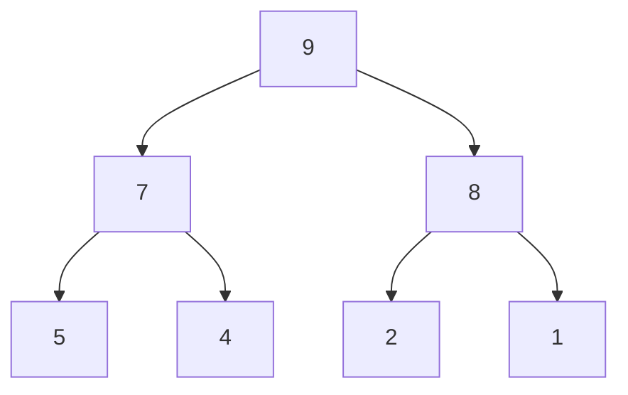
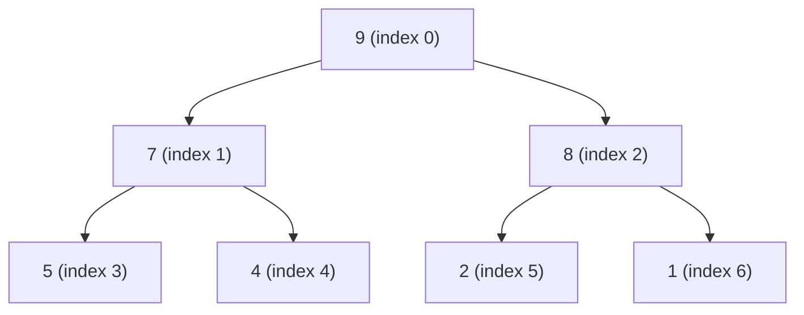

# 🌲 The Binary Tree Behind Max Heaps

## Complete Binary Trees: The Perfect Structure 📐

A Max Heap is built on a special type of binary tree called a **complete binary tree**.

> [!NOTE]
> In a complete binary tree, all levels are filled except possibly the last level, which is filled from left to right.

This property gives heaps their efficient structure and allows for a clever array-based implementation.



## From Tree to Array: A Space-Efficient Representation 📊

One of the most brilliant aspects of heaps is that despite being conceptualized as trees, they're typically implemented using **arrays**!

This array representation eliminates the need for pointers and reduces memory overhead.

For example, this max heap:

```
       9
     /   \
    7     8
   / \   / \
  5   4 2   1
```

Is represented as this array:

```
[9, 7, 8, 5, 4, 2, 1]
```

> [!TIP]
> The array representation makes heaps much more memory-efficient than traditional tree implementations!

## The Mathematical Magic: Navigating the Heap 🧙‍♂️

For any element at index `i` in the array:

- Its **parent** is at index `Math.floor((i - 1) / 2)`
- Its **left child** is at index `2 * i + 1`
- Its **right child** is at index `2 * i + 2`

This mathematical relationship makes traversing the heap incredibly efficient!

<details>
<summary>Why does this index relationship work?</summary>

The formula comes from the way complete binary trees are structured. Since we fill levels from left to right, these formulas maintain the parent-child relationships when mapping a tree to a linear array.

This is why we can navigate the tree structure without explicitly storing pointers!
</details>

## Visualizing the Array-Tree Mapping 🔄

Let's see how an array `[9, 7, 8, 5, 4, 2, 1]` maps to a complete binary tree:



Follow the indices:
- Parent of index 3 (value 5) is at index (3-1)/2 = 1 (value 7) ✓
- Left child of index 1 (value 7) is at index 2*1+1 = 3 (value 5) ✓
- Right child of index 1 (value 7) is at index 2*1+2 = 4 (value 4) ✓

## Think About It 🤔

**Question**: Why is a complete binary tree particularly important for an efficient heap implementation?

<details>
<summary>Hint</summary>

Consider what would happen if the tree had gaps or wasn't filled from left to right. Would the array indexing formula still work?
</details>

<details>
<summary>Answer</summary>

A complete binary tree ensures that the array representation has no wasted space. If the tree had gaps, we'd either need to use null placeholders in the array (wasting space) or use a more complex indexing scheme (slowing down operations).

The complete binary tree property guarantees that our simple parent-child indexing formulas always work correctly!
</details>

In the next lesson, we'll learn how to build a Max Heap from an unordered array! 